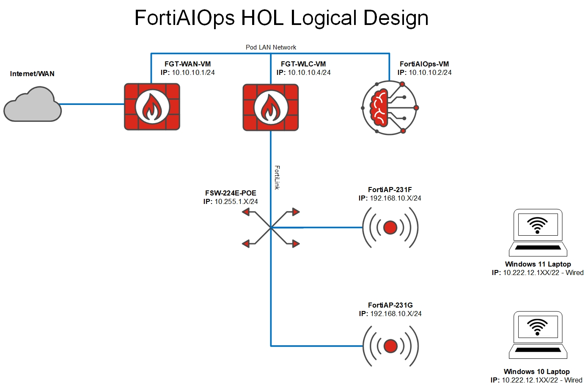

# Topology

-   :material-router-wireless:{ .lg .middle } **FortiPoC Instances**

    ---

    25x FortiPoC instances (PoC-01 through PoC-25)

    Access via: `https://10.222.14.XX` (where XX is your pod number)

-   :material-security-network:{ .lg .middle } **Security Fabric**

    ---

    Complete Fortinet ecosystem deployment with integrated monitoring

    Real-time insights across all fabric components

