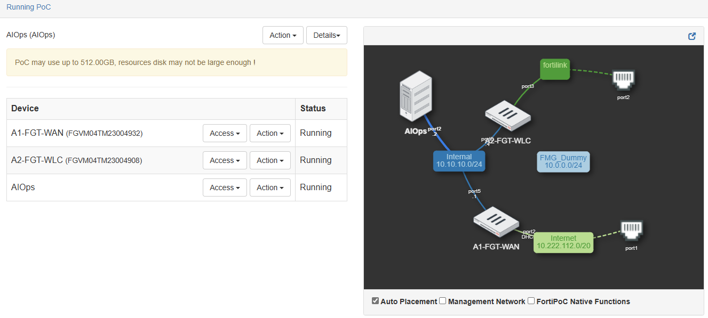

# Instance Components

| Component | Type | Description |
|-----------|------|-------------|
| **FGT-WAN** | FortiGate-VM | Internet access and core routing |
| **FGT-WLC** | FortiGate-VM | Wireless LAN Controller with FortiLink |
| **FortiSwitch** | 224E-POE | Physical switch with 4 connected APs |
| **FortiAPs** | 2x FAP-231F, 2x FAP-231G | Connected to FSW ports 1-4 |
| **FortiAIOps** | VM | AI Operations and monitoring platform |
| **Client Devices** | Windows 10/11 | Testing endpoints |
