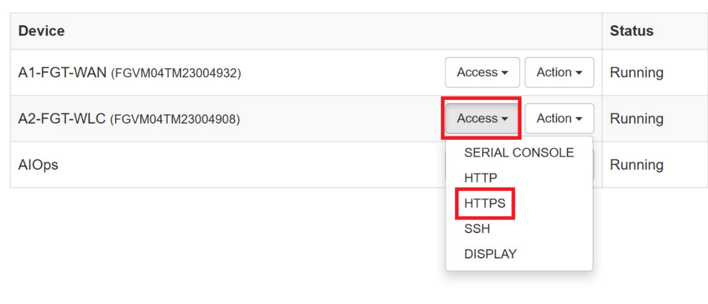
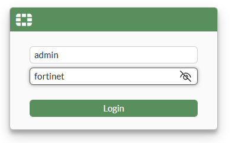
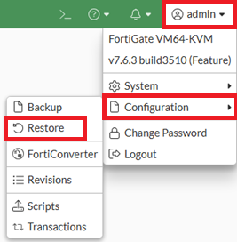
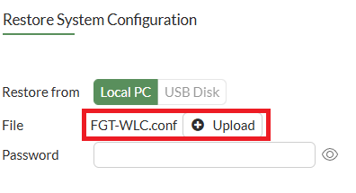
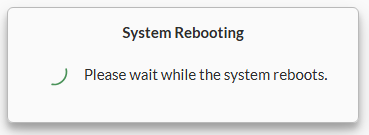
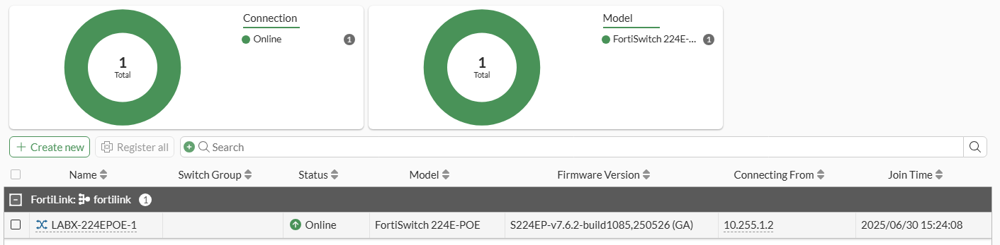

# Initial Setup

!!! important "Required Configuration"
    This initial setup is required to prepare your lab environment. You'll import the `FGT-WLC.conf` configuration file to establish the base configuration needed for all subsequent labs.

## Lab Materials

The lab guide, digital certificates, license, and image files needed to complete the hands-on lab are available to download via this Dropbox link, [Lab Materials](https://www.dropbox.com/scl/fo/etqkhb80sm8ystvqsatbe/AOrihzsROfV4gNSyhSf8qmQ?rlkey=glpm5jr3mzkatiemynlkrpsab&st=s8f7s2gj&dl=0).

## Setup Steps:

1. **Access FortiPoC**: Navigate to `https://10.222.14.XX`
2. **Login**: Use admin/fortinet credentials
3. **Access FGT-WLC**: Select HTTPS from FGT-WLC Access dropdown
4. **Import Configuration**:
   - Select admin dropdown → Configuration → Restore
   - Upload `FGT-WLC.conf` file (no password required)
   - Confirm restoration and wait for reboot
5. **Bounce FortiLink Interface**:
    - Navigate to Wi-Fi & Switch Controller → FortiLink Interface
   - Disable → Apply → Enable → Apply
6. **Verify Switch**: Check Wi-Fi & Switch Controller → Managed FortiSwitches
7. **Continue to Lab 1**

## Detailed Quick Start Steps

### Access FortiGate-WLC-VM

From the FortiPoC dashboard, select **HTTPS** from the **FGT-WLC** Access drop-down button. Alternatively, you can also access the FGT-WLC directly via the preconfigured IP/Port <https://10.222.14.XX:14001>

At the FortiOS login screen, enter your lab username and password admin/fortinet and press the Login button

### Import Configuration

1. Select the **admin** user drop down in the top right of the dashboard window
2. Select **Configuration**
3. Select **Restore**

Within the Restore System Configuration window:

- Select the **Upload** button
- Then select the **FGT-WLC.conf** file (this is included within the [Lab Materials](https://www.dropbox.com/scl/fo/etqkhb80sm8ystvqsatbe/AOrihzsROfV4gNSyhSf8qmQ?rlkey=glpm5jr3mzkatiemynlkrpsab&st=s8f7s2gj&dl=0))
- No password is needed
- Then select the **OK** button

You will be prompted to confirm the restoration - select the **OK** button to proceed

Your FGT-WLC VM will take approximately 1-2min to reboot, please wait for the login prompt to appear.

### Post-Import Steps

1. Login again using your lab username and password admin/fortinet

!!! note "FortiLink Interface Bounce Required"
    Because the FortiLink physical interface stays online during this process (a side effect of virtualisation), you will need to bounce (disable/enable) the FortiLink interface for your FortiGate to detect the FortiSwitch connected to it.

2. Within the FortiOS GUI navigate to **Wi-Fi & Switch Controller → FortiLink Interface**
3. Under Status at the bottom of this window select the **Disable** option then select the **Apply** button
4. Again under status select the **Enable** option then select the **Apply** button

5. Navigate to **Wi-Fi & Switch Controller → Managed FortiSwitches** and confirm your **FortiSwitch LABX-224EPOE-1** is now **online**. It may take up to a minute to show. Please refresh your browser window if it's still showing as offline.

6. Proceed to Lab 1 to continue with the lab.