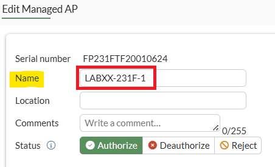
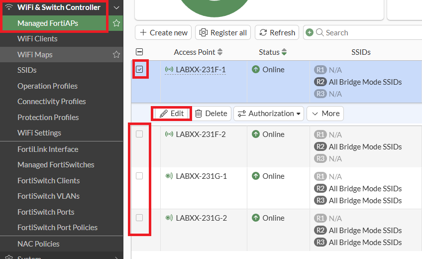
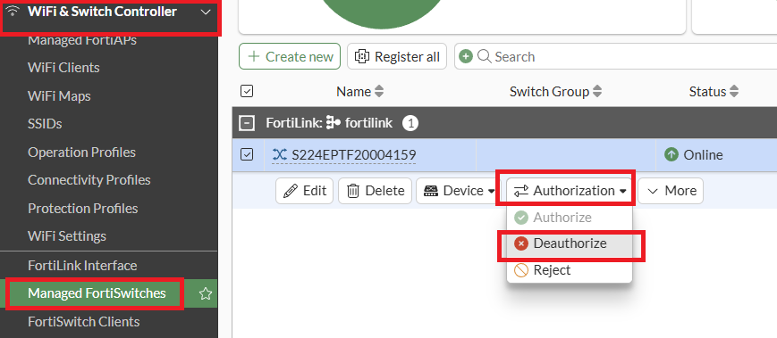
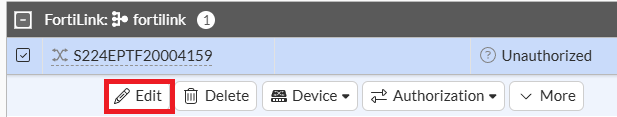
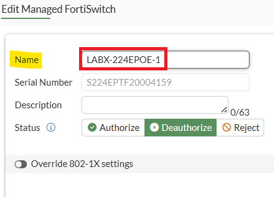
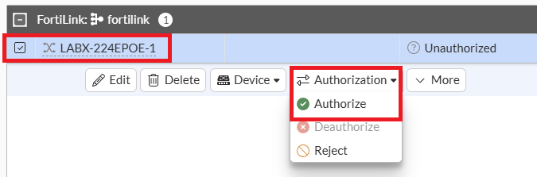
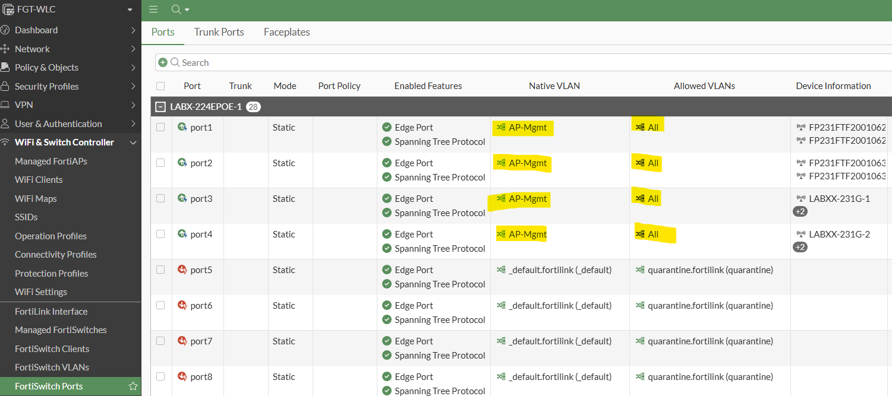

# Lab 1: Renaming Devices

Whilst not mandatory, it is recommended that in a production
environment, all devices be named using a logical naming regime. i.e.,
Building Name, Floor, and AP#

-   **Keep it Short:** Keep your AP names to 15 characters

-   **Save some Space:** No need to use characters for \"AP\" - it's
    obvious what the device is

-   **Numerical naming is Good:**  There are many combinations available

-   **Keep the names Unique:** Don't use the same numbers across
    floors - it's very confusing

-   **Use codes:** For buildings or sites -- e.g., SYD for Sydney, B1
    for Building 1, and so on

FortiAIOps is, in part, a monitoring platform, so it helps ensure that
all devices are named using a robust naming regime. Doing so can help
expedite the resolution time when troubleshooting device-related issues.

### Rename your lab FortiAPs

Renaming a FortiAP managed by a FortiGate is relatively easy;

To do so, navigate to **WiFi & Switch Controller \> Managed FortiAPs**

Select an AP, then select the Edit button

In the slide-out/pop-up window, set the name of the AP to **LabXX-231F-1** where XX is your Pod#

Select the **OK** button

Do the same for your remaining three lab APs, i.e., **LabXX-231F-2, LabXX-231G-1, and LabXX-231G-2**

### Rename your lab FortiSwitch

FortiSwitch, when managed by a FortiGate, isn't as easy to rename after
it has been authorized. It is recommended to rename all FortiSwitches
before authorizing them on your FortiGate.

Renaming via the CLI is allowed after authorization; however, the
backend process involves deauthorizing and reauthorizing the switch
automatically to implement this change.

As stated above, renaming a FortiSwitch via CLI deauthorizes and
reauthorizes it. So, let's try this same methodology via the GUI. As
you've already authorized your lab FortiSwitch, you'll want to
unauthorize it.

-   Within the FGT-WLC admin GUI, navigate to **Wi-Fi & Switch
    Controller \> Managed FortiSwitches**

-   Select your FortiSwitch and then select the **Authorization dropdown
    button**, followed by the **Deauthorize** option

Your lab Fortiswitch will now be deauthorized.

-   Next, select your FortiSwitch and select the **Edit** button

-   In the slide-out pop-up window, change the name of your FortiSwitch
    from the serial number to **LABX-224EPOE-1 where
    X is your lab number**

-   Then select the **OK** button

-   Next, select the **Authorization dropdown** button followed by the
    **Authorize** option.

Your FortiSwitch will now be re-authorized, with its new name. It will
take approximately 1 minute to come back online.

-   Next Navigate to **WiFi & Switch Controller \> FortiSwitch Ports**

You will notice that none of the switchport configuration has been lost
when renaming using this method.

