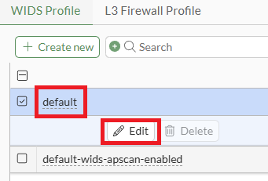
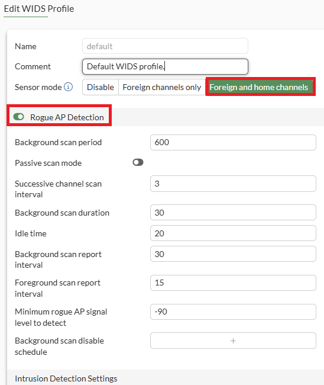

# Lab 2: Enabling WIDS

FortiAIOps can correlate and report on Wireless Intrusion Detection
System events as well as rogue devices. Hence, it's worth ensuring these
features are enabled.

!!! note
    WIDS is not enabled by default. Why is this security feature not
    enabled by default?

Note that if WIDS and Rogue AP detection features are enabled on
FortiGates with a low amount of available RAM, it can result in the FortiGate entering conserve mode.

Even when using these features on FortiGates with decent amounts of system resources, it's recommended that cleanup timers be configured to ensure that memory resources are not consumed with storing historical WIDS/Rogue APs events.

This is explained in detail in this knowledge base article, [High memory due to the cw_acd process - Fortinet
Community](https://community.fortinet.com/t5/FortiGate/Technical-Tip-High-memory-due-to-the-cw-acd-process-and/ta-p/355837)

To summarise;

### Wireless Intrusion Detection

From FortiOS v7.6.1GA and later, it is possible to configure a timer and
maximum value for WIDS database entries:

The following setting removes an entry 24 hours after it was last seen:

```
config wireless-controller timers
set wids-entry-cleanup 1440    # (<0> to <4294967295> minutes to keep wids entry after it is gone, 0 to never expire)
end
```

The example following keeps the latest 256 WIDS entries:

```
config wireless-controller global
set max-wids-entry 256    # (<0> to <4294967295> maximum entries per table, 0 for no maximum)
end
```

### Rogue AP Detection

From FortiOS 7.4.4GA, it's possible to set timers to purge historical records if the device has not been seen in a certain amount of time. By default, the Rogue AP timer is configured as '`set rogue-ap-cleanup 0`', meaning a detected Rogue AP is never forgotten.

 The following setting removes an entry 24 hours after it was last seen:

```
config wireless-controller timers
set sta-cap-cleanup 1440
set rogue-ap-cleanup 1440
set rogue-sta-cleanup 1440
set ble-device-cleanup 1440
end
```

### Configure WIDS/Rogue AP Detection 

If you haven't already, please open an HTTPS browser session to your
FGT-WLC appliance at **https://10.222.14.XX:14001**, log in using your admin
credentials, and then perform the following steps.

-   Navigate to **WiFi & Switch Controller \> Protection Profiles**

    

-   Under WIDS Profile, select and **Edit** the default profile

Within the Edit WIDS Profile pop-up window

-   Sensor mode: Set to scan **Foreign and Home channels** (basically
    all channels, including the channel the AP is operating on)

-   Rogue AP Detection: Set to **Enable**

    

!!! note
    Passive scanning is disabled; when enabled, this prevents the
    FortiGate from sending probe requests on any channels. This means the
    FortiGate will not actively scan for rogue access points; instead, it
    relies on passively listening to wireless traffic. Passive scanning is
    ideal to use where you want to minimise the performance impacts that can
    come from enabling Rogue AP Detection. Note: Having to send probes on
    every channel consumes radio airtime, which is a finite resource.

-   Select the **OK** button

You'll need to access the CLI to put the timers in place to prevent
memory resources from being heavily impacted by WIDS/Rogue AP detection.

-   Access the FGT-WLC CLI, which can be done by selecting the button in the top right corner of your FGT-WLC VM browser window, or via an SSH client to 10.222.14.XX:11001

```
config wireless-controller timers
set sta-cap-cleanup 1440
set rogue-ap-cleanup 1440
set rogue-sta-cleanup 1440
set ble-device-cleanup 1440
set wids-entry-cleanup 1440
end
```

```
config wireless-controller global
set max-wids-entry 256
end
```

That concludes the setup of WIDS/Rogue AP detection. Please continue to the next section.

