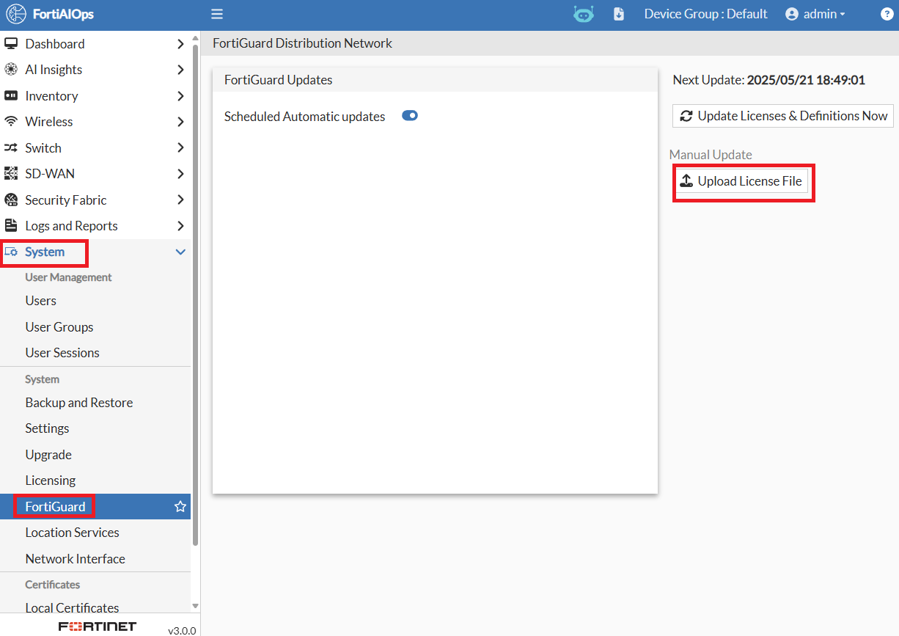
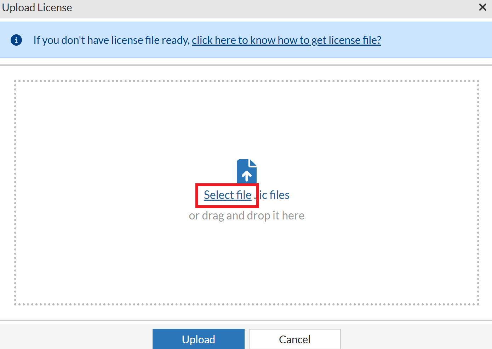
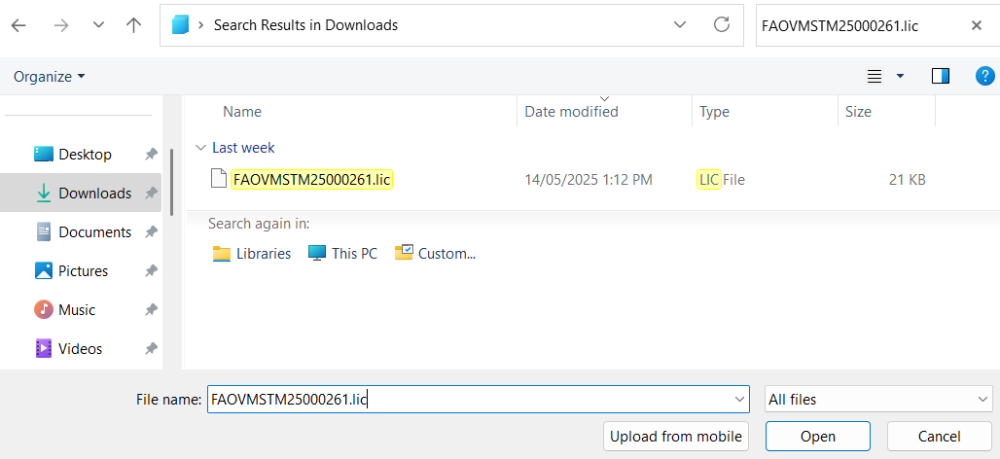
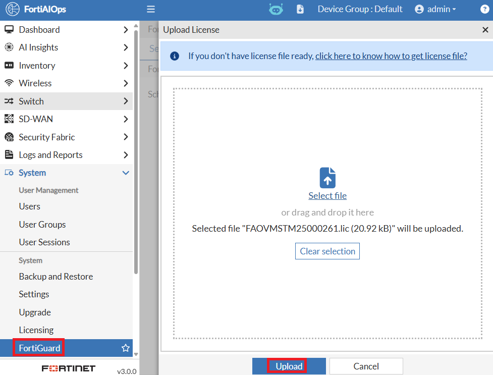
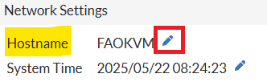
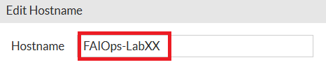
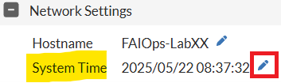
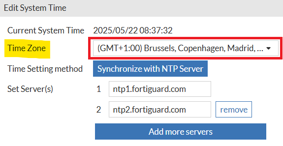
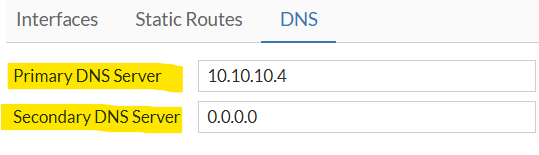

# Lab 3: Initial AIOps Config

## Licensing Overview

FortiAIOps has separate VM and Hardware appliance licenses. Both require
licenses to operate, and none are included with either appliance, as is
often the case with other Fortinet products. Why is this different? To
put it simply, the market has shifted to subscription-based licensing
models, as opposed to perpetual licenses.

FortiAIOps requires that all devices being monitored and/or utilising
the AI insights engine have a license assigned. You cannot currently
select which devices to monitor and which not to. Hence, when a
FortiGate is imported (which you'll be doing in this lab) you need to
ensure you have enough licenses available to cover all FortiAPs (FAP),
FortiExtenders (FEX)* and FortiSwitches (FSW) that are being managed by
that FortiGate.

SD-WAN monitoring & insights is separate to the monitoring & insights
licensing for FAP, FEX and FSW. The FortiAIOps SD-WAN capabilities
require that each imported FortiGate has a license to utilise these
features. At this point, a High-Availability pair/cluster of FortiGates
doesn't require any additional licenses.

Further questions around licenses are included in the FortiAIOps
Ordering Guide available here: [FortiAIOps Ordering
Guide.](https://www.fortinet.com/content/dam/fortinet/assets/data-sheets/og-fortiaiops.pdf)

## License Installation

-   Please open a HTTPS browser session to your FortiAIOps appliance,
    <https://10.222.14.XX:14002>, log in using the admin credentials
    (admin/Fortinet123!), and perform the following steps.

As there is no process to automate the license installation for
FortiAIOps, you will need to download and import it as would be done in
a typical deployment scenario.

Your FortiAIOps license has already been registered with FortiCare.
However, it will still need to be installed within the appliance.

As a pre-requisite to this section, please ensure you have downloaded
the AIOps license. It is included with the [Lab
Materials](https://www.dropbox.com/scl/fo/etqkhb80sm8ystvqsatbe/AOrihzsROfV4gNSyhSf8qmQ?rlkey=glpm5jr3mzkatiemynlkrpsab&st=s8f7s2gj&dl=0)
available for download from Dropbox.

-   Within FortiAIOps, navigate to **System \> FortiGuard**

-   On the right side, under Manual Update, select the **Upload License
    File** button

-   Within the slide-out window, choose the **Select File** link

-   In the pop-up Window, **select the license file** you previously downloaded, **i.e., FAOVMSTM25000261.lic**

    

-   In the Upload License window, select the **Upload** button

    

Your licenses should now be installed.

-   Once the license is installed, navigate **to System \> Licensing** and verify you have 500 Monitoring Licenses, 500 Analytics Licenses, and 25 SD-WAN licenses available.

    

## Configure Hostname

-   Within FortiAIOps, navigate to **System \> Settings**

-   Under the **Network Settings \> System Time** section, select the
    **Edit** icon (pencil)

-   In the slide-out window, enter the Hostname for your FortiAIOps
    appliance

i.e., **FAIOps-LabXX** where XX is your Pod number, i.e.,
**FAIOps-Lab01**

-   Select the Save button; this will immediately apply the Hostname
    change. No restarting, etc., is required.

## Configure NTP

Configuring Network Time Protocol (NTP) is highly recommended, as
several key components in this Hands-on Lab rely on the correct time,
such as certificate issuance, certificate expiry, and logging time
stamps.

-   Within FortiAIOps, navigate to **System \> Settings**

-   Under the **Network Settings \> System Time** section, select the
    **Edit** icon (pencil)

-   Within the Edit Time Setting window under Change Time Zone, set the
    Time zone: **(GMT+1:00 Brussels, Copenhagen, Madrid, Paris)** in
    EMEA and **(GMT+8:00 Kuala Lumpur, Singapore)** in APAC

-   Then select the **Save** button

## Update FortiAIOps with DNS Server IP

-   Navigate to **System \> Network Interface**

    

-   Select **DNS** from the top Menu bar

-   Set the **Primary DNS Server** to **10.10.10.4**

-   Set the **Secondary DNS Server** to **0.0.0.0**

Continue to the next section.

