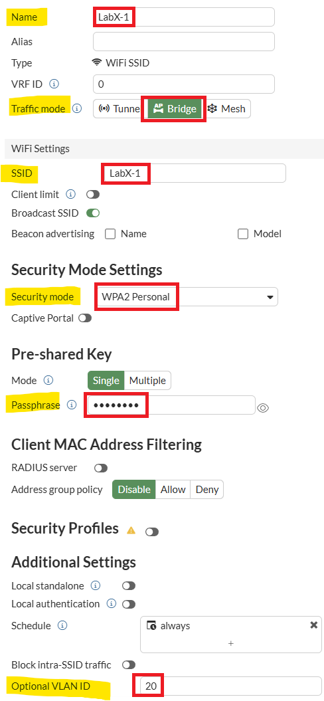
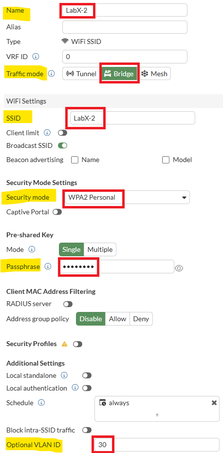

# Lab 4: Creating Wi-Fi Networks

Within this section, you will create the two SSIDs you will use to
test/validate several features within FortiAIOps.

Please open a HTTPS browser session to your FGT-WLC appliance,
<https://10.222.14.XX:14001>, and log in to the GUI using your admin
credentials.

## Configure Bridged SSID1 (LabX-1)

-   Navigate to **Wi-Fi & Switch Controller** \> **SSIDs**

-   From the top menu bar, select the **+Create New** button, then in
    the drop-down select **SSID**

In the Create New SSID window, set the following.

-   Name -- **LabX-1** where X is your POD number

-   Alias -- **LabX-1** where X is your POD number

-   Traffic mode -- **Bridge**

Under Wi-Fi Settings, set the following;

-   SSID: **LabX-1** where X is your POD number

Under Security Mode Settings

-   Security Mode: **WPA2-PSK**

-   PSK Password: **fortinet**

Under Additional Settings, set the following;

-   Optional VLAN ID - **20**

-   Leave all other settings as per default

-   Select the **OK** button to create and provision the LabX-1
    SSID

## Configure Bridged SSID2 (LabX-2)

-   Navigate to **Wi-Fi & Switch Controller** \> **SSIDs**

    

-   From the top menu bar, select the **+Create New** button, then in
    the drop-down select **SSID**

In the Create New SSID window, set the following.

-   Name -- **LabX-2**

-   Alias -- **LabX-2** where X is your POD number

-   Traffic mode -- **Bridge**

Under Wi-Fi Settings, set the following;

-   SSID: **LabX-2** where X is your POD number

Under Security Mode Settings

-   Security Mode: **WPA2-PSK**

-   PSK Password: **Fortinet!**

Under Additional Settings, set the following;

-   Optional VLAN ID - **30**

-   Leave all other settings as per default

-   Select the **OK** button to create and provision the LabX-2
    SSID

