# Lab 5: Certificates

In many production environments, customers will have installed alternate
SSL certificates to access the web admin console for their FortiGate and
other devices. This typically aligns with their company domain name and
is considered a best practice over using the Factory HTTPS certificate,
as certificates are often refreshed more frequently, which can reduce
the potential for credential-based sniffing via a man-in-the-middle
attack should a certificate private key file be stolen.

Within this section, you will need to install the p12 (PFX) and
PEM-based certificates, issued to \*.cselab.net

Note that a PFX/p12 certificate contains the public & private key along
with issuing CA certificates within one file, which is protected by a
password.

Whereas the PEM certificate files are individual certificates in text
format, there is no password in place to protect these. Hence, PEM
files, especially the private key file, should never be stored in a
location where a simple search for \*.pem may result in the certificate
files being found. If you must store these, add them to a
password-protected zip file or similar, using a strong password and
AES256 encryption.

The certificate files can be downloaded from this Dropbox link: [Lab Materials](https://www.dropbox.com/scl/fo/etqkhb80sm8ystvqsatbe/AOrihzsROfV4gNSyhSf8qmQ?rlkey=glpm5jr3mzkatiemynlkrpsab&st=s8f7s2gj&dl=0) (the same location as the lab guide) if you've not already done so.

## Import Certificates into FGT-WLC

To import the host certificate that the FortiGate will use to establish
a secure connection between FGT-WLC \<-\> FortiAIOps, perform the
following steps;

-   Within the FGT-WLC GUI, navigate to **System \> Certificates**

-   Select the **+Create/Import** dropdown button in the top menu bar,
    then select **Certificate**

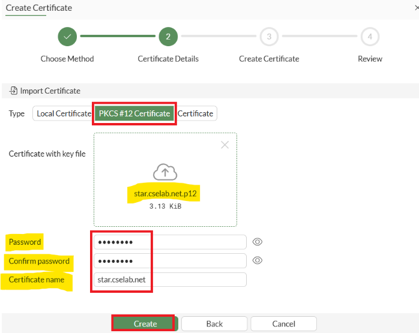

!!! note
    If you encounter issues importing the p12 certificate due to the Import window being stuck or continuously loading, resizing your browser window should resolve the issue.
Alternatively, you can connect to one of your lab Windows 10/11
workstations and import the certificate from there. This issue seems to
appear when there's high latency from the current location to the EMEA
lab.

-   In the Create Certificate window, select the **Import Certificate**
    button

-   Under Import Certificate, select the **PKCS#12 Certificate** option

-   Browse for and select the **star.cselab.net.p12** file

-   Enter the password: **fortinet**

-   Confirm the password: **fortinet**

-   Confirm the certificate name is set to **star.cselab.net**

-   Select the **Create** button

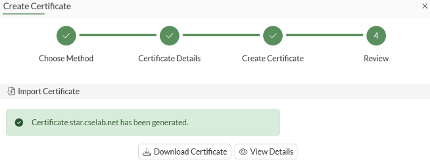

You should now see the **star.cselab.net** certificate listed within the Local Certificates section of your FortiGate as per below.

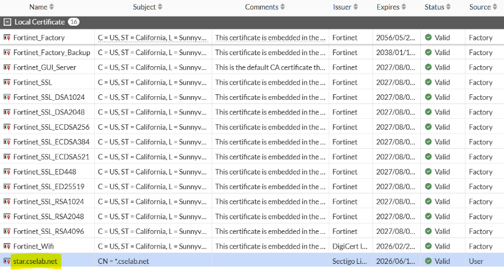

!!! note
    Fortinet already has the issuing root CA certificate for Sectigo
    within the local trusted CA certificate store. As Sectigo is a
    well-known, trusted PKI. Hence, we don't need to import the root CA
    certificates separately; however, for some PKI-issued certificates, this
    may be required.

Continue to the next section.

### Assign Certificate to FGT-WLC HTTPS Service

For FortiOS to use the previously imported wildcard certificate
\*.cselab.net to secure the HTTPS connection between FortiOS and
FortiAIOps, it must be set as the HTTPS server certificate.

-   Within the FGT-WLC GUI navigate to **System \> Settings**

-   Under **Administration Settings \> HTTPS server certificate**, from
    within the dropdown box **select star.cselab.net**

-   Then select the **Apply** button at the bottom of the window.

    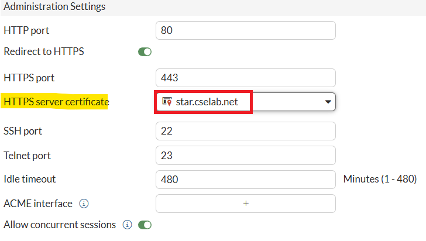

This will update the certificate being used to access the FortiGate via
HTTPS.

!!! note
    In a production deployment, it is also recommended to change the
    HTTPS server port to a non-standard port, such as 10443. However, doing
    this in the lab will break access due to backend port forwarding rules.
    Hence, please do not change the HTTPS port from the default (443).

## Import Certificates into FortiAIOps

Unfortunately, FortiAIOps doesn't yet support importing PFX/P12
certificate files. This will be introduced at a later stage. Therefore,
you will need to import the CA certificates and public/private key files
individually. As of now, PFX/P12 support is planned for FortiAIOps 3.2GA
(subject to change).

### Import CA Certificates into FortiAIOps

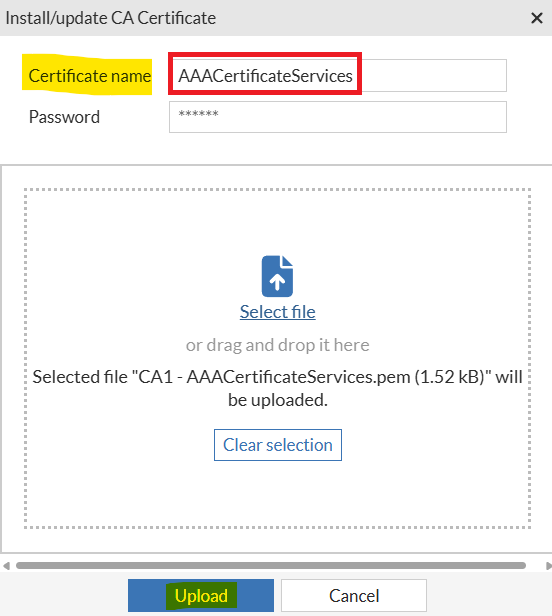

-   Please open a HTTPS browser session to your FortiAIOps-VM,
    <https://10.222.14.XX:14002>, and log in using your admin
    credentials.

-   Within the FortiAIOps GUI, navigate to **System \> Certificates \>
    CA Certificates**

-   Select the **Install CA Certificate** button from the top menu bar

First, import the issuing Root CA and Intermediate CA certificates by
completing the following steps;

-   Within the slide-out **Install/update CA Certificate** window

-   Select the **CA1 -** **AAACertificateServices.pem** file

-   Set the Certificate name to **AAACertificateServices** and select
    the **Upload** button

-   You should see that the CA certificate was imported successfully, as it will be displayed in the list.

    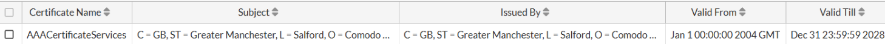

-   Again, select the **Install CA Certificate** button from the top menu bar

-   Select and the **CA2 - SectigoRSADomainValidationSecureServerCA.pem** file

-   Set the Certificate name to **SectigoRSADVSecureServerCA** and
    select the **Upload** button

-   Again, select the **Install CA Certificate** button from the top
    menu bar

-   Select and the **CA3 - USERTrustRSAAAACA.pem**file

-   Set the Certificate name to **USERTrustRSAAAACA** and select the
    **Upload** button

You should now see the three CA certificates you've just imported.

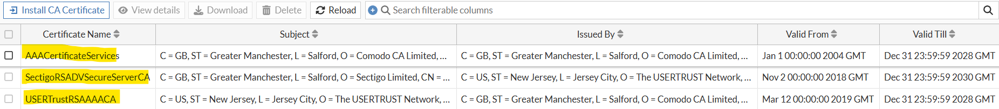

### Import Host Certificate into FortiAIOps

FortiAIOps requires the Public and Private key files of the host
certificate to be compressed into a single file.

Generally, you will need to create this file, as no PKI provider will
issue the public and private keys as a single compressed file.

Any of the following compression formats are supported; \*.tar,
\*.tar.gz, \*.tgz, \*.zip, \*.tar.xz, \*.xz

-   Combine both the **star.cselab.net-public-key.pem** and
    **star.cselab.net-private-key.pem** into a compressed file using one
    of the above formats and name it **star.cselab.net-keyfiles.zip**
    (the file extension doesn't need to be .zip, could be any of the
    above supported formats) **-** All operating systems should natively
    support this.

-   Next, within the FortiAIOps GUI, navigate to **System \>
    Certificates \> Local Certificates**

-   Select the **Import Key Pair** button from the top menu bar

-   Within the Install/update Certificate Key pair slide out window,
    select the **star.cselab.net-keyfiles.zip** you just created

-   Set the certificate name to **star.cselab.net**

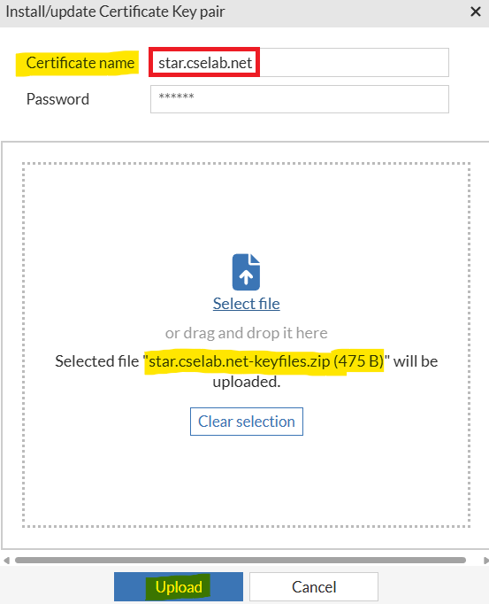

-   Then select the **Upload** button

You should now see that the star.cselab.net certificate has been
imported successfully.

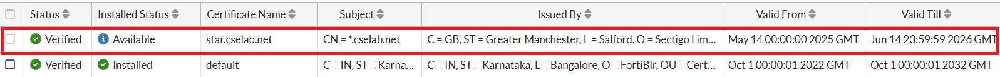

### Assign Certificate to FortiAIOps HTTPS Services

You now need to assign the wildcard certificate that you just imported
to the FortiAIOps HTTPS service.

-   Within FortiAIOps, navigate to **System \> Settings**

-   Under Administration **Settings \> Certificate** within the dropdown
    box select **star.cselab.net** and then select the **Apply
    Certificate** button

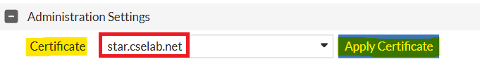

-   You will then see a warning appear in the top right corner of the
    window, select the **Continue** button

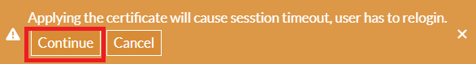

This will not cause the current session to timeout within your lab. This
is because you are using a proxied connection via FortiPoC, which is
using a different certificate. However, in a standard deployment
scenario, you would need to log back in again.

!!! note
    This should go without saying, but it's seen often in the
    field. The certificate used on the FortiGate must support the FQDN being
    used when importing the FortiGate into FortiAIOps. Hence, as we are
    using a wildcard, i.e., **\*.cselab.net**, the DNS hostname of
    **fgt-wlc.cselab.net** is viable. Of course, you must also have created
    the DNS host record on your DNS server so that this name can be
    resolved. For example, you cannot use **fgt-wlc.fortixpert.com**, even
    if this was a valid DNS entry, because the HTTPS certificate will not
    match.

