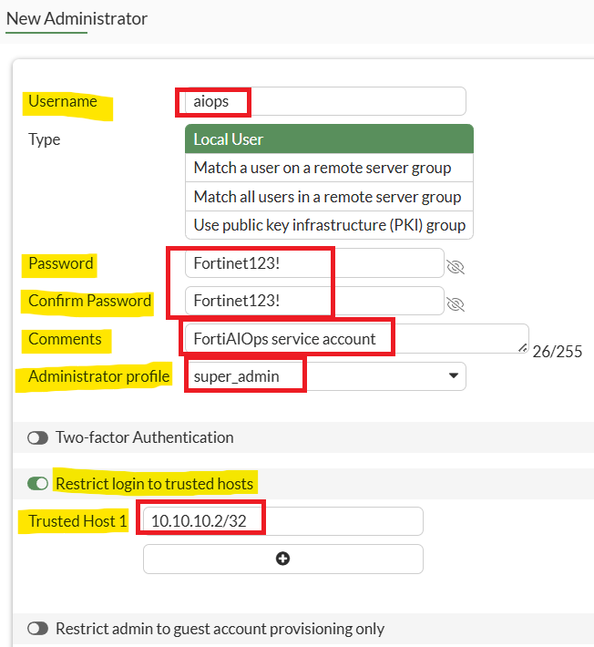
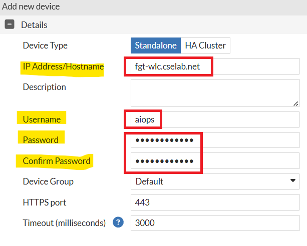
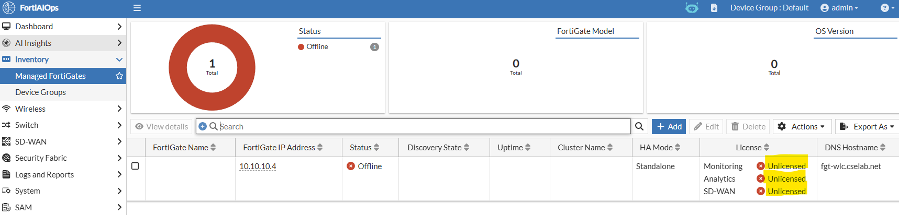
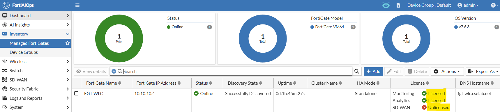
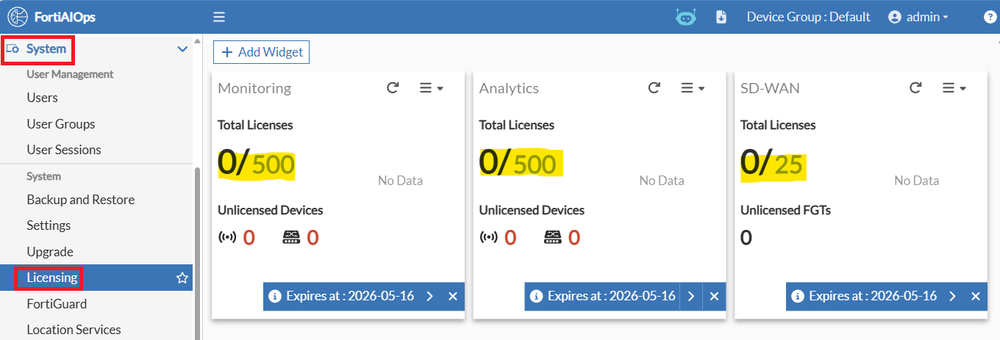
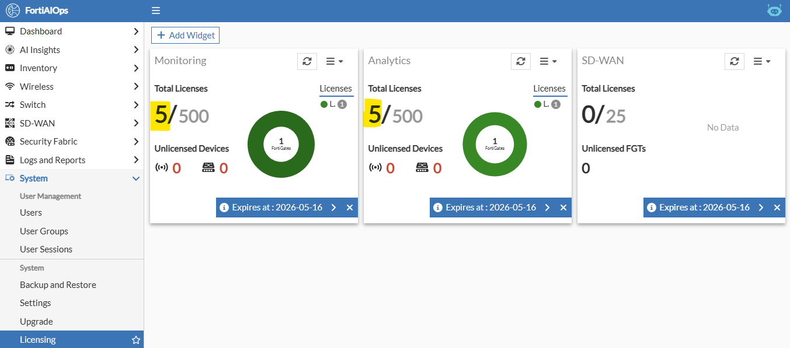
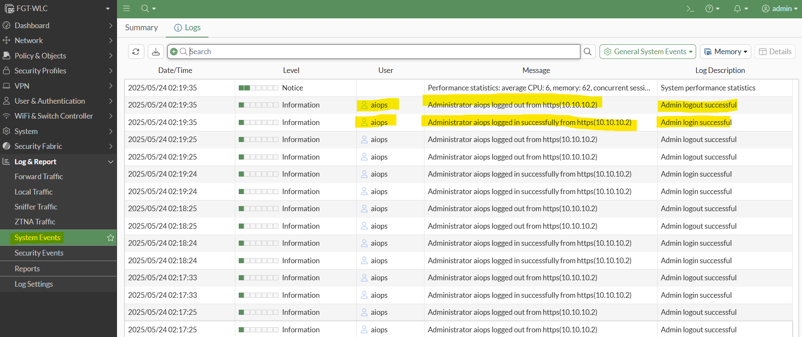

# Lab 6: FortiGate AIOps Integration

Before you dive into the benefits, features and use cases of FortiAIOps,
you'll need to get it functioning and collecting data from your lab
FortiGate/s.

## Create Service Account for AIOps in FortiOS

Because FortiAIOps needs **super_admin** rights to each FortiGate, as a
best practice, you should create a separate admin user account for
FortiAIOps to utilise for this purpose.

This account should be restricted to only allow access (user login) from
the FortiAIOps appliance.

If you haven't already, please open an HTTPS browser session to your
FGT-WLC appliance at https://10.222.14.XX:14001, log in using your admin
credentials, and then perform the following steps.

Navigate to **System \> Administrators.**

From the top menu bar, select the **+Create New** dropdown button and
select **Administrator**

In the New Administrator pop-up window, set the following

-   Username: **aiops**

-   Type: **Local User**

-   Password: **Fortinet123!**

-   Confirm Password: **Fortinet123!**

-   Comment: **FortiAIOps Service Account**

-   Administrator profile: **super_admin**

-   Select the **OK** button to create the user account

## Add FortiGate into FortiAIOps

-   If you haven't already, please open a HTTPS browser session to your
    FortiAIOps appliance, <https://10.222.14.XX:14002>, login using the
    admin credentials (admin/Fortinet123!) and perform the following
    steps.

-   Navigate to **Inventory \> Managed FortiGates**

    

-   On the right-hand side, select the **+Add** button

In the Add new device slide-out window, enter the following

-   IP Address/Hostname: **fgt-wlc.cselab.net**

-   Username: **aiops**

-   Password: **Fortinet123!**

-   Confirm Password: **Fortinet123!**

-   Select the **Add** button

Your FortiGate will now be discovered and queried by FortiAIOps over
HTTPS using REST API.

!!! note
    If your FortiGate is part of a HA Cluster, you should select this
    option instead of Standalone

## Validate Licensing Status

You'll notice just after you've added your FortiGate, under **Inventory
\> Managed FortiGates**, that the license status for Monitoring /
Analytics and SD-WAN shows as unlicensed.

This will update automatically once the number of devices connected to
your FortiGate has been discovered.

This should take approximately 30 seconds. After this amount of time has
passed,

-   **Please refresh the browser window,** and you should notice the
    Monitoring and Analytics licenses have been successfully applied.

You'll notice that the SD-WAN license remains Unlicensed. This is
expected behaviour because you haven't yet configured an SD-WAN
interface; you will set this up later in this lab.

!!! note
    An SD-WAN license will only be consumed if SD-WAN has been enabled
    on a FortiGate within the inventory.

-   If you browse to **System \> Licensing,** you should notice this has
    been updated

In section 4, you should have uploaded your FortiAIOps license file, and within FortiAIOps under System \> Licensing, it would have appeared as per the image below.

It should now appear as per the image below, with five licenses consumed (1x FSW + 4x FAP)

## Confirm FortiAIOps is accessing FortiGate.

If you haven't already, please open a HTTPS browser session to your
FGT-WLC appliance, <https://10.222.14.XX:14001>, log in using the admin
credentials (admin/fortinet), and within the GUI

-   **Navigate to Log & Report \> System Events**

You should see numerous login and logout events from the **aiops** user
account. This will occur multiple times per minute whilst FortiAIOps
polls the FortiGate for relevant metrics.

## Third-Party Devices

As with all industry AI monitoring and insights tools, they are
vendor-specific and cannot operate with 3rd party vendors. FortiAIOps
is no different in this space and can only integrate with Fortinet
products, such as FortiGate, FortiAP, FortiSwitch, FortiAnalyzer, and
soon FortiExtender, FortiManager, and FortiMonitor.

Whilst FortiAIOps currently supports the aforementioned products, a
roadmap is in place for continued growth, with the goal of providing a
holistic Fortinet Fabric-wide AI monitoring and insights solution.

Please note: Fortinet-AX and/or Alaxa-branded Switching, as well as
Fortinet/Everest Networks Wireless APs, are not currently supported by
FortiAIOps.

