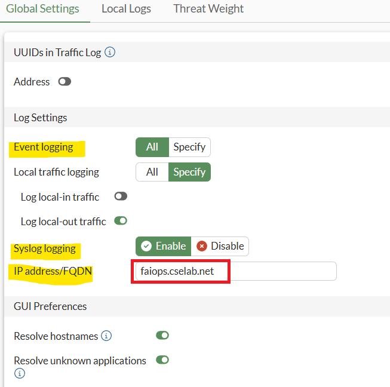
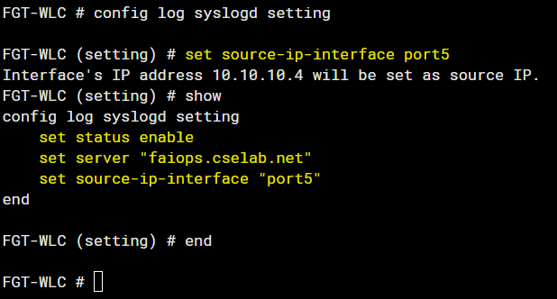

# Lab 7: Event Logs

Whilst FortiAIOps continually polls each FortiGate via REST API to
obtain most of the data shown on the built-in dashboards, not all the
necessary information is accessible via the REST API. FortiAIOps also
needs to ingest and analyse **all** (not some but **all**) of the
FortiGate event logs and application monitoring data. This enables AIOps
to dynamically create normal baselines for your environment and alert
you when things deviate from these normal baselines.

There are two ways FortiAIOps can ingest logs from a Fortigate: this
can be from FortiAnalyzer performing log forwarding or directly from
each Fortigate via Syslog forwarding.

In this lab, you'll enable Syslog Forwarding as we don't have a
FortiAnalyzer (FAZ) in place.

Within the FGT-WLC GUI, navigate to **Log & Report > Log Settings**



Under Global Settings

-   Ensure Event logging is set to **All**

-   Set Syslog logging to **Enable**

-   Set the FQDN to **faiops.cselab.net** (the DNS record you created
    earlier)

-   Select the **Apply** button

Next, you will need to set the Source IP used to send Syslog traffic;
this must match the IP address of the FortiGate that was added within
FortiAIOps.

This can currently only be done via the CLI.

-   Access the FGT-WLC CLI, this can be done by selecting the button in the top right corner of your FGT-WLC browser window, or via an SSH client to 10.222.14.XX:11001

    

Then enter the following CLI commands:



```
config log syslogd setting
set source-ip interface port5
```

!!! note
    This should set the Interface IP address to 10.10.10.4. Confirm this by typing the show command.

```
show
```

Next, type in end to apply the change:

```
end
```

This should be all that is needed to forward the event logs to
FortiAIOps.

To see events in FortiAIOps, you'll need to generate some. To do this,
you'll need to connect a client to the network; however, some additional
configuration steps are required before this can be done.

