# Lab 8: SDWan Interface Config

One of the key use cases for FortiAIOps is monitoring and deep insights
of SD-WAN interfaces across applicable FortiGates.

Before this feature can be utilised, an SD-WAN interface must be
configured.

Please open a HTTPS browser session to your FGT-WLC appliance,
<https://10.222.14.XX:14001>, and log in to the GUI using your admin
credentials.

-   Within the FGT-WLC GUI navigate to **Network > SD-WAN**

-   In the pop-up Window, select the **Configure SD-WAN manually**
    button

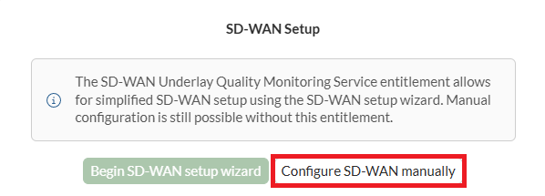

Within SD-WAN Zones

-   Select and **Edit** the **virtual-wan-link Interface**

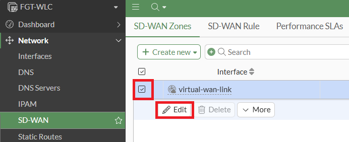

In the Edit SD-WAN Zone slide-out window, select the + within the
Interface members field, then select the +Create button within the
Select Entries pop-up.

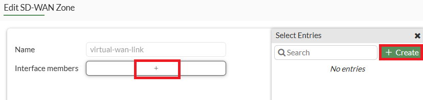

Within the New SD-WAN Member slide-out window,

-   In the Interface dropdown box, select port5

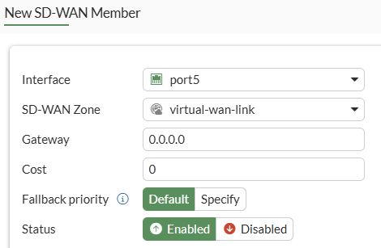

-   Leave all other settings as per default

-   Select the OK button

Back in the Edit SD-WAN Zone, port 5 should be available as a selectable
entry.

-   Select and add port5 to the Interface members

    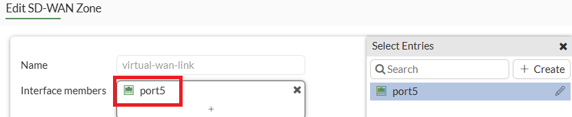

-   Select the OK button

Your SD-WAN interface will now be enabled.

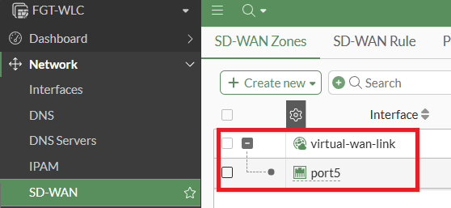

## Setup SD-WAN Performance Monitoring/Logging

For FortiAIOps to receive beneficial SD-WAN Interface metrics, you'll
need to configure some Performance SLA's. FortiOS includes some default
Performance SLAs, which can be helpful, but to better understand how
these operate, you'll create your own.

-   Within your FGT-WLC, navigate to Network > SD-WAN

-   Then, from the top menu bar, select Performance SLAs

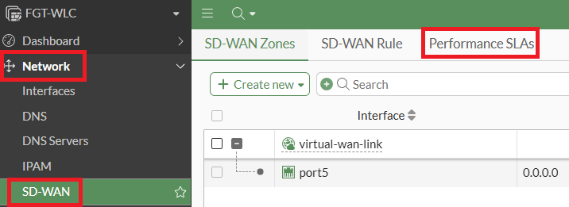

You should see five default performance SLA's listed.

-   Select and delete these.

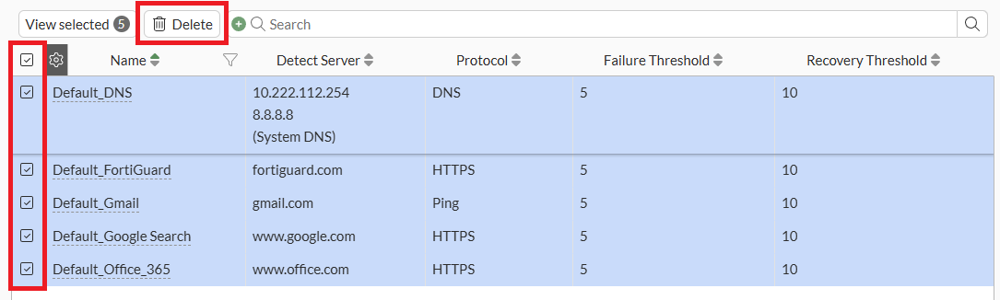

### Create a Ping SLA to Microsoft Teams

A common Performance SLA to create is monitoring of the Microsoft Teams
SIP gateway, which is used to make and receive calls over MS Teams. So,
you'll create a Performance SLA to monitor the connection to MS Teams
from your SD-WAN interface.

Within Performance SLAs, select the **+Create New** button

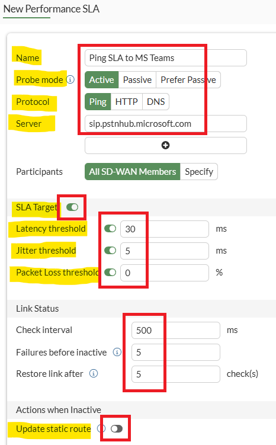

Within the New Performance SLA slide-out window, set the following;

-   Name: **Ping SLA to MS Teams**

-   Probe Mode: **Active**

-   Protocol: **Ping**

-   Server: **sip.pstnhub.microsoft.com** (this FQDN will resolve to the
    closest MS Teams gateway for your region)

-   SLA Target: Set to **Enable**

    -   Latency Threshold: **30ms**

    -   Jitter Threshold: **5ms**

    -   Packet Loss Threshold: **0%**

Link Status

-   Check Interval **500ms**

-   Failure before inactive **5**

-   Restore link after **5** checks

Actions when Inactive

-   Update Static Route: Set to **Disabled.** Why Disabled? If you
    enable this, and the SLA target fails. The static route your SD-WAN
    interface is using will be disabled. If this is the only static
    route available on your FortiGate providing internet access, guess
    what happens? Your internet access has just been shut down. Be very
    careful when enabling the update static route option. This should
    **ONLY** be used where multiple WAN links are available.
    Many customers and partners have logged support tickets stating that
    their internet connection is dropping out. After investigation, it
    was found that this was the root cause. In this case, the static
    route would only be restored if/when the Link Status checks based on
    the SLA Target values pass 5 times using the above configuration.

-   Select the **OK** button

### Create a DNS SLA to Google

Another common Performance SLA to create is the monitoring of Google DNS server availability. So, you'll create a Performance SLA to monitor the connection to Google's primary and secondary DNS servers from your SD-WAN interface.

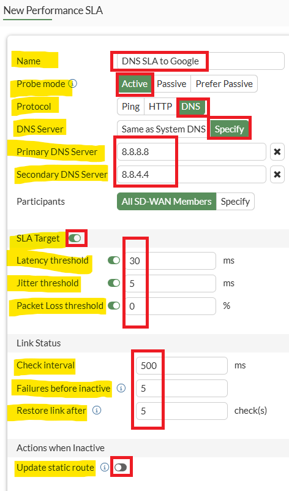

-   Name: **DNS SLA to Google**

-   Probe Mode: **Active**

-   Protocol: **DNS**

-   Primary Server: **8.8.8.8**

-   Select the + Button and add the

Secondary DNS Server: **8.8.4.4**

-   SLA Target: Set to **Enable**

    -   Latency Threshold: **30ms**

    -   Jitter Threshold: **5ms**

    -   Packet Loss Threshold: **0%**

Link Status

-   Check Interval **500ms**

-   Failure before inactive **5**

-   Restore link after **5** checks

Actions when Inactive

Update Static Route: Set to **Disabled.**

If Google DNS is not your preferred DNS provider, you can, of course,
change this to another DNS address. i.e., Cloudflare at 1.1.1.1

### Enable logging of Performance SLA events.

!!! note
    Now that the SD-WAN performance SLAs have been created, we need to enable logging on these for when an SLA is within (pass) or outside (fail) the defined SLA parameters. This can currently only be done via the CLI.

-   Access the FGT-WLC CLI, this can be done by selecting the  button in the top right corner of your FGT-WLC VM browser window, or via an SSH client to 10.222.14.XX:11001

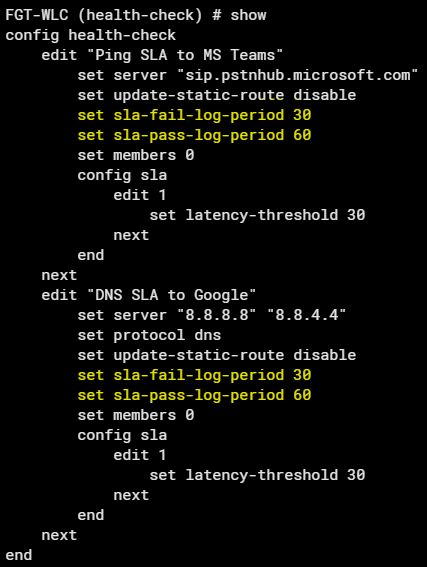

Then enter the following CLI commands:

```
config system sdwan
config health-check
edit "Ping SLA to MS Teams"
set sla-fail-log-period 30
set sla-pass-log-period 60
next
edit "DNS SLA to Google"
set sla-fail-log-period 30
set sla-pass-log-period 60
next
show
end
```

Now that the logging parameters are in place, FortiOS will forward these
performance metrics to FortiAIOps.

It will take at least 30-60 seconds for FortiAIOps to start receiving
log data related to these two SLAs, as per the defined timers.

### Create SD-WAN Rule

SD-WAN rules can be utilized to ensure the best WAN link is chosen,
ultimately improving the user experience.

How the link is utilized and by which applications can also be displayed
within the SD-WAN insights dashboard within FortiAIOps. To enable this,
at least one SD-WAN rule must be created (the default rule will not work
for this purpose).

-   Please open a HTTPS browser session to your FGT-WLC appliance,
    <https://10.222.14.XX:14001>, and log in to the GUI using your admin
    credentials.

-   Within the FGT-WLC GUI, navigate to **Network >** **SD-WAN**

In the top menu bar, select the **SD-WAN Rules** tabs > Then select the **+Create New** button

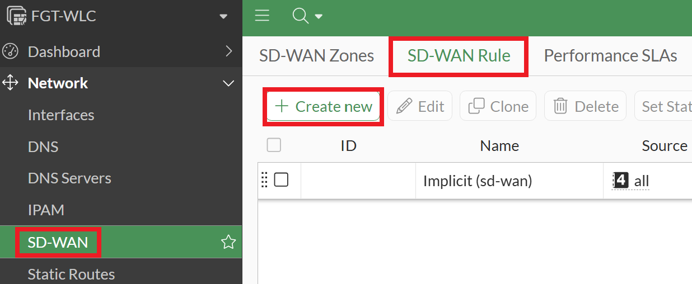

In the Priority Rule pop-out window, set the following;

Name: **All-Traffic**

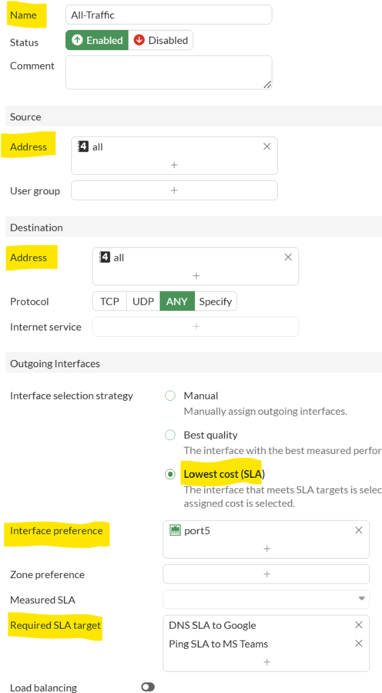

-   Under **Source > Address**: Select **all**

-   Under **Destination > Address**: Select **all**

-   Under **Outgoing Interfaces > Interface Selection Strategy**

-   Select **Lowest Cost (SLA)**

-   Interface Preference: **port5**

-   Required SLA target: **Select DNS SLA to Google & Ping SLA to MS
    Teams**

-   Select the **OK** button

This is all that's needed to begin visualizing SD-WAN traffic flows
within the SD-WAN dashboard, which you'll look into shortly.

### SD-WAN Interface Available Bandwidth

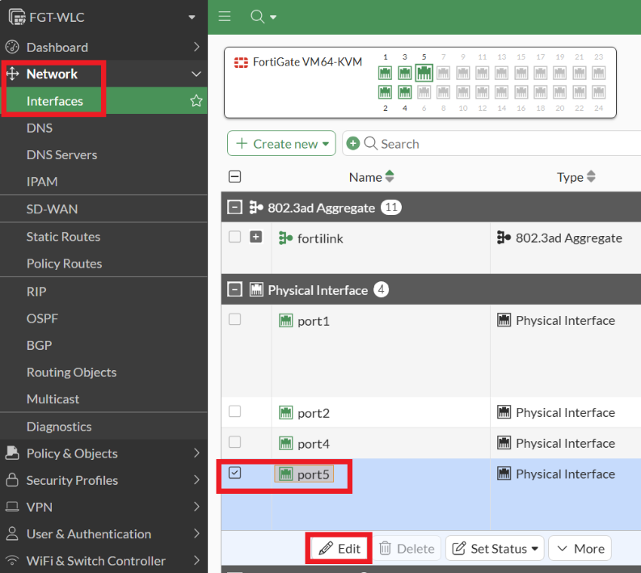

FortiAIOps SD-WAN insights monitoring can also display bandwidth
availability over time.

To capture this, the WAN interface/s being used must have their maximum
bandwidth values set within FortiOS.

-   Within the FGT-WLC GUI, navigate to **Network > Interfaces**

-   Select **port5** -- Your WAN interface

-   Select the **Edit** button

Within the Edit Interface pop-out window, set the following

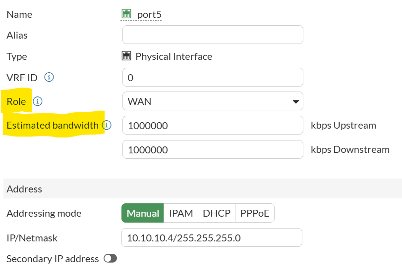

-   Role to **WAN**

The Estimated bandwidth

-   **1000000 Kbps** Upstream

-   **1000000 Kbps** Downstream

-   Select the **OK** button

Note that these values are what FortiOS uses for bandwidth calculations.

-   1000Kbps is 1Mbps

-   1000Mbps is 1Gbps

If you were to set it to 1048576 kbps, this would display as 1.05 Gbps.

!!! note
    Currently using the build in the workshop, values under 1000000kbps or 1Gbps are not recognised by FortiAIOps. This has been resolved in the latest FortiAIOps v3.0 Beta 3 image.

## Validate Licensing Status

Now that SD-WAN has been enabled on your FGT-WLC, it should also consume
an SD-WAN license within FortiAIOps.

-   If you haven't already, please open a HTTPS browser session to your
    FortiAIOps appliance, <https://10.222.14.XX:14002>, login using the
    admin credentials (admin/Fortinet123!) and perform the following
    steps.

-   Navigate to **Inventory > Managed FortiGates**

You should now see that the SD-WAN component is displayed as Licensed.

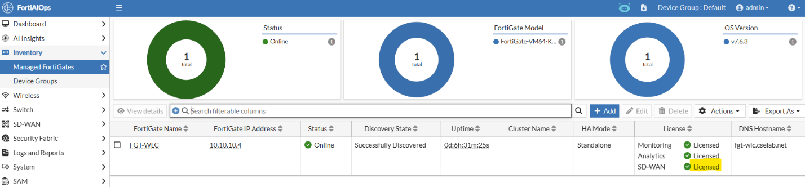

-   **Navigate to System > Licensing**

You should see that an SD-WAN License has now been consumed.

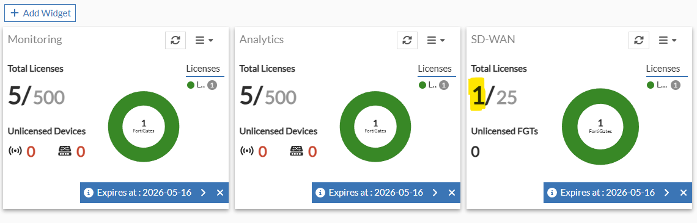

!!! note
    If you've added a HA cluster, as opposed to a Standalone
FortiGate, it will still only consume one SD-WAN license.

