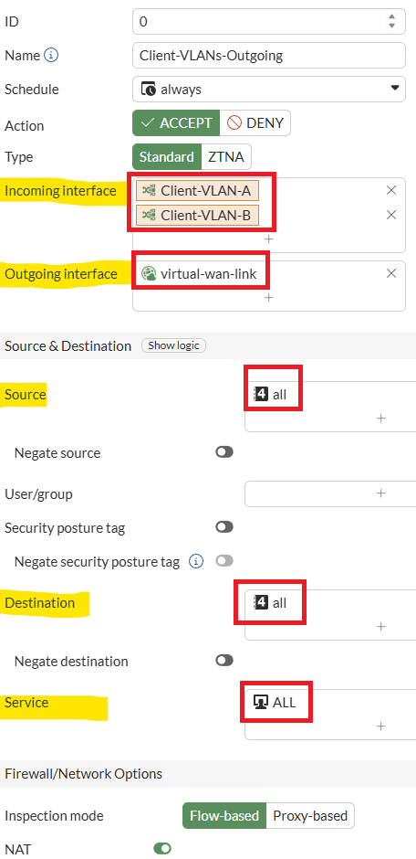
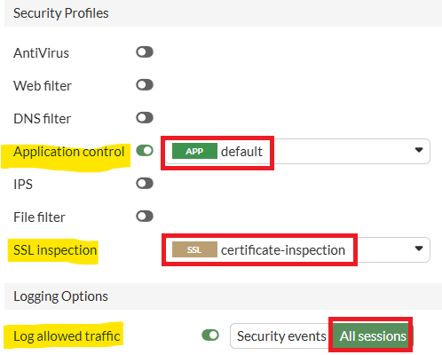
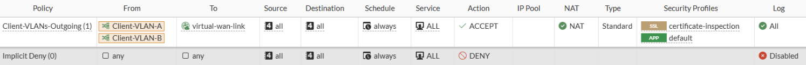

# Lab 9: Firewall Policies

Within this section, you will need to create the relevant firewall rules
to ensure that your Windows Clients can reach the internet, in order to
generate some traffic to show in FortiAIOps. Without devices connecting
to the network/traffic flow. FortiAIOps will not have any data to learn
from in order to provide intelligent feedback.

As your Clients will connect to VLANs 20 and 30, traffic must pass
through the FGT-WLC to reach the WAN/Internet. Therefore, you'll need to
create a firewall policy on this FortiGate (FGT-WLC) to allow for
relevant traffic to pass out via the SD-WAN interface.

A similar configuration would be necessary in a production environment.

-   Please open a HTTPS browser session to your FGT-WLC appliance,
    <https://10.222.14.XX:14001>, and log in to the GUI using your admin
    credentials.

## Configure Outgoing Policy from Client VLANs

Navigate to **Policy & Objects \> Firewall Policy**

From the top menu bar, select the **+Create New** button

In the Create New Policy pop-up window, enter the following.

-   Name: **Client-VLANs-Outgoing**

-   Incoming Interface: Select **Client-VLAN-A** & **Client VLAN-B**

!!! note
    If you can't select multiple interfaces in your policy, you missed enabling this feature during the Initial Setup

-   Outgoing Interface: **virtual-wan-link** (towards Server
    subnet/internet)

-   Source: Select **All or Client-VLAN-A & Client-VLAN-B addresses**

-   Destination: Select **All**

-   Service: Select **All**

Under Security Profiles, set the following;

-   Application Control: **Enable using the default profile**

-   SSL Inspection: **Select certificate-inspection**

-   Select the **OK** button

!!! note
    Application control with SSL certificate inspection and logging of all traffic must be enabled on any policy where you want to show application-specific data within FortiAIOps.

You should now see the Firewall policy listed under **Policy & Objects
\> Firewall Policy** on your lab FGT-WLC. Note that the display choice
is set to **By Sequence** for this view.

