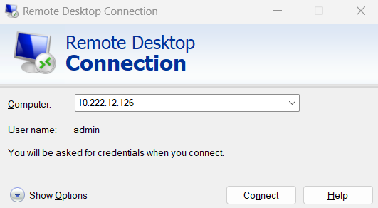
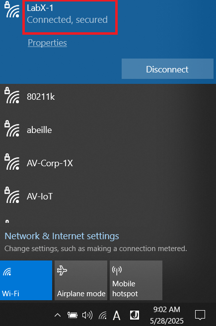
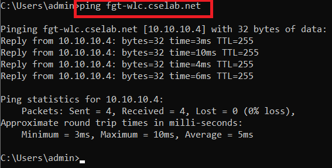
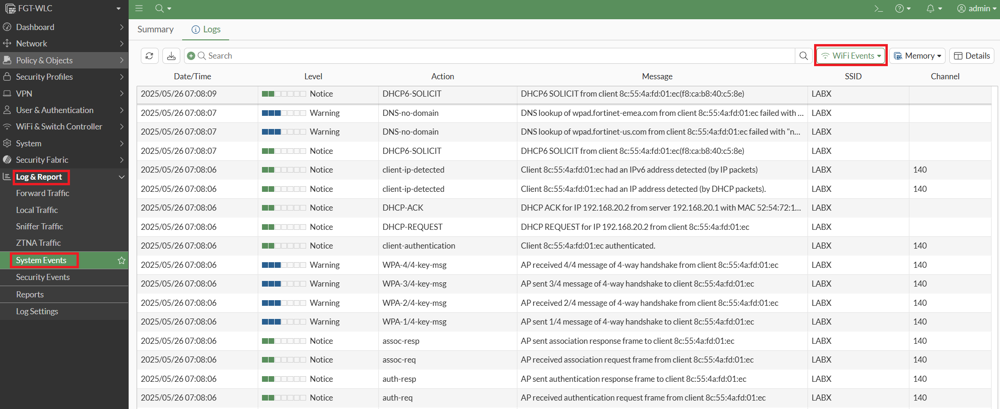
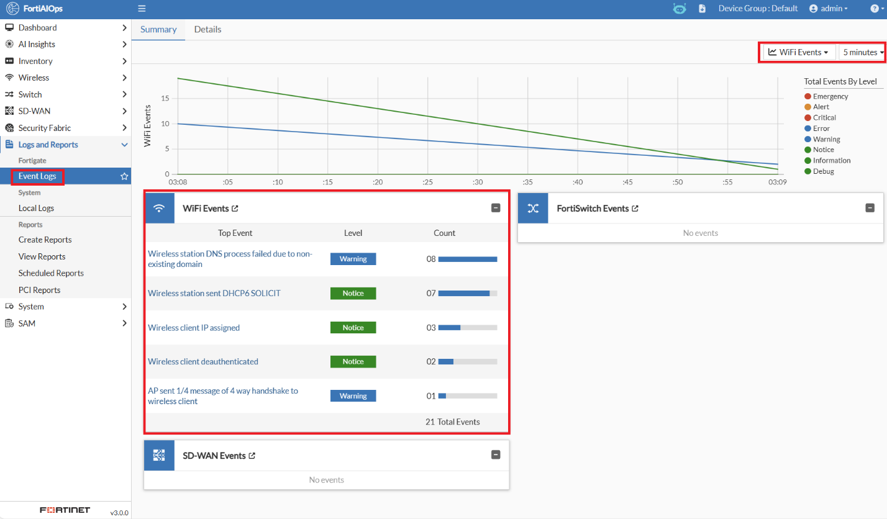
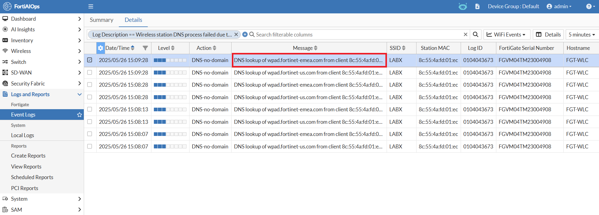
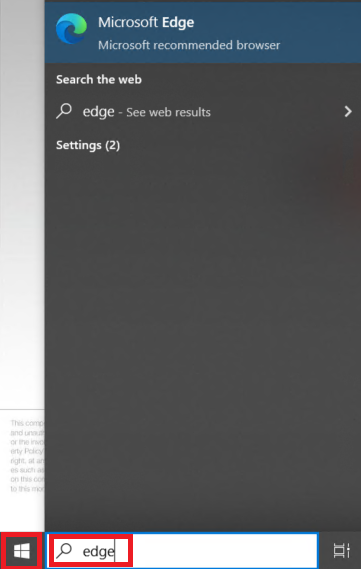
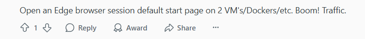
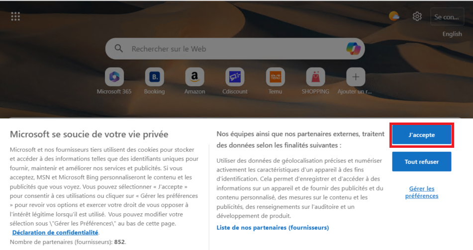

# Lab 10: Network Connectivity

Within this section, you complete the steps needed to join your lab Windows 10 PC to the Wi-Fi Network LabX-1 → Where X is your Pod#

-   **Open an RDP session to your lab Windows 10 PC** (mstsc.exe if using Windows or Windows App on MacOS) to **10.222.12.1XX,** Where XX is your pod number, i.e., If you're using POD01, your Windows 10 PC will be 10.222.12.101

Username: **admin**

Password: **fortinet**

## Connect to Lab SSID 

-   On your lab Windows 10 PC, **connect to the LabX-1**, replace X with your Pod #

-   Select the **LabX-1** and **enable** the option to **Connect
    automatically,** then select the **Connect** button

-   Enter the network security key you set in Section 5 -- Should be
    **fortinet**

Select the **Next** button

You should now be connected to the LabX-1 SSID

Next, validate that you can reach your lab FortiGate

On your lab Windows 10 PC, open a command prompt

-   Select the start button and type in **cmd.exe**

-   From the command prompt, **ping fgt-wlc.cselab.net**

You should get a successful reply from 10.10.10.4

### Validate Event Logging

In lab 7, you set up Event Log forwarding from FortiGate to
FortiAIOps. You should validate that Wireless Events seen in your
FGT-WLC are now being sent to FortiAIOps.

-   On your lab FGT-WLC, navigate to **Log & Report \> System Events**

-   In the top menu bar, set the **Event type dropdown** box to **WiFi
    Events**

You should see some recent events from when your Windows 10 laptop
connected to the Wi-Fi network (SSID).

Notably, the events listed below;

-   Authentication request and response

-   Association request and response

-   4-way-handshake

-   DHCP request and acknowledgement, assigning an IP address to the
    device.

On FortiAIOps, you should see the same. However, the data will be
grouped logically based on Event type.

Within the FortiAIOps GUI, navigate to **Logs and Reports \> Event
Logs**

**Within the Summary Dashboard, set the Event type to WiFi Events that
have occurred over the past 5 minutes**

You should see the same information as shown in the screenshot below.
This confirms your FortiAIOps instance is now receiving the syslog data
forwarded from your FortiGate.

Note: One event log you'll commonly see, where Windows devices are deployed, is 'Wireless station DNS process failed due to non-existent domains.' Upon drilling down into this, you'll notice that your Windows
devices are trying to resolve a wpad.domainname record.

WPAD.domainname is the DNS **Web Proxy Auto-Discovery** mechanism that
Windows can use to discover and use a web proxy server on the network.
If this is a problem for your customers and they don't want to see this
warning, they will need to disable WPAD on each Windows client. The
easiest way to do this is outlined on this website. [Disable WPAD via
GPO (Verified)](https://projectblack.io/blog/disable-wpad-via-gpo/)

This is not considered a FortiOS/FortiAIOps issue.

## Enable Random Web-Traffic Generator on Lab PC

While looking for a random application generator or tool, a Reddit user commented....This has been confirmed to work sufficiently well in this lab environment.

On your Windows 10 Laptop, open Microsoft Edge. Unfortunately, this has
been removed from the Taskbar as it was considered "not useful".
However, when generating random web traffic, it's a fantastic tool. As
it continually polls the widgets being displayed on the start-up page.

Also, unfortunately, (unless you can read French), as these Laptops are
in Sophia, France, everything's displayed in French.

-   To do this, select the **Start button** on your Windows 10 laptop

-   Type in "**Edge**"

-   And select **Microsoft Edge** to launch "Microsoft's Recommended
    Browser"

If this is the first time Microsoft Edge is being launched, you may see a page saying "Microsoft cares about your privacy" in French. Please accept the Microsoft privacy terms (to
share/sell all your web history) with third parties, by clicking on the
J'accepte option.

This will then trigger Microsoft Edge to open widgets for local news,
weather, sports events, and other relevant content. Please scroll down
this page a bit to open a number of widgets for traffic generation. If
you find that traffic stops being generated later in this lab, please
refresh this page.

