# Lab 11: Dashboards & Toolsets
Now that data is being polled from your FortiGate by FortiAIOps, and
logs are being forwarded to your FortiAIOps appliance, you can now look
into the dashboards, monitoring, and insight toolsets that FortiAIOps
brings to the table.

Please understand that, although you won't have time to drill down into
every component during this hands-on lab, the goal of this section is to
understand and explore some of the key benefits of FortiAIOps and how it
can be a valuable toolset to include with any SD-WAN, Wireless, and/or
Switching deployment.

## Default Dashboard

-   If you haven't already, please open a HTTPS browser session to your
    FortiAIOps appliance, <https://10.222.14.XX:14002>, login using the
    admin credentials (admin/Fortinet123!) and perform the following
    steps.

-   Navigate to **Dashboard \> Summary**

The default dashboard is the dashboard you'll see when first logging
into the device. This displays a high-level, centralized view of all
devices (FGT, FSW, and FAP) in your environment, along with their
performance statistics, including CPU and memory usage, and events
observed over a set period of time. This is shown through a number of
widgets, with up to a maximum of 20 widgets being supported.

Note: All of these widgets can be drilled down into to see further
specifics relating to the datasets shown.

##  

## AI Insights Dashboard

AI Insights are one of the core values FortiAIOps brings to the table.
It's where in-depth machine learning occurs, used to make intelligent
recommendations when an issue is detected (breaches SLA).

The real power comes from AIOps being able to analyse every single event
log and determine where an issue exists or not.

If you look at the events logs in a typical 1000-seat deployment that a
FortiGate generates, there's potential during peak times for hundreds of
events per second to occur. There's no way a network administrator can
browse through these events in a timely manner to determine whether
performance issues are being seen. It's more than likely that users will
start complaining before anyone looks into a problem...

During this section, you'll look at how some of the SLAs can be set, and
a dynamic baseline can be created. In addition to reviewing a couple of
scenarios that AIOps is designed to flag as user experience issues.

## SLA Config

FortiAIOps includes numerous performance SLAs, and this number continues
to grow with each new release. These SLAs are used as baselines to
determine what's normal in an environment. Whilst this is fine for
specific issues, such as someone using the wrong password to access the
Wi-Fi network, you're likely aware that every environment is different.

Because of this, within FortiAIOps, you can tweak some SLA values.

-   If you haven't already, please open a HTTPS browser session to your
    FortiAIOps appliance, <https://10.222.14.XX:14002>, log in using the
    admin credentials (admin/Fortinet123!), and perform the following
    steps.

-   Navigate to **AI Insights \> Configurations \> SLA Config**

You should see the **SLA Configurations > Device Health** page.

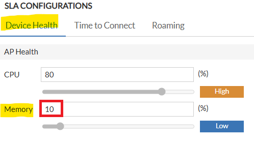

Here you can manually adjust the SLA
triggers for specific metrics. The default values are recommended as the
starting point for any production environment. However, **IF** it was
considered normal that your devices were often sitting at 80% CPU/memory
usage. You can increase this value to a higher point to prevent the
dashboard from being flooded with SLA warning messages.

-   Within the Device Health Page, change the **AP Health \> Memory
    Value** to **10%**.

-   Select the **Apply** button

This will, of course, change the SLA trigger point, meaning that if an
AP is seen to be using over 10% memory, its health status would fall
outside SLA. The results of this change will be shown within the
Impacted SLAs, Impacted Devices, and Wireless Summary Dashboard, which
you'll look into shortly.

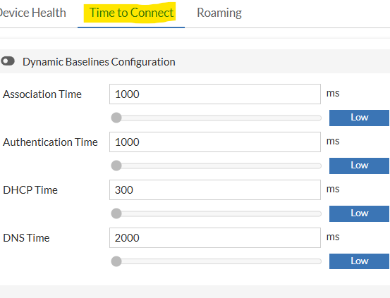

-   Next, navigate to **SLA Configurations \>** **Time to Connect**

Within this section, you can adjust some of the baseline SLA values for
Wired/Wireless clients that are monitored during initial connection to
the network and throughout the time they are connected.

For example, when a Wi-Fi client connects;

-   If they take longer than 1,000ms to associate or authenticate to
    their Wi-Fi Network (SSID), this would be flagged as a user
    experience issue.

-   If they take longer than 300ms to get a response from a DHCP server,
    this would be flagged as a user experience issue

-   If it takes longer than 2,000 ms to resolve a DNS query, this would
    be flagged as a user experience issue. **Note: '**DNS time' is not
    yet supported by FortiOS. However, if a DNS server is not responsive
    at all or an invalid DNS query is made (i.e., trying to reach an
    unresolvable FQDN), this will be flagged.

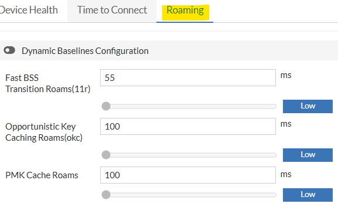

-   Next, navigate to **SLA Configurations \>** **Roaming**

Within this section, you can adjust some of the roaming baseline SLA
values for Wireless clients that are monitored throughout the time they
are connected.

-   If they take longer than 55ms to perform an 802.11r-based roam, it
    would be flagged as a user experience issue.

-   If they take longer than 100ms to perform an OKC-based roam, it
    would be flagged as a user experience issue.

-   If they take longer than 100ms to perform a PMKID-based roam, it
    would be flagged as a user experience issue.

The above Time to Connect and Roaming SLAs values are quite relaxed, and
to be honest, if those values are triggered because a client falls
outside the SLA, users would likely notice that it's taking a while to
connect to the network.

### Dynamic Baselines

You may have noticed that within both the **Time to Connect** and
**Roaming** sections, FortiAIOps has an option to enable **Dynamic
Baseline Configuration**.

Dynamic Baselining allows FortiAIOps to learn about the environment by
monitoring the user experience over time. It then creates a baseline for
these use cases, which in turn can help identify user experience issues
before users even notice them.

Unfortunately, dynamic baselining is not something we can validate
during a workshop, as it requires at least a full day's worth of data to
start building a baseline. The more data is available, the better the
baseline quality, due to the increased number of data points. However,
understanding how this works is key as it's a true benefit.

-   Navigate back to **SLA Configurations \>** **Time to Connect** and
    set the following;

-   Dynamic Baseline Configuration: **Enable**

-   Scope: **FortiGate** -- Baselines can be built on a per Group, per FortiGate, or AP basis

    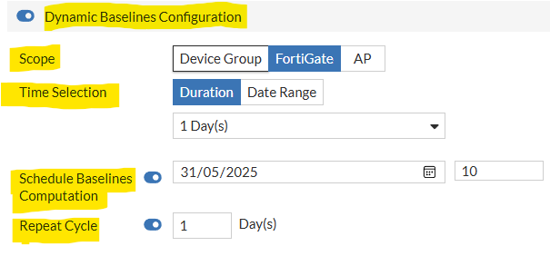

-   Time Selection: **Duration and select 1 Day(s)**(range the baseline
    thresholds will be built upon). Hence, you need at least one day of
    data collection.

-   Schedule Baselines Computation: **Enter tomorrow's date and the hour
    marker (e.g., 10 for 10:00 AM),** ideally 24 hours beyond the
    current time. (You are setting what date and hour to run the
    baselining algorithm).

-   Repeat Cycle: **1 Day(s)** How often do re-run the baseline

-   Select the **Apply** button

Once the baseline algorithm has been run,
the baseline values calculated
by FortiAIOps are displayed in the table, as shown below.

As shown in the table above, the association, authentication, and DHCP
response times are significantly lower than the default/manual
baselines. This baseline was calculated on a Per AP basis.

For example, for AP S/N: FP231GTF22000080, if an association takes
longer than 2milli-seconds, this would be flagged as a user-experience
issue as it's outside the normal boundaries expected for this AP.

-   Navigate back to **SLA Configurations \>** **Roaming** and set the
    following;

-   Dynamic Baseline Configuration: **Enable**

    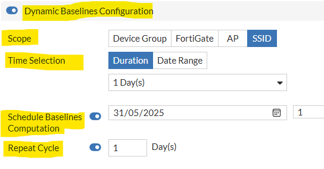

-   Scope: **SSID** - Baselines can be built on a per Group, per
    Fortigate, per AP, or SSID basis

-   Time Selection: **Duration and select 1 Day(s)**(range the baseline
    thresholds will be built upon). Hence, you need at least one day of
    data collection.

-   Schedule Baselines Computation: **Enter tomorrow's date and the hour
    marker (e.g., 1 for 1:00 AM), ideally 24 hours beyond the current
    time**. (The date and hour to run the baselining algorithm).

-   Repeat Cycle: **1 Day(s)** How often do re-run the baseline

-   Select the **Apply** button

Once the baseline algorithm has been run,

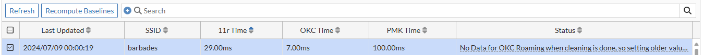
the baseline value/s calculated by FortiAIOps are displayed in the
table. You can recompute specific baseline values as per the image
below.

You can see in the table above that the 11r roaming and OKC roaming
baselines are far less than the default/manual baselines. This baseline
was calculated on a Per SSID basis.

If no specific data is seen, i.e., a PMK-based roam, then this value
would, of course, not be modified from the default baseline value. If no
data is seen for a specific roam type, the current value will be kept as
the baseline.

### Impacted SLAs

The Impacted SLAs dashboard shows where

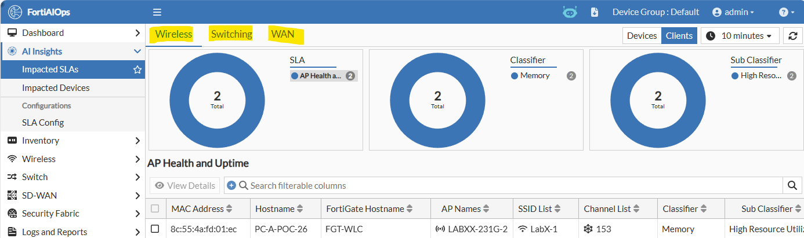
client/s or device/s are potentially impacted as a result of a defined
or dynamic SLA baseline not being met due to a Wireless, Switching, or
WAN-related issue.

-   Navigate to **AI Insights \> Impacted SLAs**

On the **Wireless Clients** dashboard, you should see that your Windows
10 laptop is potentially impacted.

If you select the Windows 10 laptop and then the View Details button,
you will see why this is the case.

Because the Access Point it's connected to is reporting high memory
utilisation.

Hence, you can easily see from this dashboard which devices (FAP/FSW)
may be impacted and as a direct result and which clients may be impacted
because they are connected to the network via these impact device/s.

### Impacted Devices

The Impacted Devices dashboard shows where

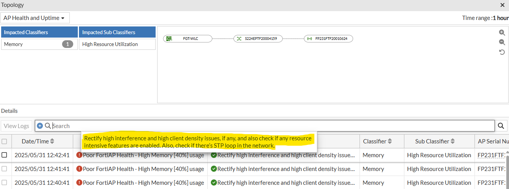
SLAs have not been met for any monitored devices. When an impacted
device is displayed, you are informed of the issue and can drill down
into that device for further insights into the exact reason this SLA has
not been met.

### Troubleshooting Scenario 1

Next, you'll generate some more events that should fall outside of the
defined built-in SLAs and use FortiAIOps to troubleshoot these.

#### Connect to Windows 11 Laptop

Put your end-user hat on and complete the steps needed to join your lab Windows 11 PC to the Wi-Fi Network LabX-1 → Where X is your Pod#

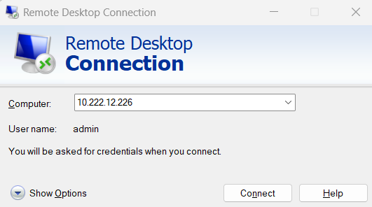

-   **Open an RDP session to your lab Windows 11 PC** (mstsc.exe if using Windows or Windows App on MacOS) to **10.222.12.226,** Where XX is your pod number, i.e., If you're using POD01, your Windows 11 PC will be 10.222.12.201

Username: **admin**

Password: **fortinet**

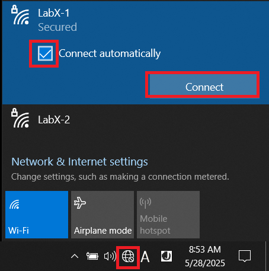

#### Connect to Lab SSID 

-   On your lab Windows 11 PC, **connect to the LabX-1**, replace X with your Pod #

-   Select the **LabX-1** and **enable** the option to **Connect
    automatically,** then select the **Connect** button

-   Enter the network security, i.e., **fortinet**

-   Select the **Next** button

You should now be connected to the LabX-1 SSID and be able to browse the internet...Ohh, wait, what? No Internet?

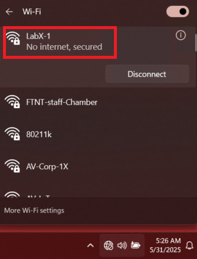

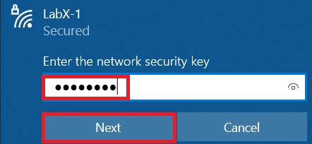

Let's go see MIS/IT and figure this out....

Now put your MIS/I.T./Helpdesk hat on and jump into the FortiAIOps
dashboard to figure this out...

-   Navigate to **AI Insights \> Impacted SLAs**

You should see a connection failure listed.

-   Highlight the impacted client (your Windows 11 laptop) and then
    select the **View Details** button to drill down further into the
    issue.

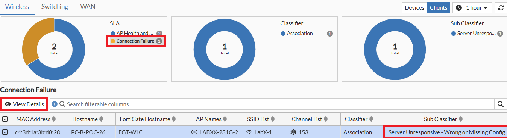

The connected topology of your Windows 11 PC should appear in a window,
along with the issue and potential remedies to resolve the lack of
internet access.

In this case, the specific remedy is missing; it was listed in earlier
builds, however, in this build it's not showing (it'll be back).
However, it does provide a close indication of where the issue lies. Can
you resolve the problem and get your Windows 11 laptop online?

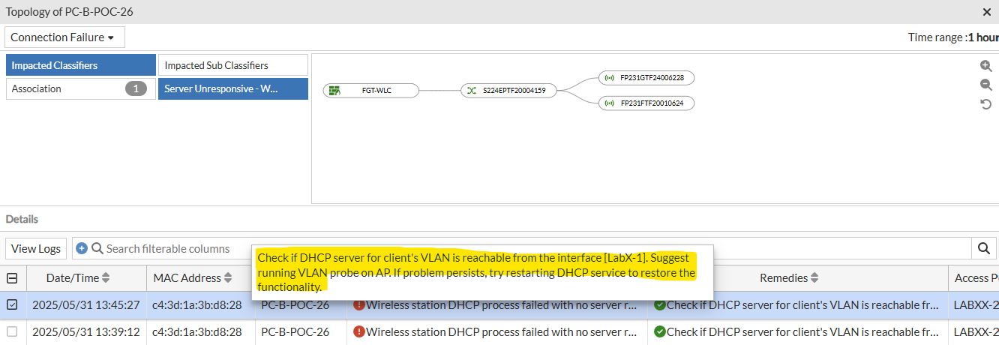

Once you believe you've figured it out, please put your end-user hat
back on and try connecting your Windows 11 PC to the network again. If
you've resolved it, your Windows 11 laptop should connect to the LabX-1
Wi-Fi Network, and you should be able to access the internet.

### Troubleshooting Scenario 2

Please put back on your end-user hat

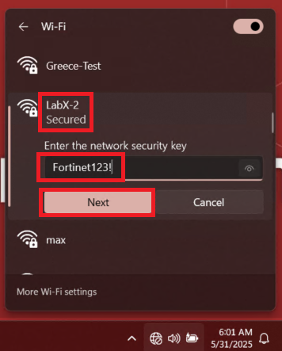

-   On your lab Windows 11 PC, **connect to the LabX-2**, replace X with your Pod #

-   Select the **LabX-2** and **enable** the option to **Connect
    automatically,** then select the **Connect** button

-   Enter the network security key, i.e., **Fortinet123!**

-   Select the **Next** button

You should now be connected to the LabX-2 SSID. Oh, wait, what again?
You can't connect...Surely it's not your fault!

Time to go blame MIS/I.T. for the issue, since it was their fault in
Scenario 1.

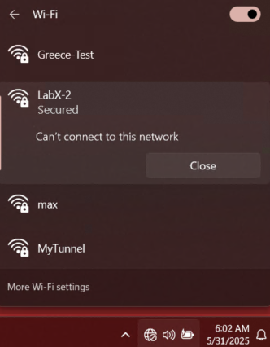

Now put your MIS/I.T./Helpdesk hat on and jump into the FortiAIOps
dashboard to figure this out...

-   Navigate to **AI Insights \> Impacted SLAs**

You should see connection failure listed or an addition to the previous
connection failures, depending on how fast you resolved the last issue.

-   Highlight the impacted client (your Windows 11 laptop) and then select the **View Details** button to drill down further into the issue.

    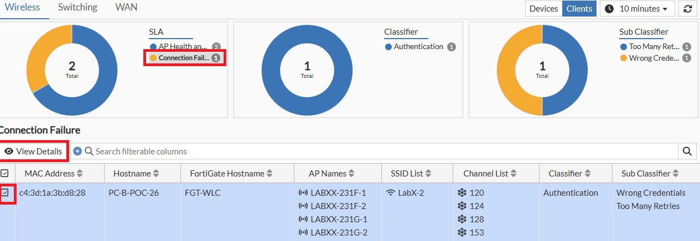

-   What's the issue? The wrong PSK was used.

-   Did you notice the client's behaviour when entering the wrong PSK?
    It attempted to connect to every access point (AP) in range, not
    just one, but all of them. AP1 failed, so I tried AP2, and so on.

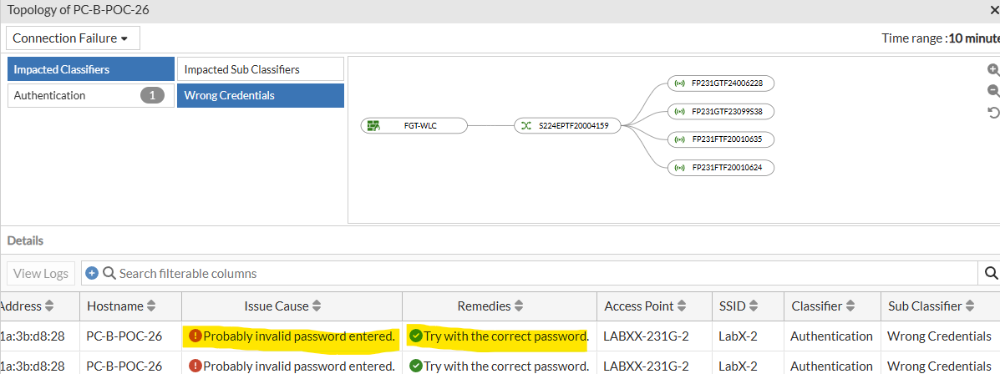

-   Try connecting again with the correct PSK. Now you can get back to
    the end user with the fix, which is to use the correct PSK, as set
    in Lab Section 5.

## Inventory Dashboard

As per Section 7, this is where you can add, remove, or reboot
FortiGates from within FortiAIOps. However, it's also where you need to
go to access the Diagnostics and Tools for any FortiGate monitored by
FortiAIOps.

Within the FortiAIOps GUI

-   Navigate to **Inventory \> Managed FortiGates**

-   Select your lab FGT-WLC, and then select the View Details button
    from the menu bar above it

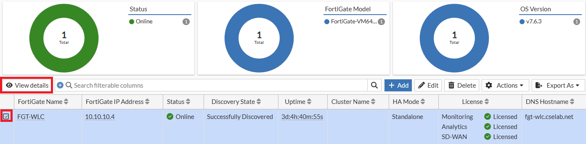

The Diagnostics and Tools slide-out/pop-up window should appear

Within the Diagnostics and Tools section, a significant amount of data
is made available at a per-FortiGate level. At a high level;

-   You can look at the performance over time

-   Wireless Channel Summary for any managed APs

-   Check the status of any managed FortiAPs, FortiSwitch, and connected
    clients, as well as the ability to drill down into each of these.

-   Full event log history

-   And Tools...

There are many tools available within FortiAIOps that can save a
significant amount of time and simplify troubleshooting or even logging
a TAC case.

You'll notice that from within FortiAIOps, you can run;

-   A Packet Capture

-   Check the ARP table

-   Check the Routing Table

-   Check DHCP addresses that have been leased

-   Perform DNS and Reverse DNS queries

-   Access the FortiGate CLI

-   Check the processes running

-   Run a TAC report

### What's a TAC report?

It's a report that should be included with every FortiCare ticket logged
where a FortiGate, Managed FortiAP, and/or managed FortiSwitch is
involved.

Included within this report are a number of status and diagnostics
commands that TAC would typically need to assist with diagnosing an
issue. By including this report upfront, it will reduce the time to
resolution, as TAC will be given a substantial amount of information to
start with, rather than needing to go back and forth asking for the
output of specific CLI commands.

-   Within the Diagnostics and Tools \> Tools window, select the **Run**
    button next to the **TAC Report** option

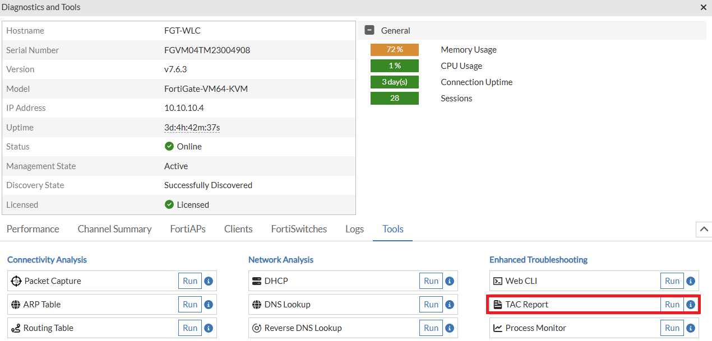

This should trigger the TAC Report to be downloaded from within
FortiAIOs.

-   Save and open the TAC Report to view the level of information
    included

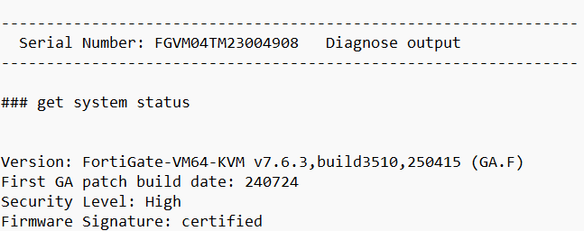

## Wireless Dashboards

-   Navigate to **Dashboard \> Wireless**

The Wireless dashboards provide in-depth monitoring and insights into
the entire Fortinet-managed wireless environment. Showing details RF
information from Access Point health, channel planning & utilisation
metrics, applications being used, and location data in both real time
and historically up to a period of 24 months, depending on data storage
availability.

### Access Points Dashboard

-   Navigate to **Wireless \> Access Points**

The Wireless Access Points dashboard shows the current status of all
Access Points being monitored by FortiAIOps. By default, this dashboard
shows;

-   AP Status

-   Uptime

-   SSIDs in use

-   Bands in use

-   Radio channel of operation

-   Number of connected Wi-Fi clients

-   AP Firmware Version

-   Which switchport an AP is connected to via LLDP

-   What FortiGate the AP is managed by

-   AP license status

    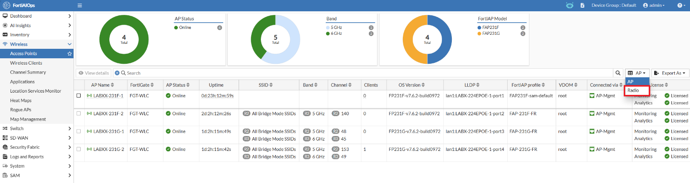

### Radio Dashboard

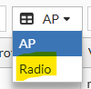

-   On the right-hand side of this dashboard, in the dropdown box
    showing the **AP** view, change this to **Radio** view

The Radio dashboard will display numerous additional AP configuration
details such as;

-   Radio Type

-   Radio Mode

-   Channel Utilization

-   Configured Radio Transmit Power

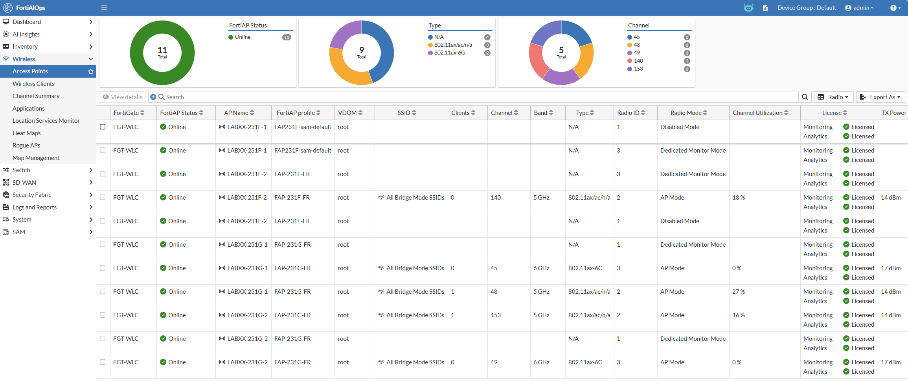

This dashboard can be used to help identify any misconfiguration across
your APs, such as incorrect radio transmit power. However, the Channel
Summary Dashboard is also an excellent tool for this purpose, which
you'll explore shortly.

### AP Diagnostics and Tools

Drilling down into the APs or Radio listed within the Wireless Access
Point Dashboard, you will be able to access the AP Diagnostics and Tools
window.

-   Navigate to **Wireless \> Access Points**

-   **Select one** of your **FAP-231F access points** i.e. **FAP-LABXX-231F-2** → Where XX is your Pod#

-   **Select** the **View details** button from the menu bar above

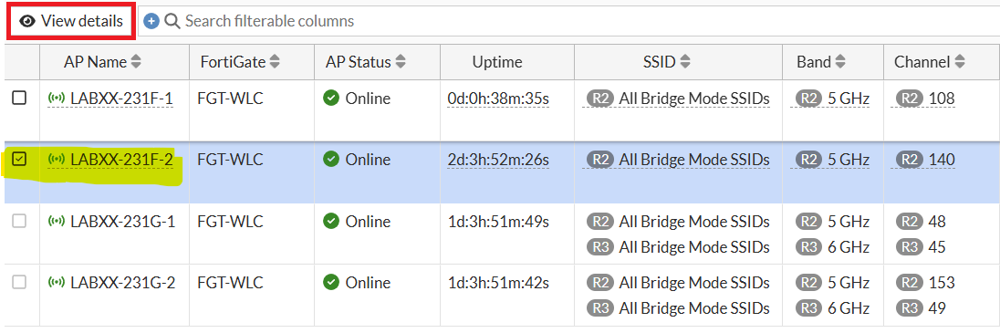

### Performance \> AP Health

The Diagnostic and Tools pop-out window

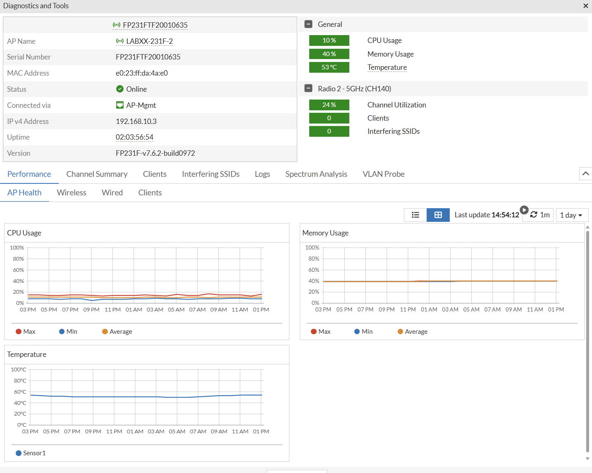
should appear, displaying details related to the specifically selected
Access Point, with the Performance \> AP Health page initially
displayed.

Within this page, you'll notice many key wireless performance
statistics, many of which can highlight if there are potential Wi-Fi
user experience issues, such as;

-   AP CPU Usage

-   Channel Utilization

-   Number of Clients

#### Performance \> Wireless

-   From the tabs listed, under **Performance,** select the **Wireless**
    tab

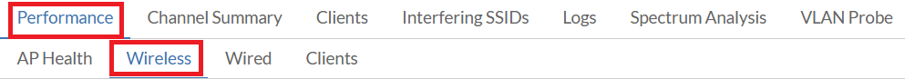

You should now see further Wi-Fi performance metrics which can and are
used to highlight Wi-Fi user experience issues such as;

**Transmission: Discards (loss) and Retries;** If seen, this will often
mean users will be experiencing a degradation in performance

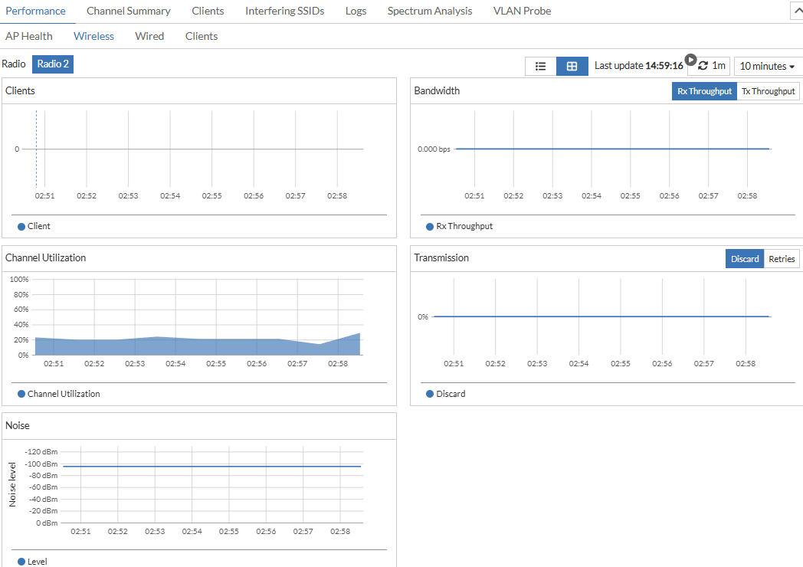**Noise:** Noise (background RF
interference) can be detrimental if it is too high, directly impacting
the client's signal-to-noise ratio (SNR) or their ability to hear and
decode wireless frames. This can result in clients needing to drop to
lower data rates to transmit or receive, or if too high, can result in
excessive retries and loss occurring. Ideally, you'd want the noise in
your environment to be lower than -90 dBm, but this may be impossible,
especially on the 2.4 GHz band, which is becoming more and more
saturated with wearables, like EarPods, Watches, Rings, and other IoT
devices.

### Spectrum Analysis

All currently supported FortiGate Managed APs can function as a Wi-Fi
spectrum analyzer on the bands for which their radios are capable of
operating.

This can help identify wireless user experience issues caused by
non-Wi-Fi interference, which is becoming increasingly common,
especially in the green energy and energy-saving sectors.

More entities are transitioning to energy-star-rated offerings, such as
smart homes and smart buildings, to reduce their energy costs.
Structures with higher energy-star ratings often have mandatory
energy-saving devices that can and do interfere with wireless networks.

Many customers' Wi-Fi networks, including several Fortinet offices
worldwide, have fallen victim to energy-saving devices that have
directly impacted wireless deployments.

The most common cause of these issues is the use of motion sensors,
which can activate and deactivate lighting.
[Example](https://www.dropbox.com/scl/fi/xtb3trmy3cmj5dp5bzgud/DET150.pdf?rlkey=1d9atkqj40wgrq83mtlsw8p5k&dl=0)

These devices typically operate

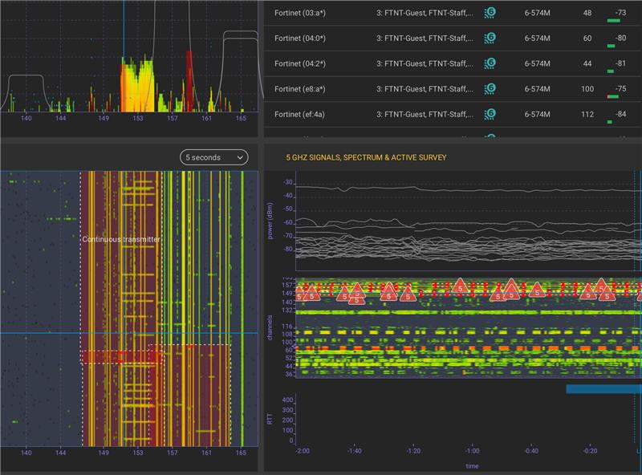 within the UNII-3 band,
primarily around 5.8 GHz, but also cross into the 5.7 GHz and 5.9 GHz
ranges. Hence, this means typically that CH149-165 are unusable where
these devices have been deployed. The image below contains an example of
what you may see if using an Ekahau Sidekick as a spectrum analyzer in
the same space.

Now, if you have a Spectrum Analyzer available, such as an Ekahau Side
Kick, you would see something similar to the image below, highlighting a
continuous transmitter nearby.

However, as most customers don't have high-end Wi-Fi troubleshooting
hardware on hand, using the Spectrum Analyzer capability built into
FortiAP/FortiAIOps can also help identify if there's an RF problem.

Note: The signal interference doesn't need to be relatively loud, just
persistent. That's all it takes. However, in your lab environment, it's
very easy to see why the 2.4GHz band isn't ideal to use.

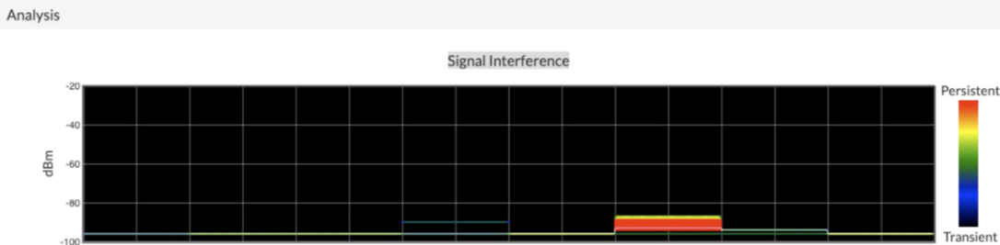

Continuing within the AP Diagnostics and Tools window

-   Navigate to **Spectrum Analysis**

    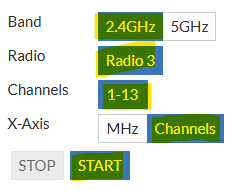

!!! note
    Within the Spectrum Analysis Dashboard, select the following:

-   Band: **2.4GHz**

-   Radio: **Radio 3**

-   Channels: **1-13**

-   X-Axis: **MHz or Channels** (whatever you prefer)

-   Then select the **Start** button

It will take some time for the Spectrum analysis data to be shown. Let
it run for approximately 1- 2 minutes and then look at the results. It
should start to look like the images below;

As you can see from

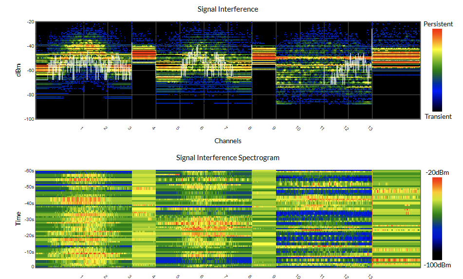 the Signal Interference
Spectrograms, the 2.4GHz channel is showing significant RF noise.

By further comparing

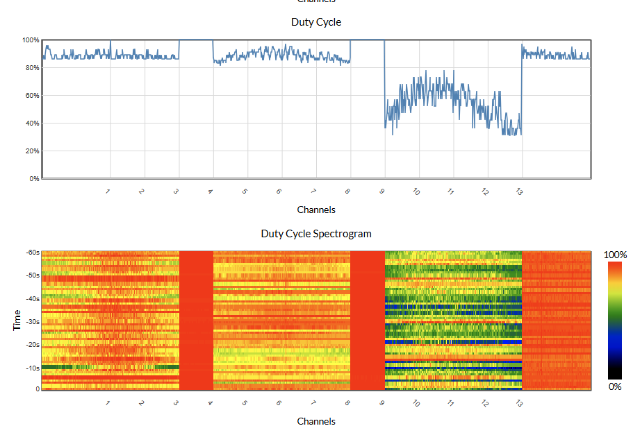 this to the Duty
Cycle Spectrogram, we can see that all 2.4 GHz channels, especially
channels 1 and 6 in this case, are nearly 100% utilized. If any Wi-Fi
users were connected to the 2.4GHz band on these channels in this space,
they would indeed face an inferior user experience.

**Question:** If you had to select a 2.4GHz channel in this environment,
what channel would you use?

If the non-Wi-Fi signal

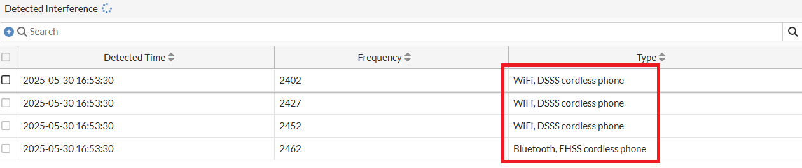 matches a known
reference pattern, the type of device causing the interference will also
be listed, which can help to locate the source.

**Please note:** A FortiAP's primary task is to code and decode 802.11
(Wi-Fi) frames, not to perform spectrum analysis. If you are after a
dedicated spectrum analyzer, do not obtain a FortiAP for this purpose.
There are far superior tools available, such as the Ekahau SideKick or
Oscium Wi-Spy. However, based on the results from your lab, you can see
that it can be a valuable tool for isolating a potential root cause of
Wi-Fi user experience and connectivity-related issues.

### Channel Summary Dashboard

The channel summary dashboards are unique to FortiAIOps and provide some
of the best insights into any monitored RF environment.

The Channel Distribution dashboard lets you visualize the channel
deployment and re-use across your entire Fortinet Wi-Fi deployment.

This dashboard is essential if you are implementing a static channel
plan and want to ensure the optimal use and reuse of available channels,
while also confirming that the channel widths set per Access Point (AP)
are as per Wi-Fi design, i.e., 20MHz, 40MHz, or 80MHz.

-   Within FortiAIOps, navigate to **Wireless \> Channel Summary**

You should see the Channel Distribution Dashboard as shown below

As you have 4x AP radios running 5GHz in your lab(2 x FAP-231F and 2x
FAP-231G). You should see 4 x 20MHz channels in use as per the image
below.

You should also see 2 x 80MHz channels in use for the 2 x AP radios
running 6GHz (2x FAP-231G) in your lab as per the image below.

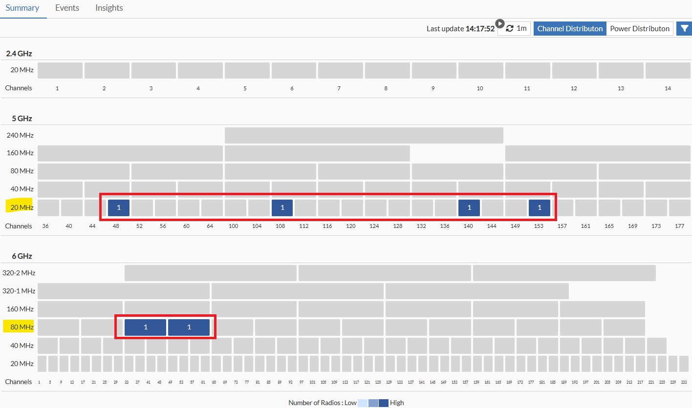

-   Within the Wireless \> Channel Summary Dashboard, **navigate to the
    Power Distribution Dashboard** by selecting the **Power
    Distribution** option on the upper right side of the window.

This dashboard allows you to view the radio TX power distribution across
all the selected AP radios in your environment.

You should see 4x AP radios

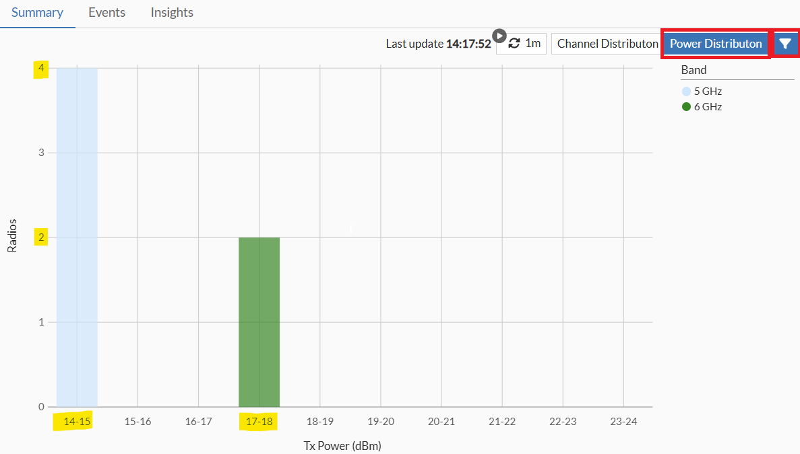 operating at 14dBm (4 x 5GHz) and 2 x radios operating at 17dBm (2x 6GHz)

Within either dashboard, you can select and drill down to confirm which
APs are aligned to the data metrics being shown.

Whilst you won't cover this specifically, you can also view this data
using the filter tool in the top corner to restrict this view to a
per-site/building/floor basis if needed. Alternatively, you can also use
Device Group to limit the view to a per FortiGate basis, if necessary.
This does require that the sites, buildings, and floors be defined
within the Wireless \> Heatmaps Section beforehand.

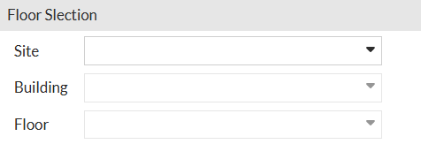

### Rogue APs

Within FortiAIOps, navigate to **Wireless \> Rogue APs**

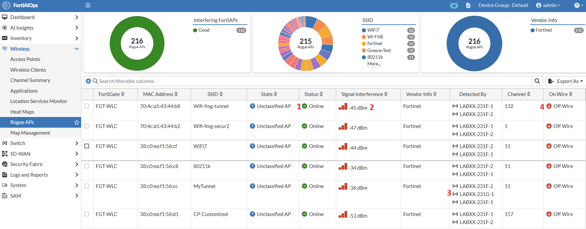

-   If a rogue AP is shown as online, this means it's currently
    broadcasting within the vicinity of your APs

-   If the Signal Interference, i.e., RSSI of the Rogue, is \> 75 dBm,
    it will likely be within 10m of your APs.

-   If detected by 3 or more APs, you should be able to locate the
    device within your environment. FortiAIOps will list the 3 APs that
    can hear the rogue at the highest RSSI.

-   If the device is seen Off-wire, that means it's not connected or
    seen on the wired side of the network. This identification method
    uses the AP base MAC address. If the Ethernet MAC is visible on the
    wired side and aligns with the radio MAC on the wireless side, it
    would be flagged as on-wire.

-   What's a Rogue in the Wi-Fi sense? If you believe it's a malicious
    Wi-Fi device, sorry, you're misinformed.

-   Even Google AI provides the misinformed answer, i.e., you can search
    What is a Rogue access point and get this bogus response: "A rogue
    access point is **a wireless access point that has been installed on
    a secure network** without explicit authorization from a local
    network administrator." Yes, this does fall into the definition of a
    rogue, but it's not entirely correct.

-   A rogue is **any interfering Wi-Fi-enabled device seen by your
    managed access points;** this could be a station or access point.
    This can be as simple as a neighbouring AP that's not part of your
    managed network, and nothing more than that. It doesn't need to be
    malicious or connected to your network to be considered a rogue.

-   Rogue APs and clients can harm Wi-Fi performance. However, 802.11,
    being a contention-based standard, does a great job of sharing the
    airtime with neighboring devices on the same channels (so long as
    they can hear each other).

-   Meaning two or more APs, on the same channel and channel width, will
    indeed share the channel airtime as equally as possible. Where
    things can and often do go wrong is when an Access Point (AP) is
    configured to operate using 40MHz or 80MHz wide channels, while at
    the same time the neighbouring APs are set to run on 20MHz wide
    channels, resulting in overlapping Basic Service Set (BSS) issues,
    also known as Wi-Fi death for the APs running on the wider channels.
    (No, this is not going to be a lesson around OBSS).

-   However, it's highly recommended to identify rogue access points
    and, where possible, configure your Wi-Fi network to a point where
    these rogue APs will have as minimal impact. FortiAIOps enables this
    by displaying all current rogue APs detected by all managed APs
    across all FortiGates from a single central location.

-   When combined with the Wireless Heatmaps and Wireless Location
    Services engine available within FortiAIOps, you can also
    triangulate and see where rogue devices are in your environment to
    remove them should it be necessary.

## Switching Dashboards

### FortSwitches

-   Within FortiAIOps, navigate to **Switch \> FortiSwitches**

 This page displays a graphical snapshot of the FortiSwitch activity,
such as; the total number of FortiSwitches, their status
(online/offline/unauthorized), and the deployed model details

From here, you can drill down into your managed FortiSwitches to see
further statistics and diagnostics in detail.

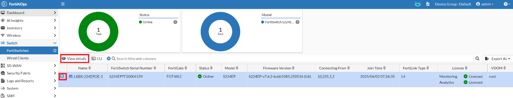

-   **Select** your lab FortiSwitch i.e. **LABX-224EPOE-1** → where X is your Pod#

-   Select the **View details** button

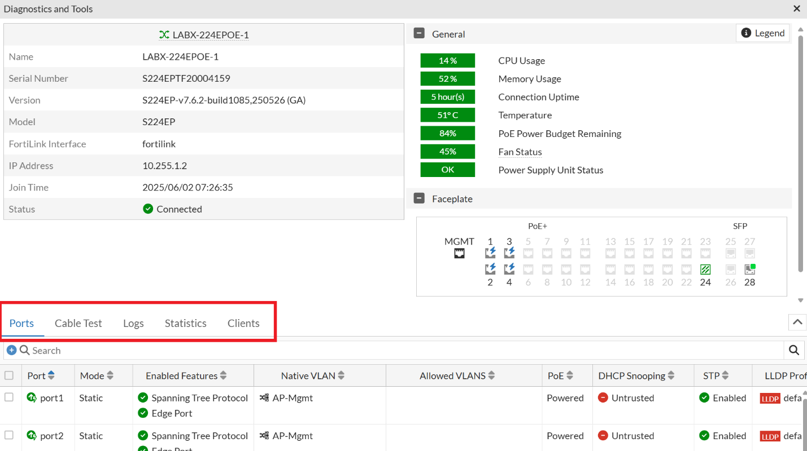The Diagnostics and Tools pop-out window
should appear, which includes the current FortiSwitch face plate/port
usage, hardware summary, general status, statistics, and specific
configuration details.

There are several other tabs available: Cable Test, Logs, Statistics,
and Clients.

#### Cable Test

The Cable test is a diagnostic and troubleshooting tool that allows you
to check the state of cable pairs between the FortiSwitch and the
devices connected to its physical copper ports. This tool does not work
on fiber ports and may provide some inaccuracy for very short ( <1m ) or
very long cable runs ( >100m ).

It's a straightforward tool to use; you need to select an active port
and then select the Diagnose button.

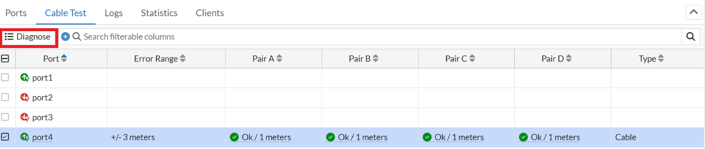

Unfortunately, the cable test doesn't work on the FortiSwitch-224E-POE
switches in the lab. It should, but doesn't. **Please don't run this,**
as it can result in the switch port going into an offline state. The
switch will need to be rebooted to restore port functionality if a Cable
Test is run.

#### Logs

Under the Logs tab, all FortiSwitch logs are available for up
to 1 week.

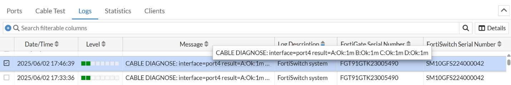

### Statistics

Within the Statistics tab, you can view all SwitchPort Ethernet frame
metrics. This can be used to identify connectivity and performance
issues on Ethernet links. For example, if you are seeing TX, RX, or CRC
Errors, this could indicate a cabling or switchport speed negotiation
issue. This data is available for up to 24 months, depending on storage
and data availability.

You can also drill down into each port to view these stats over time.

### Wired Clients

-   Within FortiAIOps, navigate to **Switch \> Wired Clients**

From this Dashboard, you can monitor the wired clients seen by the
FortiSwitches that are deployed in your network. This page displays a
graphical snapshot of client activity, including the total number of
FortiSwitch clients, their status (online or offline), client device
details, and associated VLANs. Hovering over the charts provides
specific statistics, and clicking on a specific area on the chart
filters the data displayed on this page.

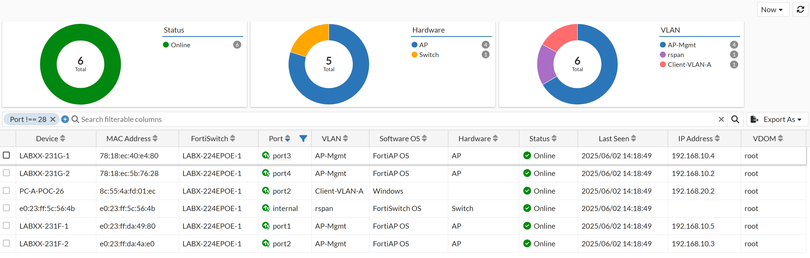

A great use case for this dashboard is identifying which switchport a
client is connected to on the network at a specific point in time.
Recently, a customer in Australia used this dashboard to locate a
malicious botnet client in their network. The MAC address appeared to be
spoofed, and all they had was the device name to go from. Without
FortiAIOps, they don't believe they could have isolated the client as
quickly as they did.

## SD-WAN Dashboards

The SD-WAN Dashboards provide insights into the monitored SD-WAN
interfaces. Using machine learning and AI modelling, this dashboard will
show when an interface is or has been impacted and predict when further
impacts may occur.

The SD-WAN dashboard has been significantly improved within FortiAIOps
3.0; Improvements include

-   Monitoring/Dashboard improvements

-   AI-Driven Predictive Modelling and Anomaly Detection (Forecasting)

-   Dynamic Baselining Model of Normal Network Behaviour (Dynamic SLA
    baseline)

-   Deviation Analysis for Proactive Anomaly Detection

-   Many new SLAs to improve WAN alerting and performance, with the
    ultimate goal of improving WAN reliability and user experience.

### Insights Dashboard

-   Within FortiAIOps, navigate to **SD-WAN > Insights**

    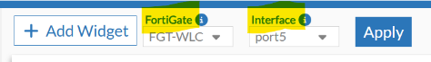

-   In the top menu bar, under FortiGate, ensure your lab **FGT-WLC** is
    selected and that your SD-WAN interface **port5** is selected

-   Then select the **Apply** button

The Insight Dashboard displays current and historical SD-WAN performance
metrics, which can be traced back 24 months, provided the data is
available within FortiOps. This can be used to examine SD-WAN link
performance and utilization statistics over time. For example, to
determine if and when more bandwidth may be needed.

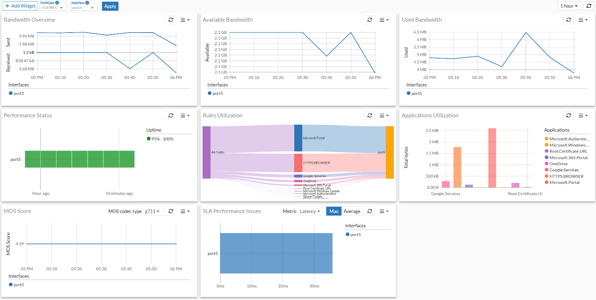

**Note:** To obtain all the metrics shown in this dashboard, all SD-WAN
configurations must be in place as per Lab Section 9, along with
Application monitoring and traffic logging being enabled on the relevant
outbound firewall policies.

Several of these widgets, such as Performance Status, can also be
drilled down into to gain further insights related to the displayed
data, including reviewing individual performance results for each SD-WAN
SLA, as shown in the image below.

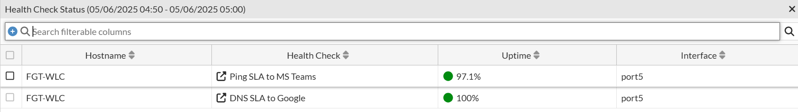

Looking at the SD-WAN Insights dashboard, you will also notice the MOS
Score or Mean Optimisation Score. A MOS is a numerical measure of the
human-judged overall quality of an event or experience. In SD-WAN, a
Mean Opinion Score is a ranking of the quality of voice and video
sessions.

MOS is judged on a scale of 1 (bad) to 5 (excellent), and is the average
of a number of what would typically be human-scored individual
parameters. Within FortiAIOps, the MOS is generated by an Objective
Measurement Method that approximates a human ranking based on
performance metrics observed over time. For this to be accurate, your
SD-WAN baselines must be accurate. Therefore, it's essential to check
your SD-WAN performance monitors and ensure the threshold values set for
the following are at a level that should always be within the SLA,
unless there is a real performance issue.

-   Latency Threshold

-   Jitter Threshold

-   Packet Loss Threshold

### Forecasting Dashboard

-   Within FortiAIOps, navigate to **SD-WAN > Forecasting**

    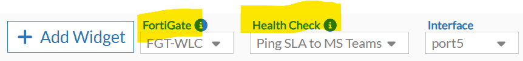

-   In the top menu bar, under FortiGate, ensure your lab **FGT-WLC** is
    selected, that one of your Health Checks is selected, i.e., **Ping
    SLA to MS Teams**, and that **port5** is selected

The Forecasting Dashboard requires multiple days, i.e., a week or more,
of data points (observations) to start providing predictive modeling.
Hence, it will not be possible for you to utilize the capabilities of
this dashboard fully within your Hands-On-Lab. However, below are some
images from an AIOps instance that has been operational for several
weeks.

These dashboards show current and historical latency, jitter, and packet
loss statistics for all monitored SD-WAN links, for up to 24 months,
depending on data availability

From the previous week's SD-WAN dashboard data below, you will notice
the following;

-   Latency, Jitter, and Packet loss (performance) stats

-   How often each of the defined SLAs were breached (Anomalies)

-   How often the link was inside and outside of SLA boundaries

-   Any outages that may have occurred, i.e., **SLA down**

-   Most common issue resulting in SD-WAN SLA breaches

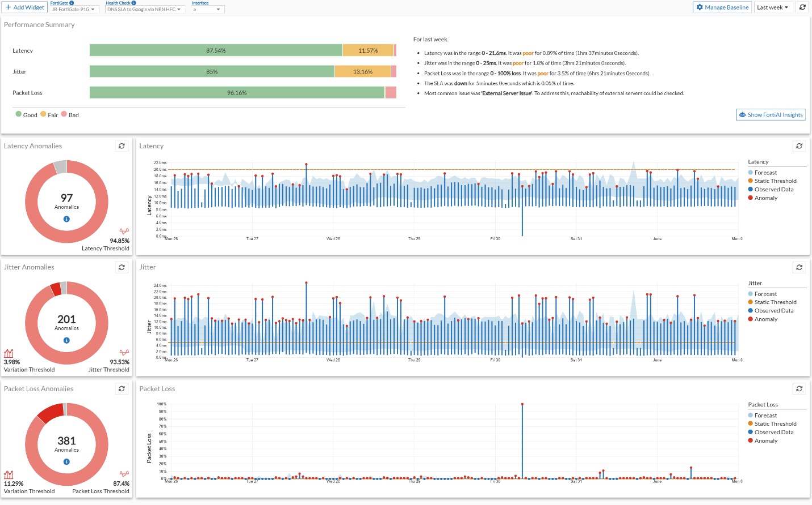

Comparing last week's data to the current week, you will notice;

-   Forecasting expectations of the latency, jitter, and packet loss.

-   Current performance stats

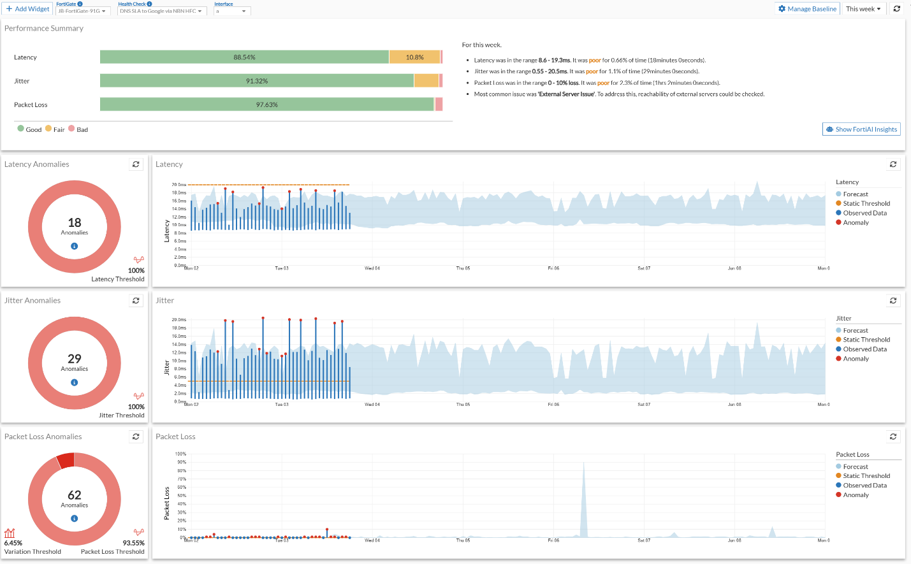

Note: You can also drill down into each datapoint for further analysis and insights as to what caused and flagged anomalies (SLA breach).

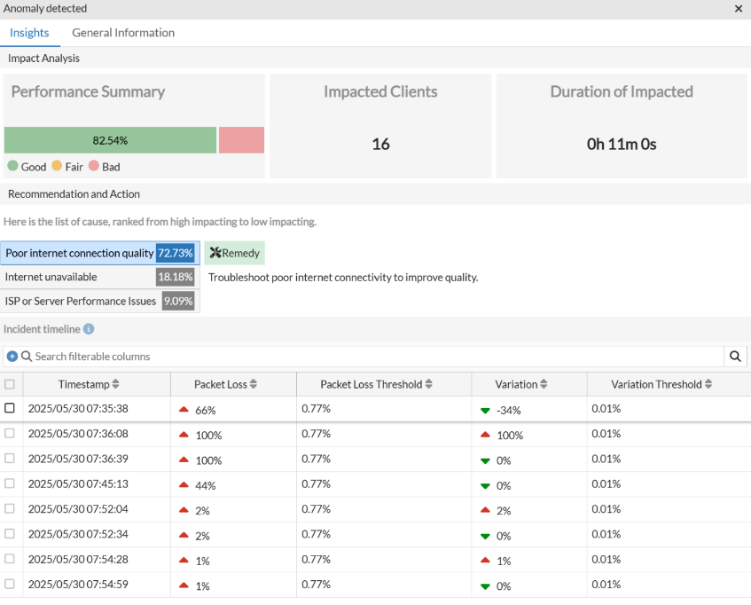

*Please note: This drill down may not work in the current dev build (144).*

### AI Insights

With the introduction of FortiAI into FortiAIOps, you will also notice
that within the Forecasting dashboard, there is a **Show AI Insights**
button.

-   Select the **Show AI Insights** button

This tool can be used to ask pre-canned questions about the performance
of the monitored SD-WAN interfaces.

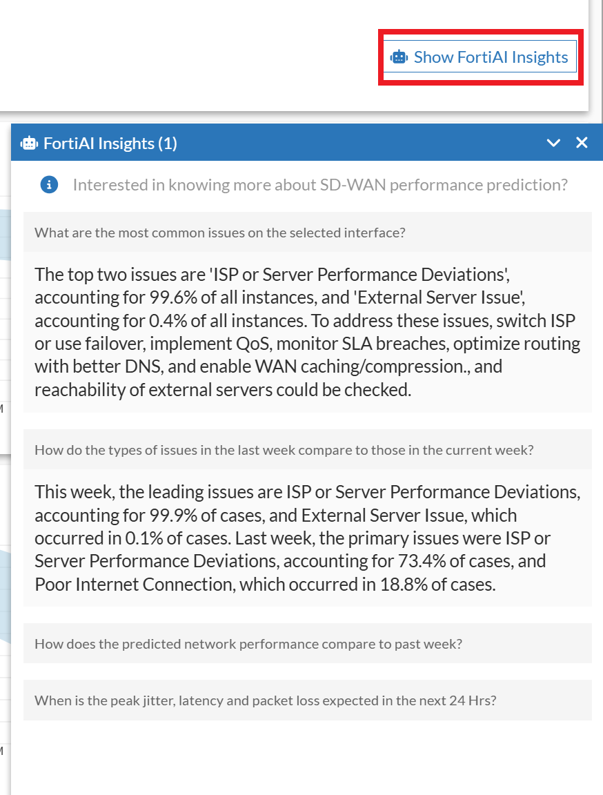Specifically;

-   What are the most common issues on the selected interface?

-   How do the types of issues in the last week compare to those in the
    current week?

-   How does the predicted network performance compare to the past week

-   When is the peak jitter, latency, and packet loss expected in the
    next 24 Hrs?

**Note:** You cannot yet ask these types of questions within the FortiAI
tool, covered in Section 14. Because the FortiAI/GenAI tool doesn't yet
ingest monitoring-based data.

## Security Fabric

The Security Fabric Dashboard was introduced with FortiAIOps v1.0; It
displays the physical and logical view of your connected FortiGates \>
Access Points \> Radios, and Clients. This can help you visually
determine which AP is connected to which Fortigate or which Wi-Fi client
is connected to which AP radio.

Further updates to this dashboard are planned for later v3.X releases,
which will include switching and potentially other fabric devices to
provide a complete and holistic view.

To view this dashboard within FortiAIOps, navigate to **Security Fabric
\> Physical Topology.**

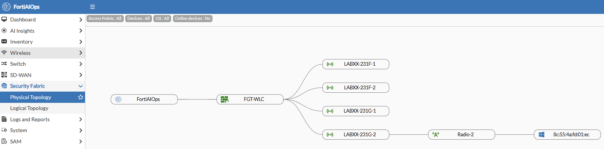

## Reporting Dashboard

Within FortiAIOps, navigate to **Logs and Reports \> Reports \> Create
Reports**

Currently, the reporting feature within FortiAIOps is limited to some
legacy pre-canned wireless reports.

For the time being, Fortinet's view is to use its core reporting
platform, FortiAnalyzer, for any reporting purposes. Hence, we will not
cover it during this hands-on lab.

As shown at Accelerate in Berlin earlier this year, Fortinet plans to
further integrate FortiAIOps with several core platforms, including
FortiAnalyzer and FortiManager. Improvements to the reporting section
with FortiAIOps are planned but will not change in the short term.

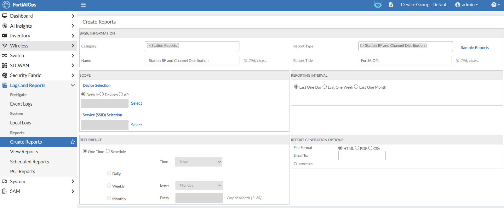

