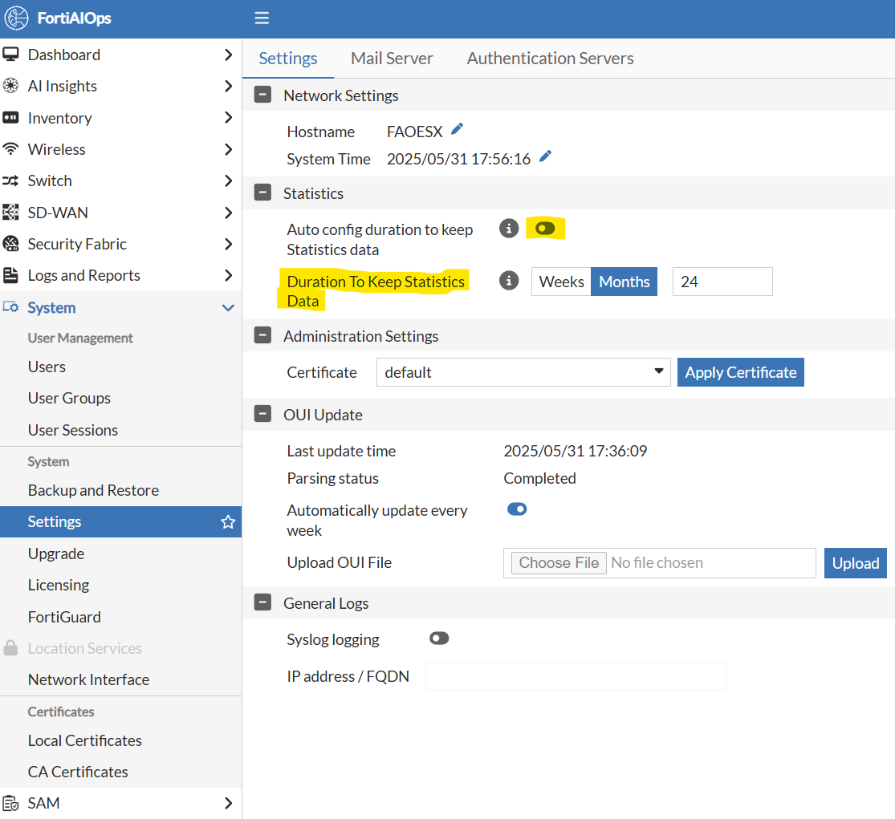

# Lab 12: Data Retention

With the release of FortiAIOps 3.0, the data retention for statistical
data has been increased up to 24 months.

This, of course, depends on the amount of available disk space.

Shorter retention periods can occur when insufficient disk space is made
available. It is recommended to use the sizing guidelines provided in
[Supported Hardware and
Software](https://docs.fortinet.com/document/fortiaiops/2.1.0/release-notes/903200)
when determining storage and other hardware requirements.

-   Navigate to **System \> Settings**

-   Auto config duration to keep Statistics data: Set to **disable**

-   Duration to Keep Statistics: Set to **Months 24**

-   Select the **Apply Changes** button

