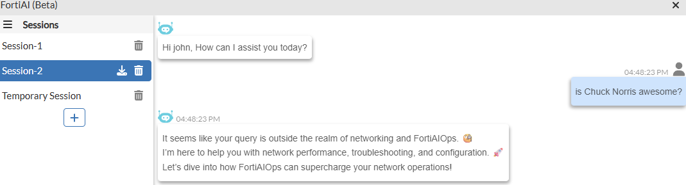
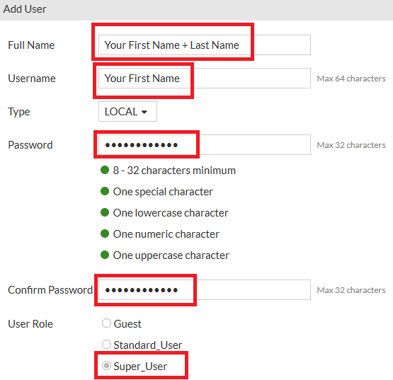
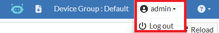
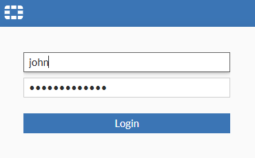
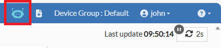
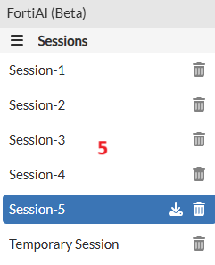
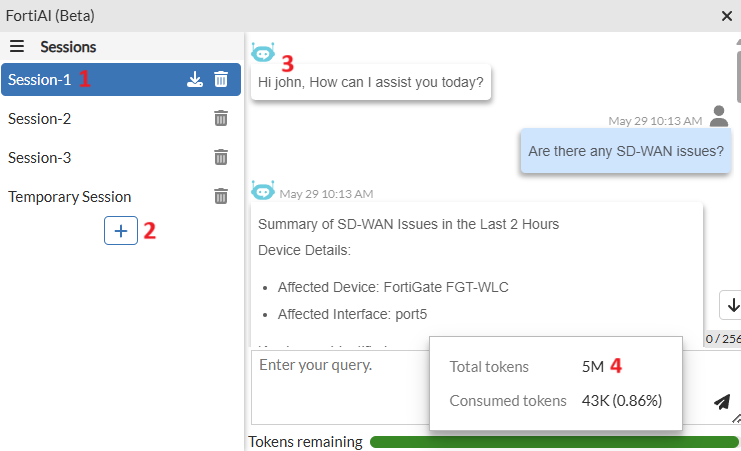
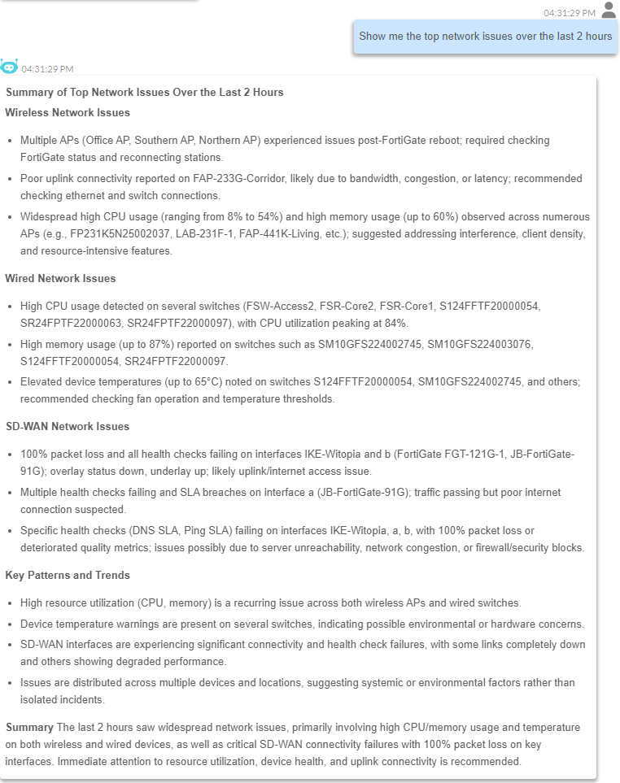
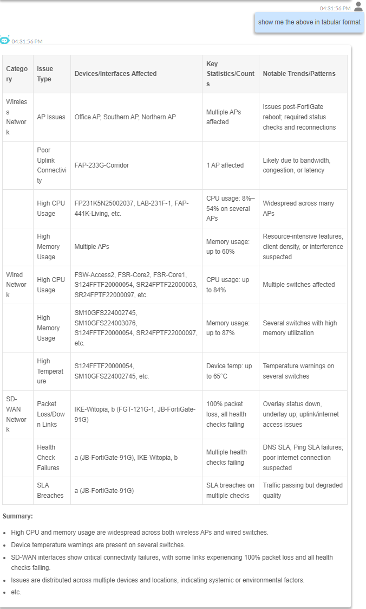

# Lab 13: FortiAI & GenAI

FortiAIOps v3.0 has added FortiAI, Fortinet's GenAI engine, which is
available as a beta in the current release and will continue into 3.0
GA.

FortiAI leverages large language models (LLMs) to understand and process
requests, consuming tokens as a measure of the processing resources and
related costs. FortiAI Cloud handles the LLM processing; this is not
processed directly on FortiAIOps due to the large amount of system
resources needed for LLMs to process thousands of tokens per second.

For example, the Nvidia RTX 5090 (currently a high-end GPU) is capable
of processing up to 60 tokens per second using a small language model.
To process events in FortiAIOps in a timely manner, a significant amount
of compute is required.

FortiAIOps v3.0 will be supplied with 5million tokens made available as
part of the beta period, which is available once per fresh install and
displayed within the FortiAI dashboard (shown later in this section)

Please note: Token consumption isn't straightforward, as it is based
around small chunks of words and/or special characters as per the
examples below;

**Apple** would consume one token

**Blueberries** would consume two tokens, as this is two words combined

Special characters within words, e.g., Hands-On-Lab, would result in this output consuming five or more tokens, as bold text, underlining, etc., all consume tokens.

It's not possible to provide how the LLM would respond. It will be based
on the data ingested and the questions asked? Some example questions
which FortiAIOps is designed to handle are below;

-   Which APs are facing high channel utilisation?

-   Were there any MCLAG issues?

-   Any packet collisions detected?

-   Any loops in the wired network?

-   Tell me if there are any network misconfigurations.   ==\> This will
    be fixed in the next build

-   Did any of the SD-WAN underlay interfaces go down?

-   Frequent password failure attempts?

-   Get me all assoc issues in the last 1 hr?

-   Devices affected by FGT shutdown?

-   Were any CRC alignment errors detected?

-   Health checks that failed due to external server issues?

-   Any interfaces with high latency and packet loss?

If you ask questions that are not relevant to FortiAIOps, you will receive a response like below;

And yes, asking questions as above will also consume tokens.

The goal of using FortiAI within FortiAIOps is to help isolate
network-related issues (wireless, switching, and SD-WAN) quickly,
without having to drill down into specific devices where performance
SLAs have been flagged as outside normal boundaries.

Before you get started with using FortiAI within FortiAIOps, you'll need
to create a user account to provide a more personalised experience.

-   Please open a HTTPS browser session to your FortiAIOps-VM,
    <https://10.222.14.XX:14002>, and log in using your lab admin
    credentials admin/Fortinet123!

-   Within the FortiAIOps GUI, navigate to **System \> Users**

-   From the top menu bar, select the **+Add** button

Within the Add User window, enter the following;

-   Full Name: **Your First Name + Last Name**

-   Username: **Your First Name** (lowercase only)

-   Password: **I<3FortiAIOps**

-   Confirm Password: **I<3FortiAIOps**

-   User Role: select **Super_User**

-   Select the **Save** button

**Note:** As of FortiAIOps 3.0, authentication using external servers is
now available. This includes RADIUS, LDAP, Microsoft AD, SAML SSO &
Microsoft AD FS SAML IDP. External authentication servers can be added
under System \> Settings \> Authentication Servers.

**Note:** When creating a user account in FortiAIOps from v3.0 GA, the
user account details are the same across the CLI and GUI; there is no
longer a requirement for separate accounts.

Next, log out of the current user account, admin, and then log back in
using your new user account.

-   To do this, select the currently logged-in user within the top right corner of your browser window

-   Then, within the dropdown box, select Log out

-   At the login screen, enter the details of the user account you just
    created

You should now be logged in using your new user account.

-   Next, select the FortAI (Beta) icon located in the top right corner
    of the browser window

-   The FortiAI (Beta) slide-out window should appear.

In this window, there are several things to take note of;

1.  Temporary Session: Any questions asked here will be deleted when the
    window is closed

2.  Adding new sessions by pressing the + Icon creates sessions that
    will be saved and can be downloaded and shared with others. These
    sessions will remain until deleted, even if you log out.

3.  You will notice that the FortiAI addresses you by your username

4.  And the remaining LLM tokens are displayed on the lower side of the
    window.

5.  A maximum of 5 sessions can be stored

Whilst data in the lab environment is limited to what has been collected
over this short period;

-   As you have SD-WAN monitoring in place, which has been running for a
    little while now, within Session-1, ask FortiAI a question, i.e.,
    **Are there any SD-WAN issues?**

-   Ask another question, i.e., **Show me the top network issues over
    the last 2 hours?**

You should receive a response explaining what has been seen over the
last X amount of time and what the potential causes and remedies are to
fix these issues.

Using FortiOS alone, you would have no simple visibility of outages or
when a WAN link is under-performing due to saturation, congestion, etc.,
unless a user complains. By integrating FortiAIOps into the fabric, it
enables the ability to monitor the environment over an extended period,
ultimately assisting in ensuring the user experience remains optimal.

Further to this you can ask it to show you the data in different formats i.e. tabular so it can be easily exported into a report if necessary.

-   Ask FortiAI to **show the above in tabular format**

**Note:** You can download the session output as a HTML file.

Monitoring data has not yet been made available to the Gen AI engine
within FortiAIOps; this is on Fortinet's roadmap. Hence, you cannot yet
ask questions like;

-   "Which application is most used in my environment?"

-   "How many Watts in PoE is switch X delivering?"

-   "How much power budget do I have left on switch X?"

-   Questions around monitored SD-WAN interfaces - You can utilise the
    pre-canned questions within the SD-WAN Forecasting dashboard for an
    example as to how this will function.

