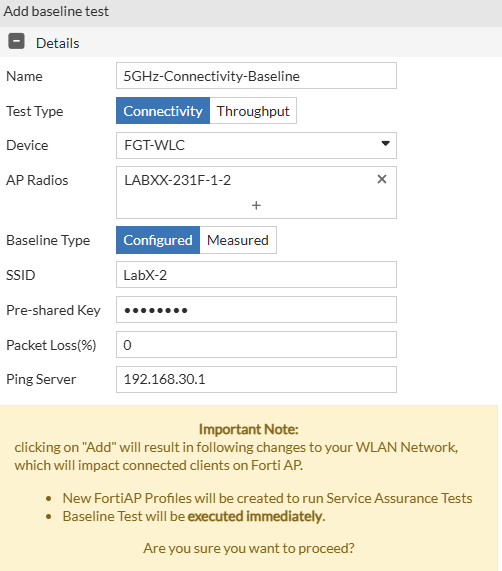
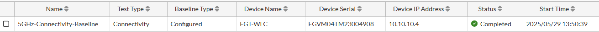
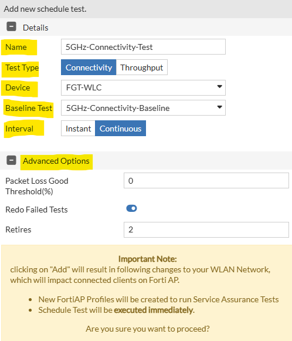
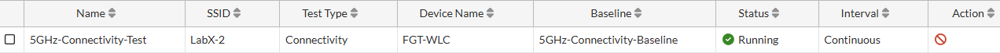
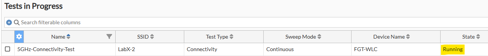
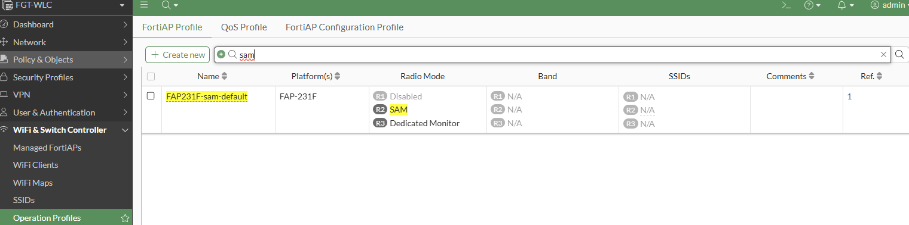
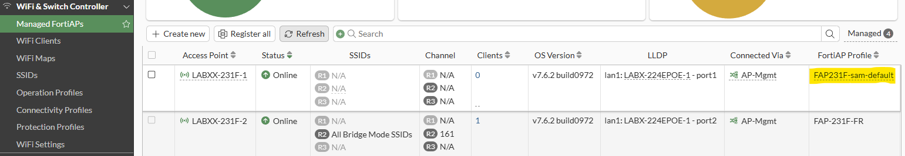
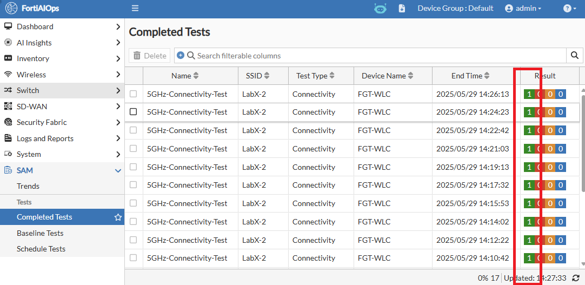
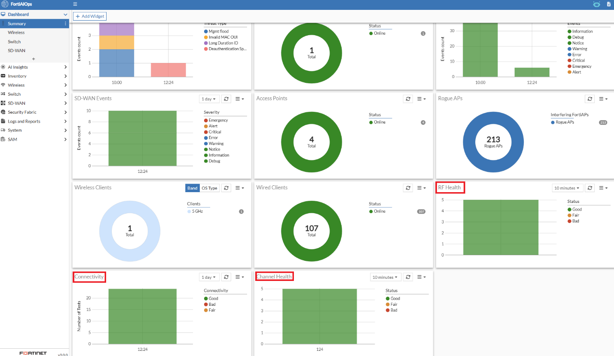

# Lab 14: SAM

Service Assurance Manager (SAM) is a fantastic FortiAIOps tool that lets you run and/or schedule tests against the Wi-Fi network from the Wi-Fi client's point of view.

The way this tool works is by converting a Fortinet AP into a Wi-Fi
client and running connectivity (ping) and throughput tests (iPerf2.0)
against the production Wi-Fi network. In this section, you will use one
of your FAP-231F radios to become a client device, generate a baseline,
and run connectivity tests against the other access points (APs) in your
network.

**Limitations:** SAM is still in the early stages of development and
requires some improvements on the FortiOS side to become a solid tool
for monitoring and troubleshooting.

It doesn't yet support WPA3-SAE authentication, hence it is only
suitable for testing WPA2-PSK networks.

When an AP operates as a SAM client, it cannot service any clients on
the Wi-Fi network. Therefore, it is recommended to use additional
non-service APs for SAM purposes.

Throughput testing requires that an iPerf 2.0 (not 3.0) server be
available on your network. This is not currently in place for this
workshop.

-   If you haven't already, please open a HTTPS browser session to your FortiAIOps appliance, <https://10.222.14.XX:14002>, log in using the admin credentials (admin/Fortinet123!), and perform the following steps.

    

-   Navigate to **SAM \> Baseline Tests**

-   On the right side, select the **+Add** button

Within the Add baseline test pop-up window, set the following;

-   Name: **5GHz-Connectivity-Baseline**

-   Test Type: **Connectivity**

-   Device: **FGT-WLC**

-   AP Radios: **FAPXX-231F-1-2** → where XX is your Pod# Select the
    5GHz radio i.e. interface 2. *Note: If any client is connected to
    this radio, you will be warned that they will be disconnected.*

-   Baseline Type: **Configured**

-   SSID: **LabX-2**

-   Pre-Shared Key: **fortinet**

-   Packet Loss (%): **0** (This is the acceptable value; any packet
    loss should be considered unacceptable)

-   Ping Server: **192.168.30.1** (FGT-WLC gateway for LabX-2/VLAN30
    subnet)

-   Select the Add button

The 5GHz-Connectivity-Baseline should now appear as completed and ready to use.

The baseline test just created, in this case, is the configuration that
will be used to perform a connectivity test once scheduled.

Next, you'll need to schedule this test to run to validate Layer-3
(ICMP) connectivity over the Wi-Fi network.

-   Navigate to **SAM > Schedule Tests**

    

-   On the right side, select the **+Add** button

Within the Add new schedule test pop-up window, set the following;

-   Name: **5GHz-Connectivity-Test**

-   Test Type: **Connectivity**

-   Device: **FGT-WLC**

-   Baseline Test: **5GHz-Connectivity-Baseline**

-   Interval: **Continuous** → *Note continuous means the test will run
    time and time again. Without stopping. Instant means the test will
    run once. In a production environment, you would typically only run
    this as an instant test unless you have a dedicated AP to operate as
    a SAM client.*

-   Select the **Add** button

You should now notice that the 5GHz-Connectivity-Test is running.

You can cancel this action at any time by selecting the "Stop Test" icon
within the action column.

Do not cancel this action for now.

Within the FortiAIOps GUI

-   Navigate to **SAM \> Completed Test**

You should notice your **5GHz-Connectivity-Test** is currently in
progress

In the background, FortiAIOps provisions the selected FortiAP with a new
Operational profile (wtp-profile) on the managing FortiGate (FGT-WLC).

-   If you log in to your FGT-WLC and navigate to **WiFi & Switch
    Controller \> Operational Profiles,** you'll notice a new profile
    has been created, **FAP231F-sam-default**

-   If you then navigate to **WiFi & Switch Controller \> Managed
    FortiAPs**, you'll notice that this profile has been assigned to the
    previously defined FortiAP, i.e., FAP-231F-1

-   Switch back to FortiAIOps and navigate to **SAM \> Completed Tests**

After approximately 2 minutes, your first test should have completed
successfully.

A connectivity test typically takes 1.5 minutes to complete. As you have
scheduled this test to run continuously, a new result should become
available within FortiAIOps every 2 minutes or so.

If everything is working as expected, you should see multiple successful
results appear within 10-15 minutes.

Next, within FortiAIOps, navigate to the SAM \> Trends Dashboard

Here, you will find further information about the results of your
Connecitivity Test. If multiple tests or Throughput tests have been run,
they will also be shown here.

Finally, you can also add a Widget to the FortiAIOps Dashboard to show
these results at first glance.

-   Navigate to **Dashboard \> Summary**

-   In the top menu bar, select the **+Add Widget** button

-   Scroll down to the **Service Assurance** section and select the
    **Connectivity,** **Channel Health,** and **RF Health** widgets.

-   Then select the **Close** button

You will notice that these Widgets are now showing relevant data on the
primary summary dashboard.

