# Lab 15: Location Services

FortiAIOps can ingest Fortinet's location services feed (aka FortiPresence feed) to provide location awareness of devices (rogues and stations). This allows for the visualization of wireless stations
(connected or not) on a floor plan, as well as providing indicative RF
heatmaps that highlight potential coverage expectations or performance
issues.

To support this, you'll need to;

-   Create an Outbound Firewall Policy from your APs to FortiAIOps

-   Enable the location services feature within FortiAIOps

-   Enable and configure the Wi-Fi location data feed from FortiAP into
    FortiAIOps.

-   Import Floor Plan/s into FortiAIOps

-   Place APs onto the floor plan

!!! forti "Lab Materials Required"
    Before commencing this section, please ensure you have downloaded the College.jpg and Ground_Floor.jpg images from the [Lab Materials](https://www.dropbox.com/scl/fo/e7otuz3y02bd8g1cub8ow/ANp1zxFkOL7u2uED7bGNFxQ?rlkey=2yz5k3yugw3rtus2j17x82jfz&st=jrqygmi2&dl=0) Dropbox.

## Configure Firewall Policy

The location services feed is sent directly from each access point (AP)
to FortiAIOps. Hence, the APs must be able to forward traffic from their
subnet to the FortiAIOps appliance.

-   Please open a HTTPS browser session to your FGT-WLC appliance,
    <https://10.222.14.XX:14001>, and log in to the GUI using your admin
    credentials.

To simplify this, you will add the AP-Mgmt subnet to the existing
**Client-VLANs-Outgoing** policy created in Lab 10

-   Navigate to Policy & Objects \> Firewall Policy

-   Within the Client-VLANs-Outgoing Policy, **Edit** the From Interface field

    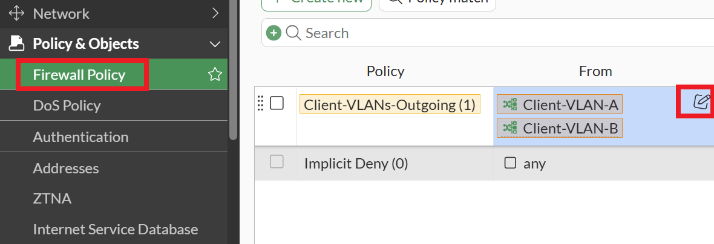

-   Select the **AP-Mgmt** Subnet

-   Then select the **Apply** button

    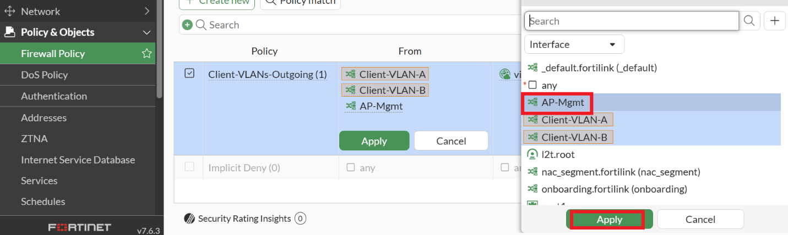

This should now allow traffic from your FortiAPs to reach FortiAIOps.

## Enable Location Services

-   If you haven't already, please open a HTTPS browser session to your FortiAIOps appliance, <https://10.222.14.XX:14002>, log in using the admin credentials (admin/Fortinet123!), and perform the following steps.

    

-   Within FortiAIOps, navigate to **System \> Location Services**

-   Within the Location Service window, set the Location Services Status
    to **Enable**

-   Note down the **Secret Key**; you will need this information in the next step.

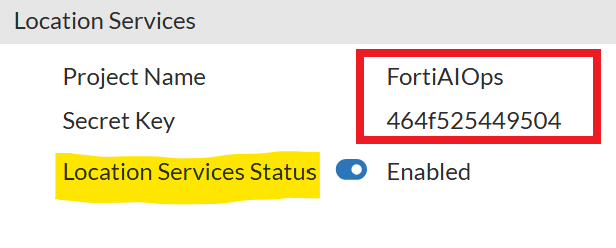

## Forward the Wi-Fi location data feed from FortiAP into FortiAIOps.

-   Please open a HTTPS browser session to your FGT-WLC appliance,
    <https://10.222.14.XX:14001>, and log in to the GUI using your admin
    credentials.

-   Navigate to **WiFI & Switch Controller > Operation Profiles**

    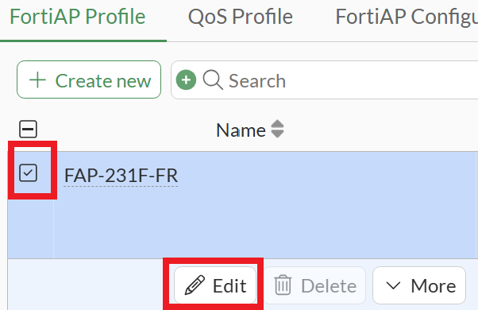

-   Select and **Edit** the **FAP-231F-FR** profile

-   Within the Edit FortiAP Profile window, scroll down to
    Location-based Services

Under FortiPresence, set the following:

-   Mode: **Foreign and Home Channels**

-   Project Name: **FortiAIOps**

-   Password: **Secret Key** that you noted down in the previous step,
    this is unique, hence you cannot use what is shown in the guide

-   FortiPresence server type: **IP**

-   FortiPresence server IP: **10.10.10.2**

-   FortiPresence server port: **4013** → This is listed in the FortiAIOps user guide

-   Report Rogue APs: set to **Enabled**

-   Report Unassociated Clients: set to **Enabled**

-   Report transmit frequency (in seconds): **10**

-   Select the **OK** button

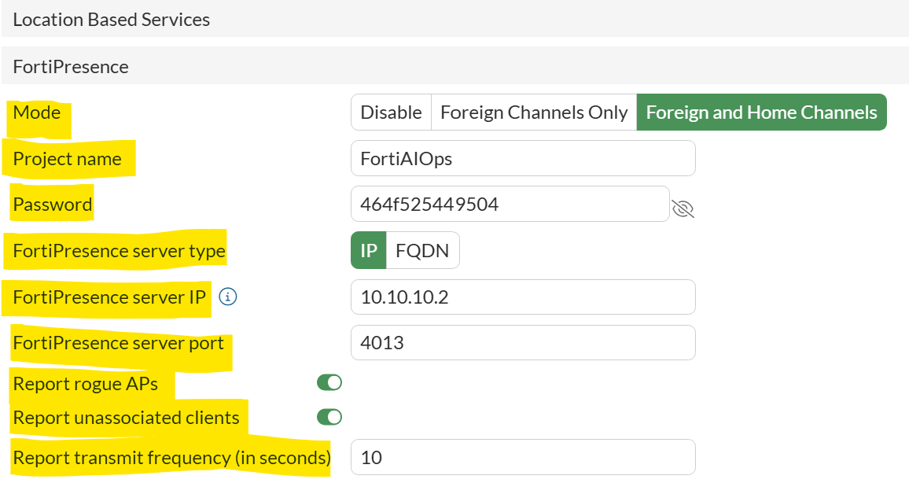

Next, do the same for the FAP-231G-FR profile.

-   Select and **Edit** the **FAP-231G-FR** profile

    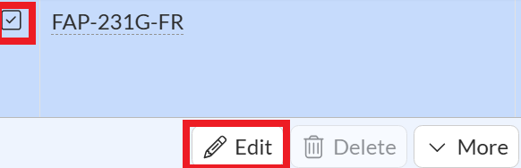

-   Within the Edit FortiAP Profile window, scroll down to
    Location-based Services

Under FortiPresence, set the following:

-   Mode: **Foreign and Home Channels**

-   Project Name: **FortiAIOps**

-   Password: **Secret Key**, which you noted down in the previous step.
    This is unique, hence you cannot use what is shown in the guide

-   FortiPresence server type: **IP**

-   FortiPresence server IP: **10.10.10.2**

-   FortiPresence server port: **4013** → This is listed in the FortiAIOps user guide

-   Report Rogue APs: set to **Enabled**

-   Report Unassociated Clients: set to **Enabled**

-   Report transmit frequency (in seconds): **10**

-   Select the **OK** button

## Import Floor Plans into FortiAIOps and Placement of APs

-   If you haven't already, please open a HTTPS browser session to your
    FortiAIOps appliance, <https://10.222.14.XX:14002>, log in using the
    admin credentials (admin/Fortinet123!), and perform

-   Within FortiAIOps, navigate to **Wireless \> Map Management**

-   Within the Map Management \> Site Details window select the **+Add**
    button

-   Enter a Site Name i.e. **Site_LabXX** &#x2190; Where X is your Pod \#

-   Enter a description, i.e., **My Site**

    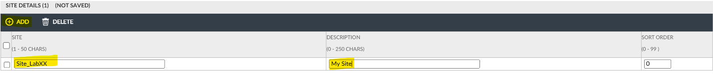

-   Select the **Save Changes** button in the lower right-hand side of
    the page

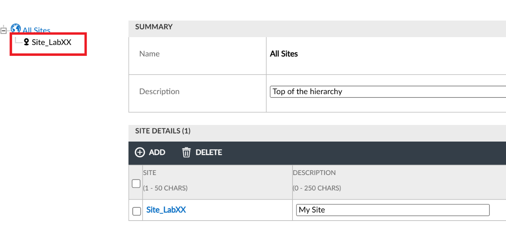

Once the Save has completed, you should see your site appear, as shown in the image below.

-   Select the **Site_LabXX** link &#x2190; Where XX is your Pod \# - Inside
    the rectangle per image above.

-   Within the Site Map section, select the **Change Image** button

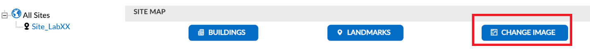

-   Select and Upload the **College.jpg** image

    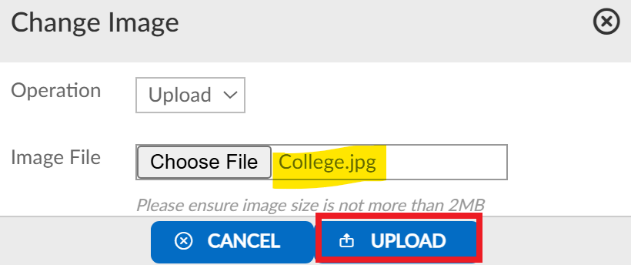

You should now see the Site Map loaded (screenshot from Google Maps)

-   Select the **Save Changes** button in the lower right-hand side of
    the page

-   Next, select the **Buildings** button

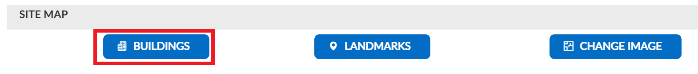

-   Within the Manage Site Buildings pop-up, select the **+Add** button

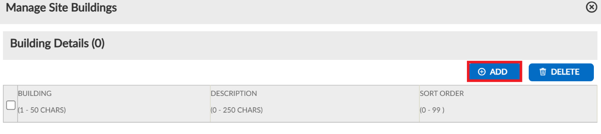

-   In the Building field, enter the name, i.e., **SK01**, then select the **OK** button

    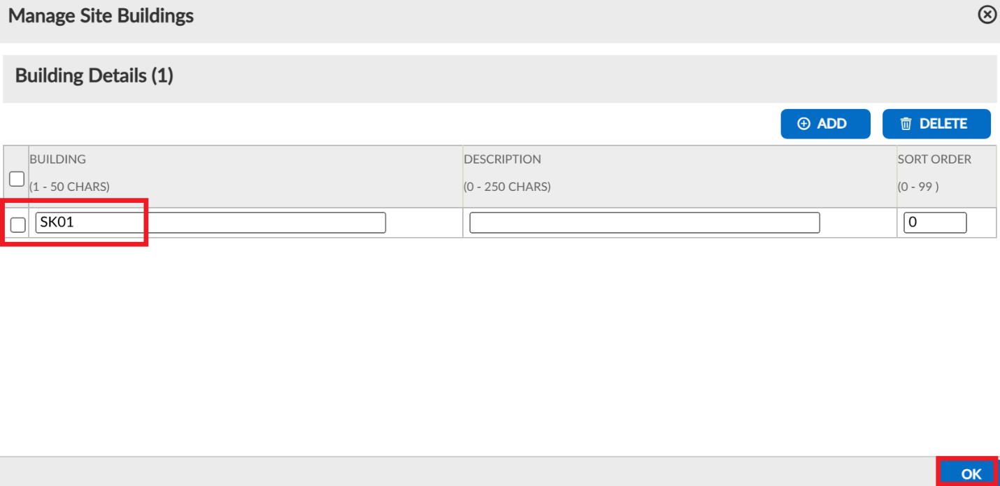

-   Select the **Building Icon** and **place it inside the Map**.
    Ideally, this would be placed in the correct location; however, for
    the purpose of this Hands-on Lab, it can be placed anywhere on the
    Site image. To do so, click on the building icon and then click on
    the site image.

-   Select the **Save Changes** button

    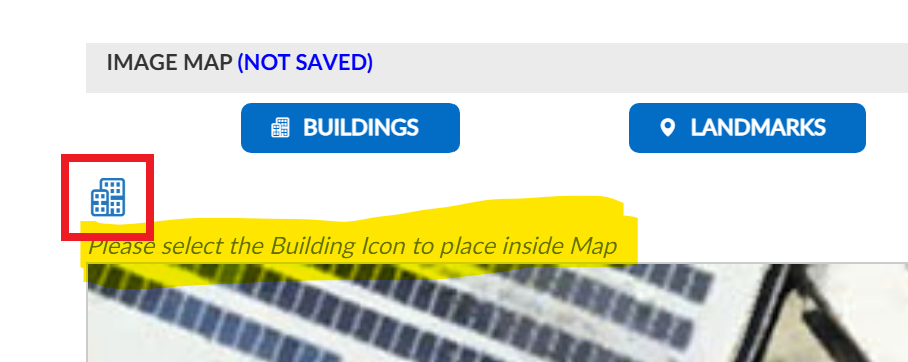

-   Select the **SK01** Building within the Site_LabXX &#x2190; Where XX is
    your Pod

-   Under Floor Details, select the **+Add** button

-   Enter **Ground_Floor** in the floor name field

-   Set the Length (X-Axis) to **40 &#x2190;** This is the length of the floor
    plan image being imported in an upcoming step

-   Set the Width (Y-Axis) to **40 &#x2190;** This is the total width of the
    floor plan image being imported in an upcoming step

-   Set the Metric to **Meter**

    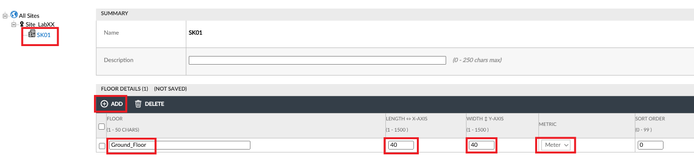

-   Select the **Save Changes** button

**Note:** An ideal way to determine the floor size is to use a Wireless
design tool such as Ekahau or Hamina, and then measure the entire length
and width of the image. You can then use this sizing for the steps
above.

Next, upload the Ground Floor plan

-   Select the **Ground_Floor** within the SK01 building, withing
    Site_LabXX

-   Select the **Change Image** button

    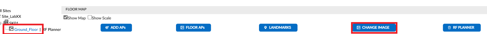

-   Select the **Choose File** button and select the **Ground_floor.jpg** file

    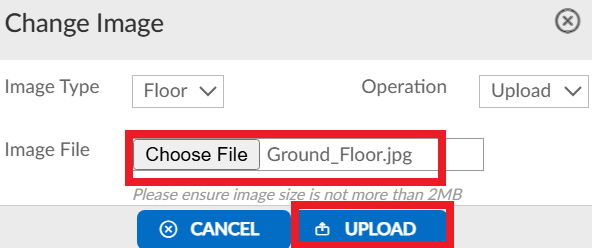

-   Select the **Upload** button

The Ground_Floor image should now be displayed

-   Select the **Save Changes** button

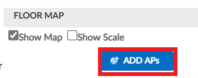

-   Within the Floor Map window, select the **Add APs** button

-   **Select all four access points** from the table

-   Then select the **Save** button

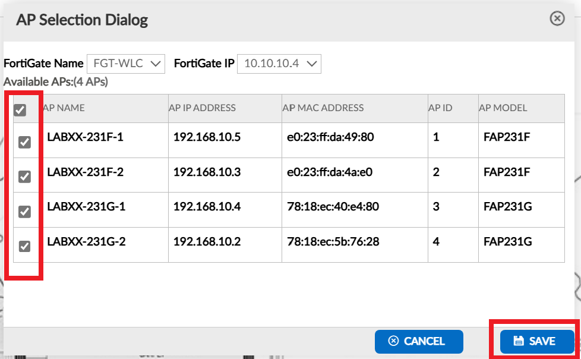

You will notice that the APs are now available to be placed on the floor
plan, as shown in the image below.

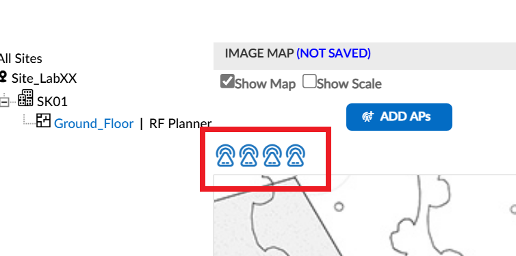

-   **Select each AP** and then **select a location on the floor plan to
    place it**. For the purpose of this hands-on lab, place them all
    within one of the classrooms.

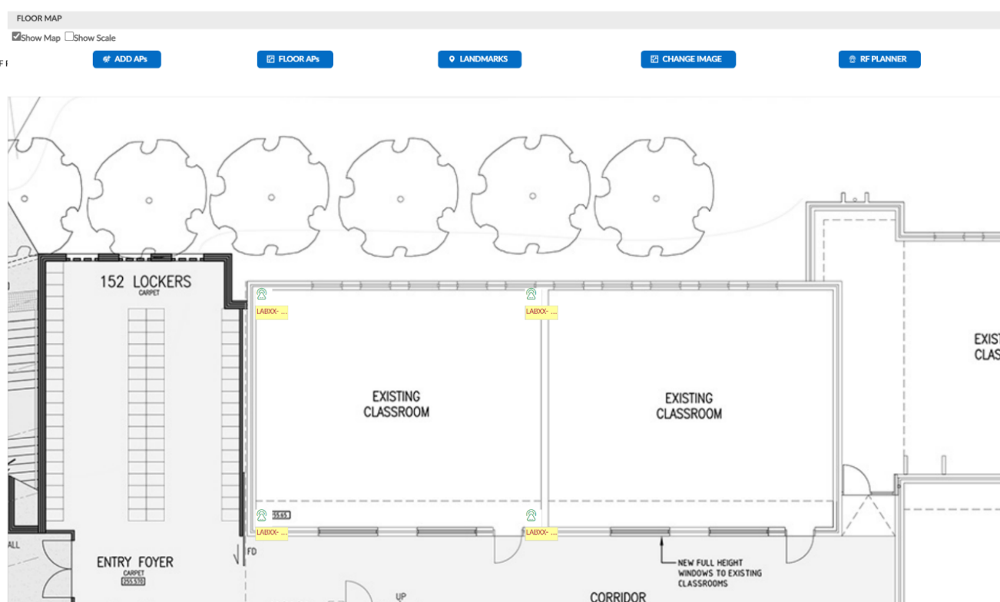

**Note:** In a production deployment, you must ensure the APs are accurately placed, in line with where they are deployed

-   Select the **Save Changes** button

**Note:** For Wi-Fi location services to achieve a level of accuracy
(within 5m - 10m), at least three access points (APs) must be able to
see the device within the boundary of their coverage area. If fewer than
3 APs or the device is outside the boundaries of shared coverage, then
it will be an approximated guess as to where the device may be located.

## 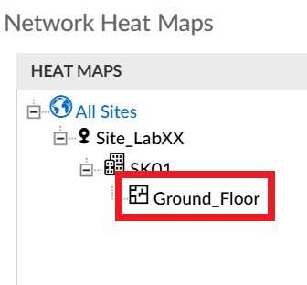Wireless Heat Maps

Within the FortiAIOps GUI

-   Navigate to **Wireless \> Heatmaps**

Within the Network Heat Maps section

-   Select the Floor, i.e., **Ground_Floor**

-   You may see this pop-up, as per the image below. Select the **OK**
    button. This pop-up is triggered because the 2.4GHz band is selected
    by default. As we do not have the 2.4GHz radios enabled as service
    radios, no 2.4GHz signal can be displayed.

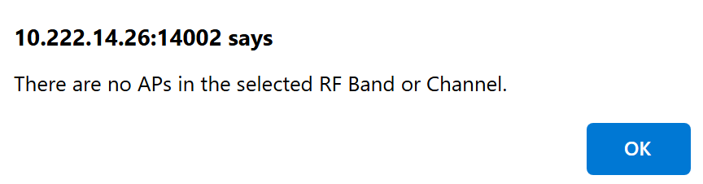

-   Select the **Select Channels** button

    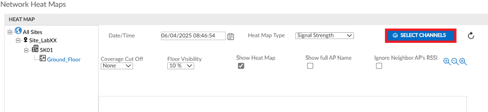

-   Select the **5GHz Channels** option, and then select the **Save**
    button

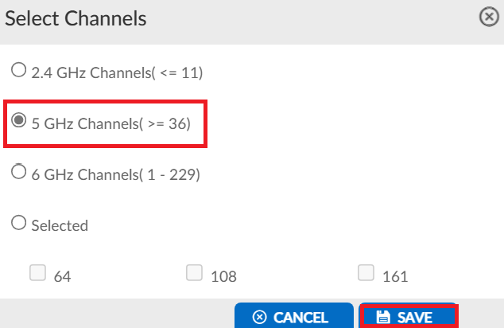

You should now see a predictive heatmap model, based on the AP TX power
and floor plan geometry.

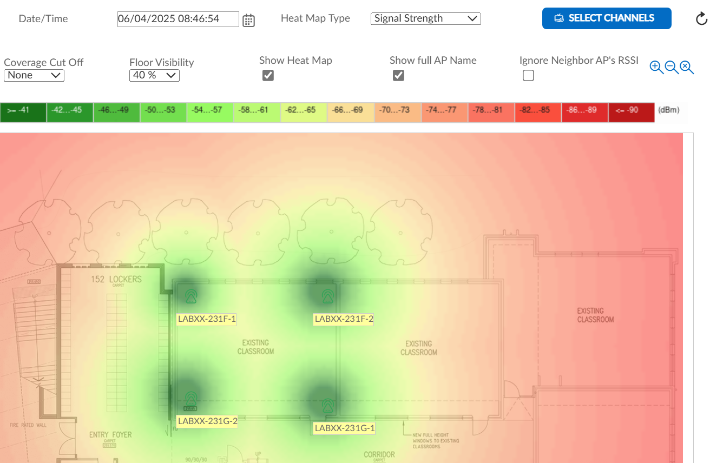

**Note:** You can change the Heat Map type to view other metrics such as
Channel Utilization

By selecting an AP within the floor plan, you can see the exact channel
utilization at a per-AP/radio level.

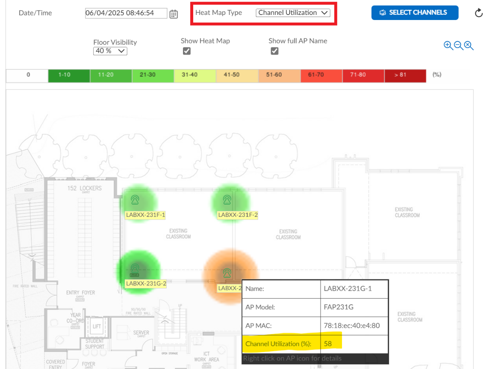

## Location Services Monitoring

A key benefit of this tool is that it can be used to locate devices
within the network boundaries, including rogue devices that are
interfering with your network, allowing you to easily isolate and take
corrective action if required.

Within the FortiAIOps GUI

-   Navigate to **Wireless \> Location Services Monitor**

-   Within the top drop-down boxes select the Site \> Building \> Floor
    \> Station/BLE MAC i.e**., Site_LabXX \> SK01 \> Ground_Floor \>
    Station/BLE MAC**

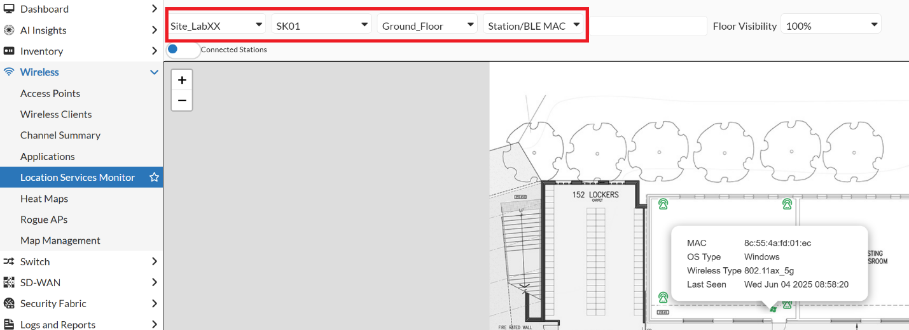

You should then see any connected stations, such as one of your Windows Laptops, shown on the floor plan. You should
be able to select this station and see further details about it.

-   Change the Connected Station Slider to Connected and Discovered
    Stations

You should now see other Wi-Fi-enabled devices nearby that are not connected to your network.

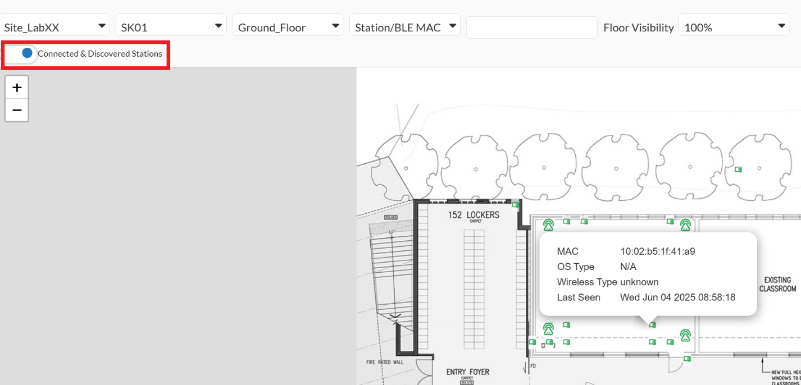

You should be
able to select any station and see further details about it. However,
this information is somewhat irrelevant due to the MAC address
randomization technique devices commonly use.

-   Within the top drop-down boxes select the Site \> Building \> Floor
    \> Rogue MAC i.e**., Site_LabXX \> SK01 \> Ground_Floor \> Rogue
    MAC**

You should now see any rogue APs that the WIDS engine has detected. You
can then select a Rogue AP shown within the floor plan for further
details.

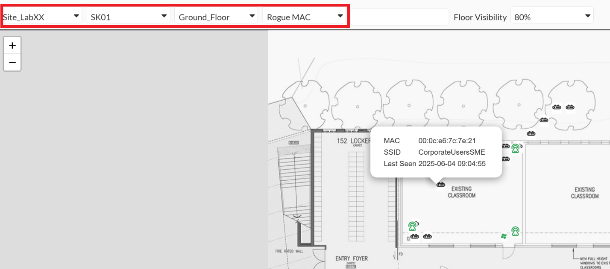

