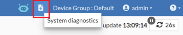
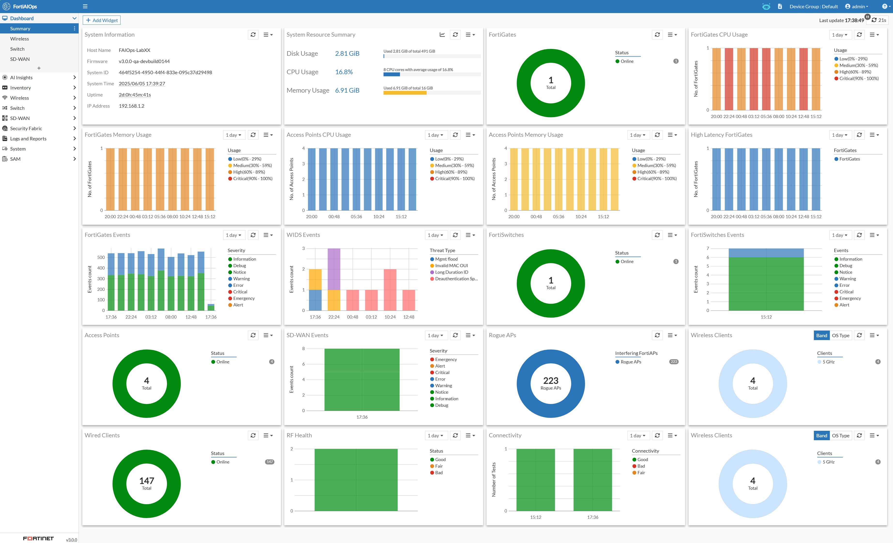

# Lab 16: Troubleshooting

As for troubleshooting issues with FortiAIOps, it's quite limited. The
user guide includes troubleshooting details. [Command Line Interface
(CLI) Reference \| FortiAIOps 2.1.0 \| Fortinet Document
Library](https://docs.fortinet.com/document/fortiaiops/2.1.0/user-guide/986334/command-line-interface-cli-reference)

If you encounter any problems during a Proof of Concept (PoC), please
download the support logs. To do so, click on the Icon in the upper
right corner and contact the CSE team via Knock. They can assist you
with validating the problem and involve engineering via Mantis if
required.

## You're a Completionist

-   If you've completed everything so far within FortiAIOps, navigate to
    **Dashboard \> Summary**

It should appear as shown in the image below, with all widgets
displaying up-to-date statistics of your lab environment.

!!! success "Congratulations - You have completed the Introduction to FortiAIOps hands-on lab"
    Hopefully, you have gained some useful knowledge by completing this workshop, which will help you position FortiAIOps within your Fortigate-managed SD-WAN, Wireless, and Switching opportunities.
