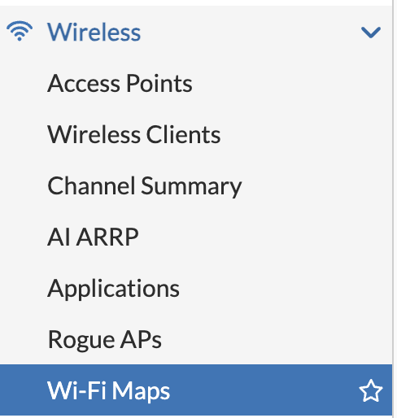
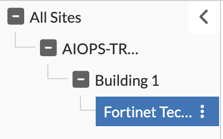
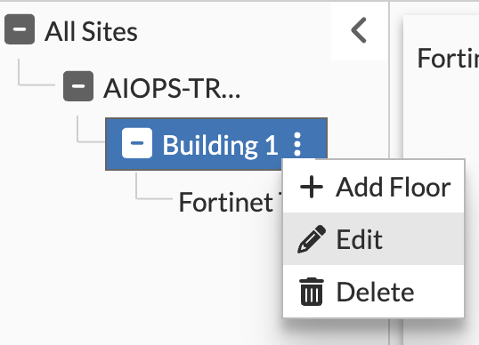
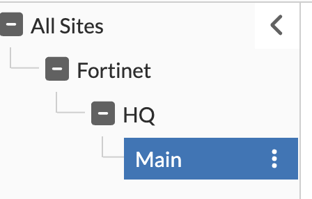

MAPS

To Import A MAP into your AIOPS this is supported

Open Wireless then Wi-Fi Maps

Click on Import
Select File
AIOPS-TRAINING-MAP.esx

Open the File Tree

You will see the AP is automatically placed.

This is because we ensured the similated AP in the Ekahau File Matches the same name as your deployed AP.

To rename the building
Click on the pipe icons and select edit.

Reame the Building to HQ

Select the AIOPS-TRAINING-MAP and lets rename this
Click on the : Icon and select edit

Lets Rename this to Fortinet

We can do the same for the Floor Plan so lets rename this to Main

If we want to Add a Building 
We can do this also and then add a floor and a map

Create a Building called Vancouver

Here we can add image file in jpg png and jpeg formats.

You need to provide the dimensions of the floorplan incuding compensating for any white outlines.

import this floorplan

