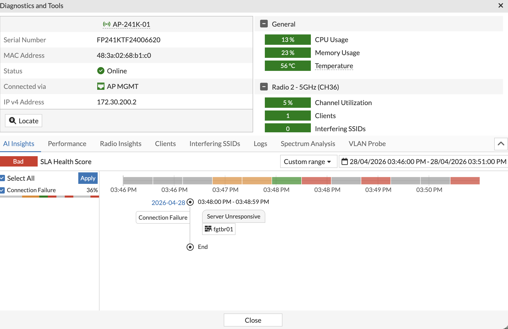
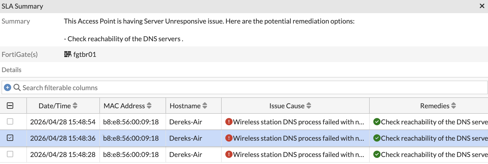
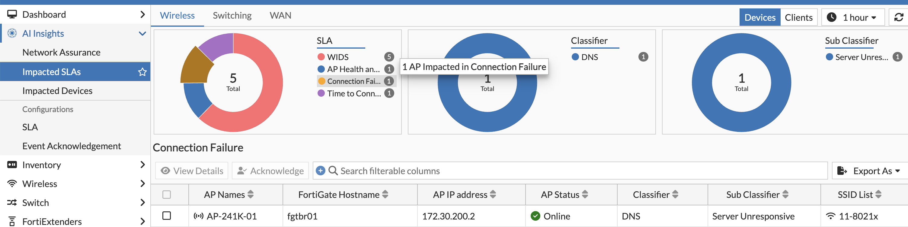
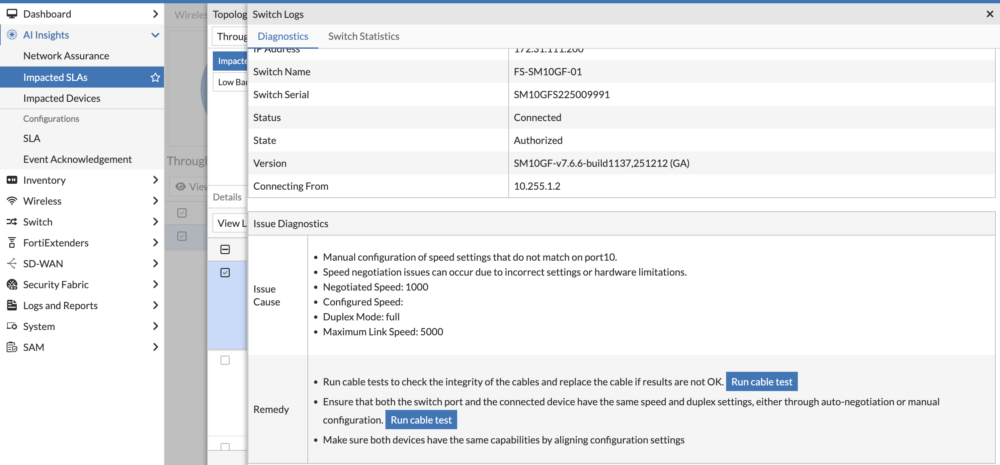
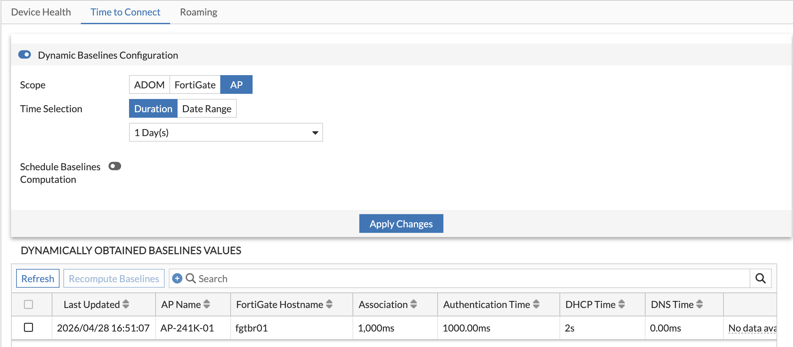
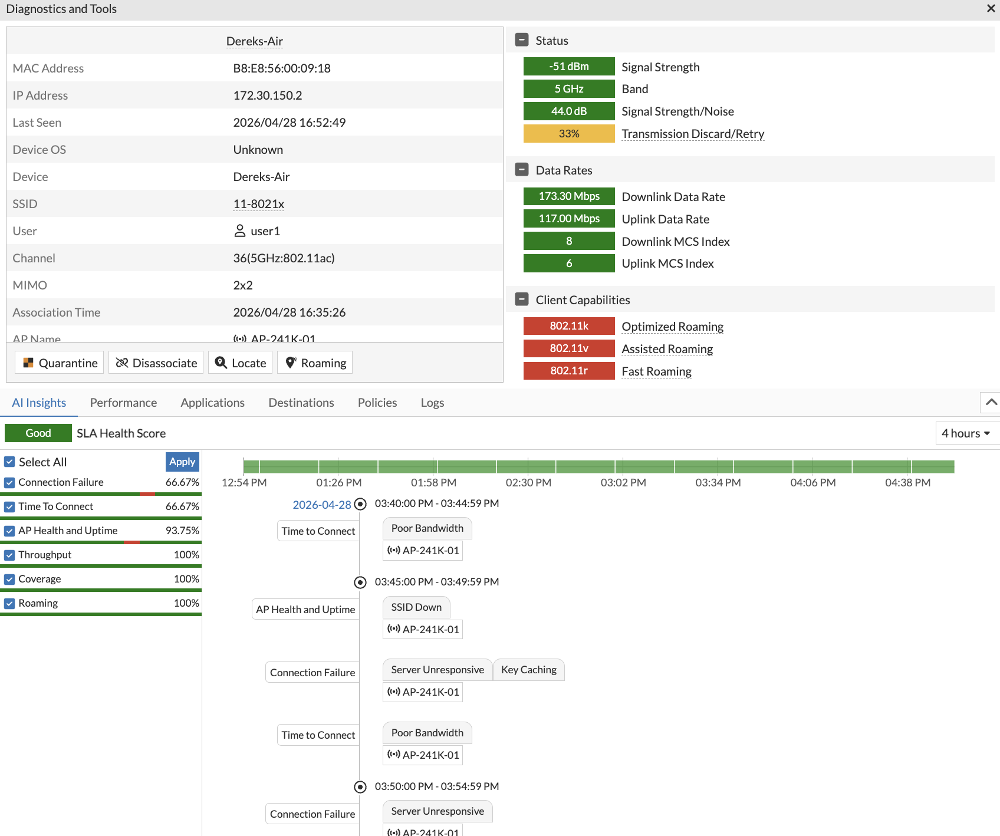
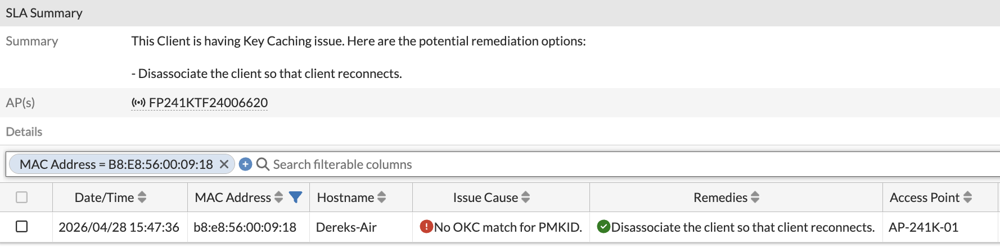
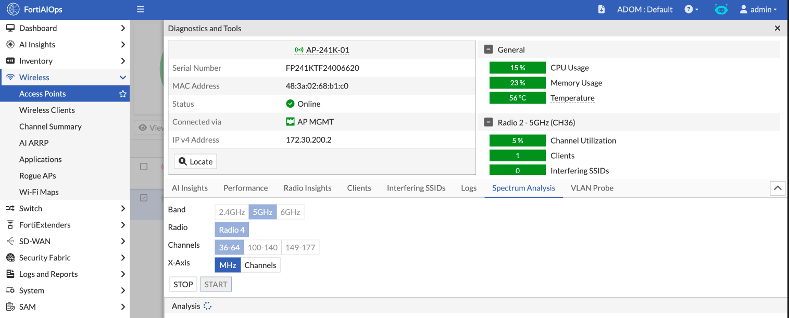
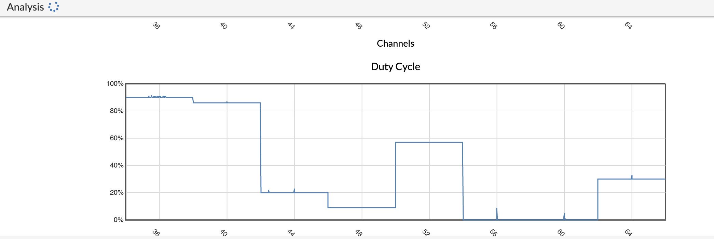
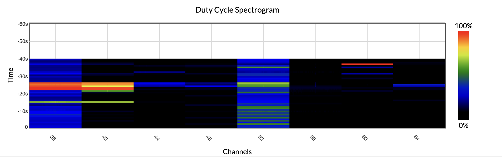

#### FortiAIOPS - AI Insights and Introduction to Troubleshooting

1. Navigate to AI Insights > Network Assurance

  

  - Provides a wireless health score and identifies the lowest-performing AP
  - Also identifies the SLA score and shows successes, failures, and details of SLA violations
  - Explore this section and find details of the issues that have impacted the scores

  

  - The summary displays logs translated into plain English for your review and consideration

  

2. Navigate to Impacted SLAs

  

  - Compare what was previously available in FAZ and FortiOS alone — FortiAIOPS provides the insight needed for effective understanding of your environment
  - Issues are not only identified, but advice on how to resolve them is also provided

  

3. Configure SLA baselines
  - SLA is configured in the Configuration section within this menu
  - Move the "Time to Connect" SLA to Dynamic Baselines
  - FortiAIOPS learns what is normal for each AP by analyzing logs; since each AP is placed in a different location, baselines may differ per AP
  - Alternatively, you can configure this by ADOM or FortiGate as desired

  

4. Navigate to Wireless > Wireless Clients
  - Select a client and click View Details

  

  - You will see detailed information about that client and its current capabilities
  - Scroll down to AI Insights to find more details on issues and examine the resolution options offered by FortiAIOPS

  

  - Review the other menus: Performance, Application, Destinations, Policies, and Logs
  - Note: Applications require App Inspection to be enabled on your security profile
  - FortiAIOPS also provides insight into SD-WAN and Forecasting

5. Navigate to Wireless > Access Points and select your AP
  - Note the channel your AP is operating on for 5 GHz
  - Click View Details, then navigate to Spectrum Analysis
  - Select the band for 5 GHz and set the channel range to include your channel
  - Click Start

  

6. Run a speed test on your device connected to the AP and scroll down to Duty Cycle

  

  - You should notice the duty cycle increase — this is expected, as it is normal to consume airtime when moving data during a speed test
  - Consistently high channel utilization under normal operation is where it becomes a problem, reinforcing the need for capacity planning
  - Review the spectrogram to see the duty cycle over time

  

  - High amounts of red indicate a high duty cycle, which is the RF term for channel utilization
  - Note: Wi-Fi uses unlicensed channels that are not dedicated solely to Wi-Fi
