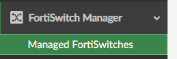
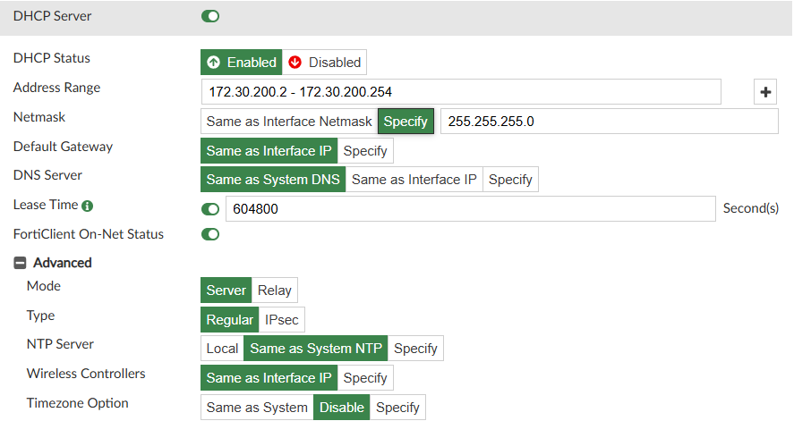
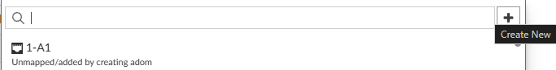
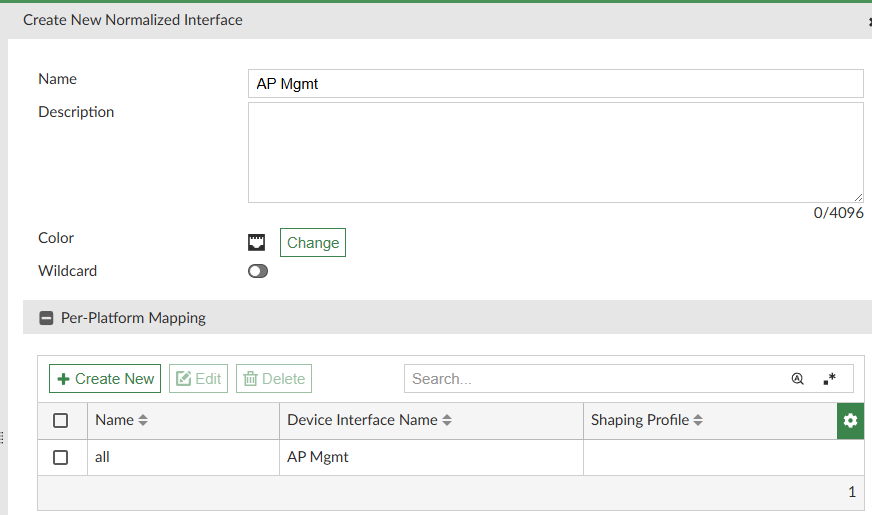
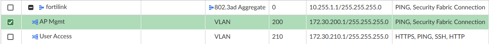
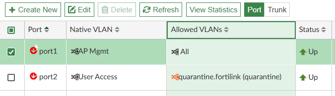
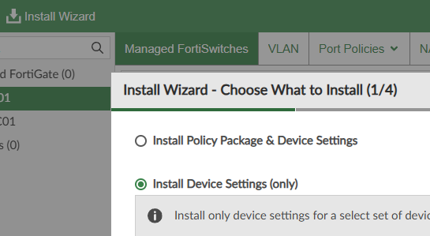
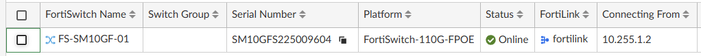
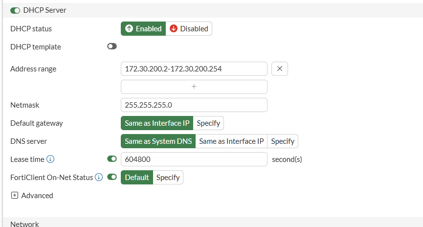

#### Lab 2 - Provisioning Switch

| Device       | Username/PW        |
| ------------ | ------------------ |
| FabricStudio | admin/fortinet1!   |
| FortiManager | admin/fortinet4A!! |
| FGTDC01      | admin/fortinet4A!! |

### Adding the FortiSwitch

>[!NOTE]
> This lab has disabled central management for Switch and AP Manager to focus more closely on ease of configuration. Please leave them off.

1. Navigate to FortiSwitch Manager > Managed FortiSwitches and click Create New

  

2. Add a wildcard switch with the following configuration
   - FortiGate: FGTBr01
   - Serial Number: SM10GF****000000
   - Name: FS-SM10GF-01

>[!CAUTION]
> If you are not using a SM10GF, replace the first 6 characters of the serial number with the first 6 of your actual switch serial number.

3. Click OK

  

>[!TIP]
> Under Managed FortiSwitches > CLI Configuration > Switch Profile, you can find the option to change the default password on FortiSwitches. Do not make changes to the default profile — this will cause issues. If you want to change the password, create a new profile and assign it as a best practice.
>
> 

### Adding VLANs

4. Before connecting the FortiSwitch, provision a pair of VLANs for use later

| Name        | Network         | Gateway        | VLAN ID |
| ----------- | --------------- | -------------- | ------- |
| AP Mgmt     | 172.30.200.0/24 | 172.30.200.254 | 200     |
| User Access | 172.30.210.0/24 | 172.30.210.254 | 210     |

5. Navigate to FortiSwitch Manager > Managed FortiSwitches > VLAN and click Create New VLAN Interface

>[!CAUTION]
> If when creating your DHCP scopes you notice no address range, go back to the addressing mode, reset it to "Manual", and reconfirm.

6. Configure the first VLAN
   - Interface Name: AP Mgmt
   - VLAN ID: 200
   - IP/Netmask: 172.30.200.254/24
   - Admin Access: Ping and Security Fabric Connection enabled
   - DHCP Server: Enabled
     - Address Range: 172.30.200.2 - 172.30.200.250
     - Netmask: Specify - 255.255.255.0
     - DNS: Same as System DNS
     - Advanced > NTP: Same as System NTP
     - Advanced > Wireless Controllers: Same as Interface IP

  

   - Select Map to Normalized Interfaces and click Create New
     - Name: AP Mgmt
     - Per-Platform Mapping > Create New
       - Matched Platform: All
       - Mapped Interface Name: AP Mgmt

  

  

   - Click OK and add change notes

7. Configure the second VLAN
   - Interface Name: User Access
   - VLAN ID: 210
   - IP/Netmask: 172.30.210.254/24
   - Admin Access: Ping, HTTPS, and SSH enabled
   - DHCP Server: Enabled
     - Address Range: 172.30.210.2 - 172.30.210.250
     - Netmask: Specify - 255.255.255.0
     - DNS: Same as System DNS
     - Advanced > NTP: Same as System NTP
   - Select Map to Normalized Interfaces and click Create New
     - Name: User Access
     - Per-Platform Mapping > Create New
       - Matched Platform: All
       - Mapped Interface Name: User Access
   - Click OK and add change notes

You should now have two new VLANs:

  

8. Navigate back to the FortiSwitch you created, click Edit, and configure the following switchports
   - Port1 Native VLAN: AP Mgmt / Allowed VLANs: All
   - Port2 Native VLAN: User Access

  

9. Use the install wizard from the top and select Install Device Settings Only

  

10. Once the install is complete, power up and connect Switch Port A on FGTBr01 to Port 10 on your switch
    - You can continue to the next lab while this completes — it will take approximately 5-10 minutes to autolink, reboot, and finish

  

>[!NOTE]
> ###### This appears to be fixed in the 8.0 release but is left here in case you encounter it
> There is a known bug in this version where the netmask of DHCP servers is not correctly passed to the FortiGate. After the install, log directly onto the FortiGate and verify that your DHCP server ranges for both VLANs have a valid netmask — they may show 0.0.0.0.
>
> 
>
> After correcting these, run a quick install on FGTBr01.

#### Lab complete — move on to Lab 3
