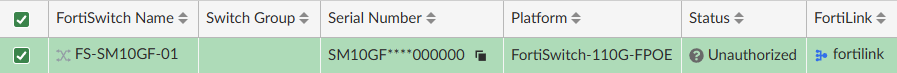
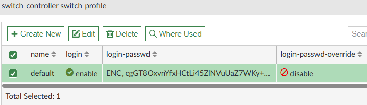

# Lab 2 - Provisioning LAN Edge

| Device       | Username/PW        |
| ------------ | ------------------ |
| FabricStudio | admin/fortinet1!   |
| FGTDC01      | admin/fortinet4A!! |

### Adding the Fortiswitch

>[!NOTE]
> This Lab has dissabled central managment for Switch and AP manager to focus more closely on ease configruation. Please leave them off

1. Navagate to FortiSwitch Manager -> Managed FortiSwitches and "Create New" Fortiswitch
2. Exploring Wildcard Switches, please add the following
   - Fortigate : FGTBr01
   - Serial Number : SM10GF****000000
   - Name : FS-SM10GF-01
3. click ok

>[!TIP]
> Under Managed Fortiswitches > Cli Configuration > Switch-Profile, you can find the ability to change the the default password on fortiswitches
>
> 

4. Before Connecting the fortiswitch lets provision a pair of vlans for use later, 

| Name               | Network         | Gateway        | Vlan ID |
| ------------------ | --------------- | -------------- | ------- |
| Wireless MGMT Vlan | 172.30.200.0/24 | 172.30.200.254 |         |
| User Vlan          | 172.30.210.0/24 | 172.30.210.254 |         |