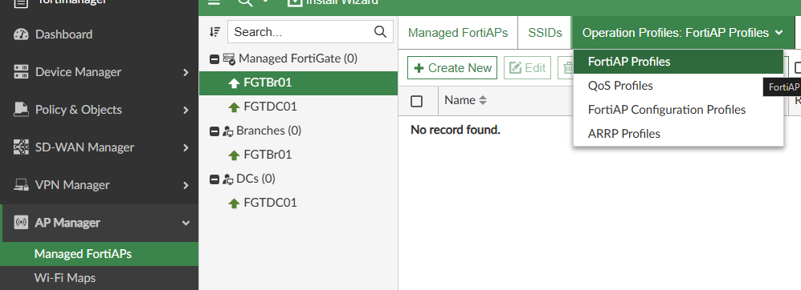
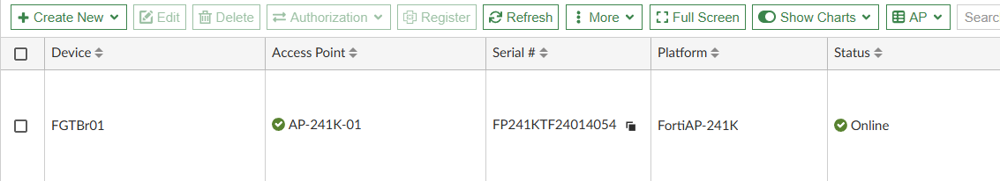

# Lab 3 - Provisioning AP

| Device       | Username/PW        |
| ------------ | ------------------ |
| FabricStudio | admin/fortinet1!   |
| FortiManager | admin/fortinet4A!! |

### Creating Operation Profile
1. Navagating to AP Manager > Managed FortiAPs > Operational Profiles > FortiAP Profiles

2. Create a new Profile
   - Name : FAP-241K-SELab
   - Platform : FortiAP-241k
   - Region : Canada
   - AP Login Password : Set to "fortinet"
   - Administrative Access : enable https and ssh
   - Radio 1 : Disabled ( 2.4Ghz from every pod = bad)
   - Radio 2 :
     - Bands : 802.11 be/ax/ac/n/a
     - Short Guard Interval : Toggle On
     - Transmit Power: Toggle dBm and set to 14 dBm
     - SSID : Tunneled
   - Radio 3 :
     - Bands : 802.11 be/ax
     - Channel Width : 80MHz
     - Short Guard Interval : Toggle On
     - Transmit Power: Toggle dBm and set to 17 dBm
     - SSID : Tunneled
   - Radio 4:
     - Mode : Dedicated to Monitor
     - WIDS Profile : default
   - Leave everything else as Default and click OK

>[!Note]
>As you haven't added the AP you you'll need to toggle "View All Profiles" to make it visable

### Adding a Model AP
3. Navagate to AP Manager > Managed FortiAPs
4. Create New Model AP
   - Fortigate : FGTBr01
   - Serial Number : FP241K****000000
   - Name: AP-241K-01
   - FortiAP Profile: FAP-241K-SELab
 - Click OK

### Policy for NTP / DNS
>[!note]
>Lastly before adding the AP we need to make sure NTP and DNS work correctly. We could enable those both on the fortigate, but instead we'll create a policy to allow the AP's to reach out to our NS01

5. Navagate to Policy & Objects > FGTBranch Firewall Policy and Create New
   - Name : APServices -> NS01
   - Action : Accept
   - Incoming Interface : AP Mgmt
   - Outgoing Interface : overlay
   - Source : **Create New Address**
     - Name : AP Mgmt Subnet
     - IP: 172.30.200.0/24
     - Click Ok add change note and Add to source
    - Destination : Select DC Services
    - Service : DNS and NTP
   - Leave the rest Default, Click OK, fill in change note

6. Install changes and connect your AP to Port1
    - You can either wait for it to finish or continue on this will take around 5 - 10 minutes to autolink reboot and finish

#### Lab complete move onto Lab 4