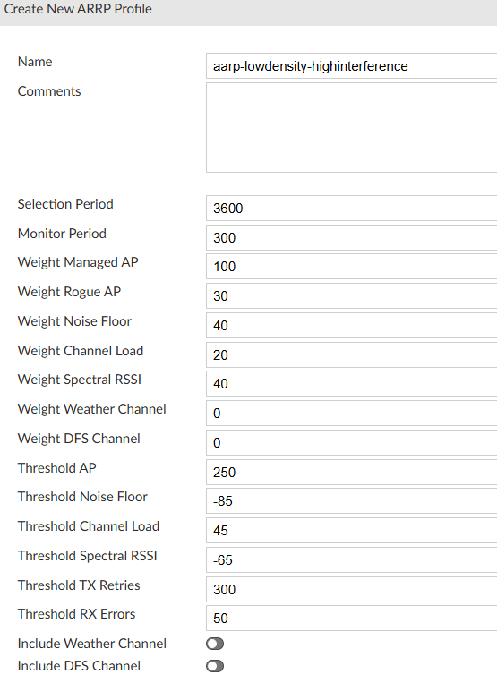
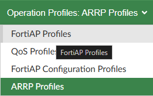
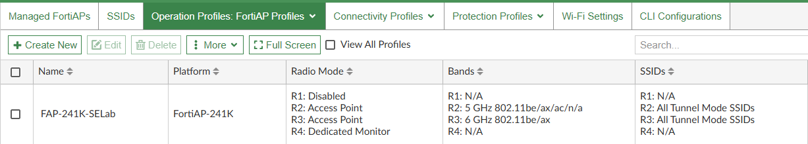
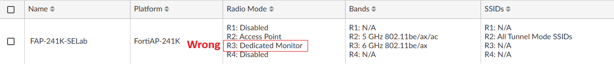
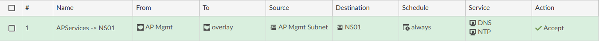
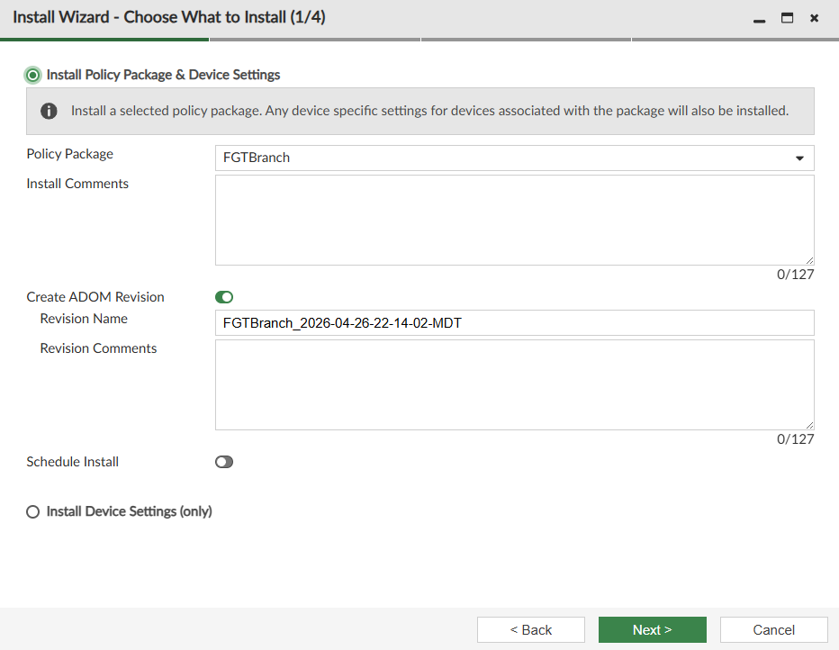

# Lab 3 - Provisioning AP

| Device       | Username/PW        |
| ------------ | ------------------ |
| FabricStudio | admin/fortinet1!   |
| FortiManager | admin/fortinet4A!! |

### Creating ARRP Profile
1. Navagating to AP Manager > Managed FortiAPs > Operational Profiles > FortiAP Profiles

2. Create a new ARRP Profile with the following settings:
   - Name : aarp-lowdensity-highinterference
   - Weight Managed AP : 100
   - Weight Rogue AP : 30
   - Weight Weather Channel : 0
   - Weight DFS Channel : 0
   - Threshold Channel Load : 45
   - Leave the rest default
   - Click ok

### Creating Operation Profile
3. Navagate to Operation Profiles: FortiAP Profiles

4. Create a new Profile
   - Name : FAP-241K-SELab
   - Platform : FortiAP-241k ( or the AP Model assigned to you )
   - Region : Canada
   - AP Login Password : Set to "fortinet"
   - Administrative Access : enable https and ssh
   - Radio 1 : Disabled ( 2.4Ghz from every pod = bad)
   - Radio 2 :
     - Radio Resouce Provision : Toggle On
     - ARRP Profile : aarp-lowdensity-highinterference
     - Bands : 802.11 be/ax/ac/n/a
     - Short Guard Interval : Toggle On
     - Transmit Power: Toggle dBm and set to 10 dBm
     - SSID : Manual
     - Advanced Options 
    - Airtime-Fairness : Toggle On
   - Radio 3 :
     - Radio Resource Provision : Toggle On
     - ARRP Profile : aarp-lowdensity-highinterference
     - Bands : 802.11 be/ax
     - Channel Width : 80MHz
     - Short Guard Interval : Toggle On
     - Transmit Power: Toggle Percent : 100%
     - SSID : Manual
     - Advanced Options 
     - Airtime-Fairness : Toggle On
   - Radio 4:
     - Mode : Dedicated to Monitor
     - WIDS Profile : default
   - Leave everything else as Default and click OK
>[!Note]
>As you haven't added the AP you you'll need to toggle "View All Profiles" to make it visable

>[!warning]
>- Double check everything looks right, it seems a 50% that the R3 Profile dosne't save. You just need to go back in and toggle it to access point instead of dedicated monitor
>##### Good
>
>
>##### Bad
>

### Adding a Model AP
5. Navagate to AP Manager > Managed FortiAPs
6. Create New Model AP
   - Fortigate : FGTBr01
   - Serial Number : FP241K****000000
   - Name: AP-241K-01
   - FortiAP Profile: FAP-241K-SELab
>[!caution]
>If you're not using a FP241K replace the first 6 of the SN with the first 6 of the actual Switch SN you have
 - Click OK

### Policy for NTP / DNS
>[!note]
>Lastly before adding the AP we need to make sure NTP and DNS work correctly. We could enable those both on the fortigate, but instead we'll create a policy to allow the AP's to reach out to our NS01

7. Navagate to Policy & Objects > FGTBranch Firewall Policy and Create New
   - Name : APServices -> NS01
   - Action : Accept
   - Incoming Interface : AP Mgmt
   - Outgoing Interface : overlay
   - Source : **Create New Address**
     - Name : AP Mgmt Subnet
     - IP: 172.30.200.0/24
     - Click Ok, Add change note, and Add as a source
    - Destination : NS01
    - Service : DNS and NTP
   - Leave the rest Default, Click OK, fill in change note

8. Run the install wizzard and Install Policy Package & Device Settings. Click Next

9. Once the install is complete connect your AP to Port1
    - You can either wait for it to finish or continue on this will take around 5 - 10 minutes to autolink reboot and finish

#### Lab complete move onto Lab 4
