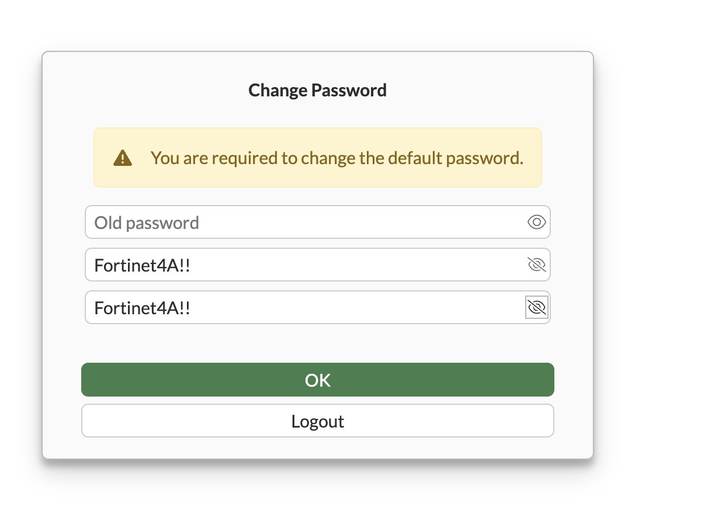
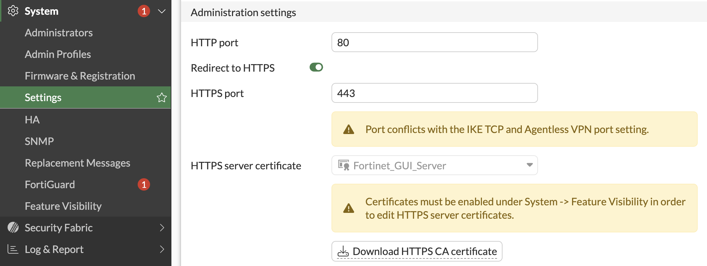
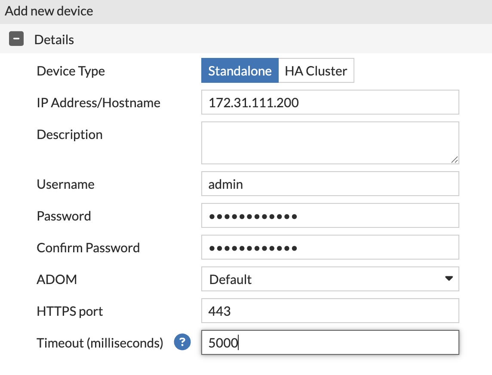
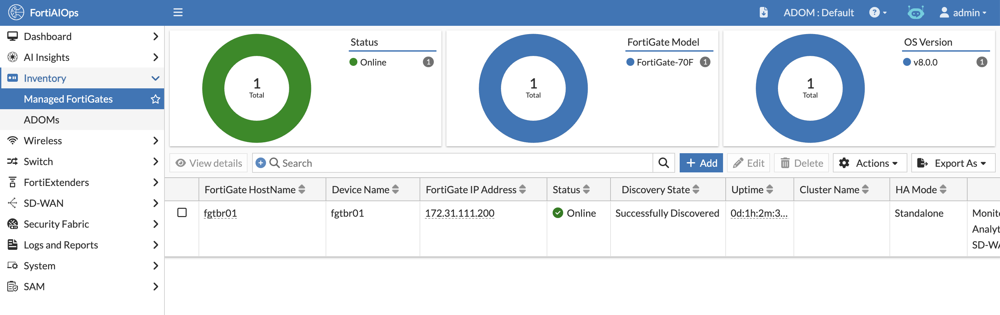

#### FortiAIOps Integration

> **Note:** FortiAnalyzer in your lab is set up to forward all logs to FortiAIOPS.

1. Log into FortiAnalyzer and authorize your device
  - The device will be part of the root ADOM
  - Click OK, then Close

2. Configure log forwarding
  - Navigate to System Settings > Advanced > Log Forwarding tab and click Create New
  - Name: FortiAIOPS
  - Remote Server Type: Syslog
  - Click OK

3. Navigate to your FortiGate: https://172.31.1(PodID).200
  - Username: admin
  - Password: (none — change it to Fortinet4A!!)

  

  - Select Login Read Only

4. Download the HTTPS CA Certificate
  - Go to System > Settings and select the Access tab
  - Download the HTTPS CA Certificate

  

  - Log out of your FortiGate

5. Log into FortiAIOps and install the CA Certificate
  - Navigate to System > CA Certificates

  

  - Click Install CA Certificate and select the certificate from your FortiGate
  - Certificate Name: FGTBr01
  - Note: If you change your HTTPS certificate due to an upgrade or a new cert being loaded, this will need to be updated. It is recommended that customers use a wildcard certificate here.

6. Add your FortiGate to inventory
  - Navigate to Inventory > Managed FortiGates and click Add
  - Enter the IP or hostname of your FortiGate: 172.31.1(PodID).200 (e.g., Pod 1: 172.31.101.200)
  - Username: admin
  - Password: Fortinet4A!!

  

  - Shortly, you should see the FortiGate come online

  

#### Lab complete — move on to Lab 5
