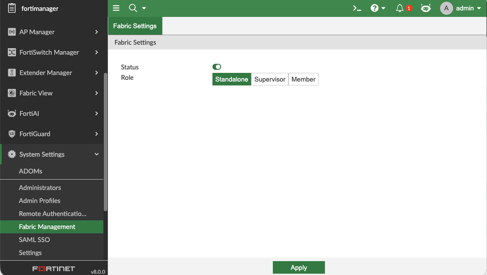
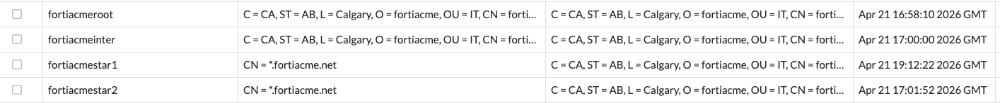
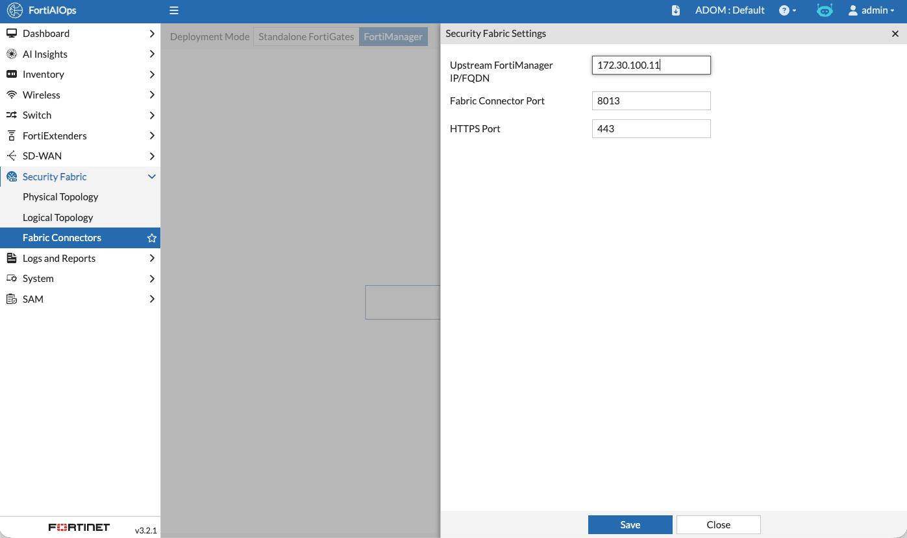
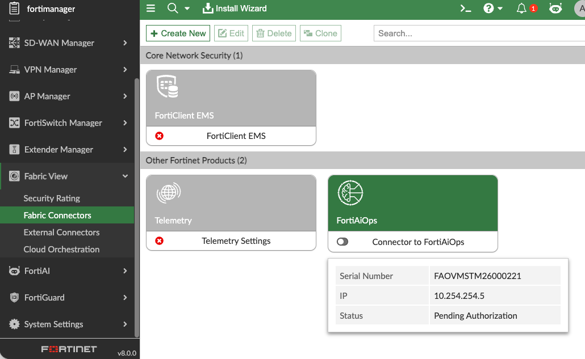
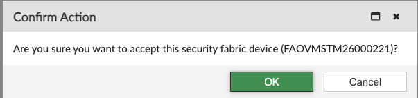

FortiAIOps intergration

Note that FortiAnalyzer in your lab is set up to forward all logs to AIOPS.

Log into FortiAnalyzer and Authroize your device.

Authorize the device

In our case this will be part of the root ADOM.

click ok and then close.

Navigate to System Settings -> Advanced
Log Forwarding Tab
Create New

Set Name : FortiAIOPS
Remote Server Type : Syslog

Click OK

Log into FortiManager

System Settings
Fabric Management.

Toggle Status to Enable

Confirm

Set Status to Enable

Set Role to Standalone
Click Apply

Login to AIOps

First we need to add the certificates from FortiAutheticator.

Navigate to Security Fabric
CA Certificates

Install your fortiacme Root then intermediate certificate
followed by your star certificates.

In Security Fabric Menu 
Select Fabric Connector
Set the Deployment mode to Fortimanager
Select Connect New

Enter the IP of your fortimanger 172.30.100.11

This will show Connected.

Click on Authrorize

Accept the Certificate

Log into fortimanager

Fabric View

Enable FortiAIOPS fabric connector

Toggle to enabel then Authrorize the AIOPS connector.

Confirm the action

Click Save

You will now see the AIOPS connector enabled.

Go back to AIOPS 

Select the Root Adom by clicking on the adom on the top bar.
then select root
