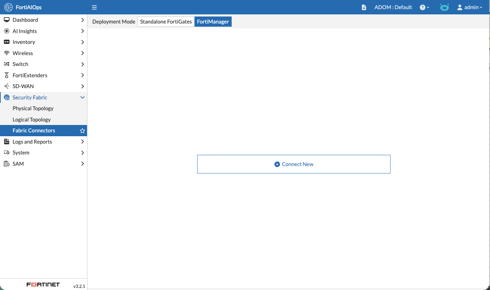
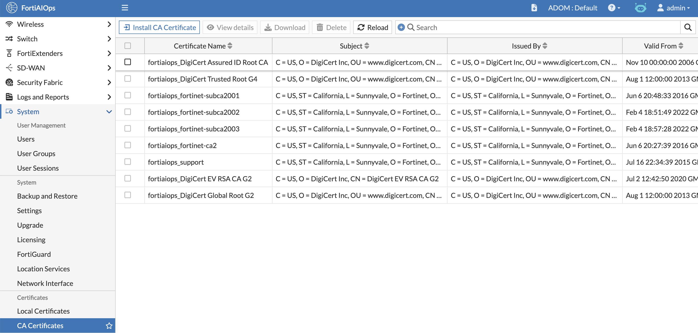
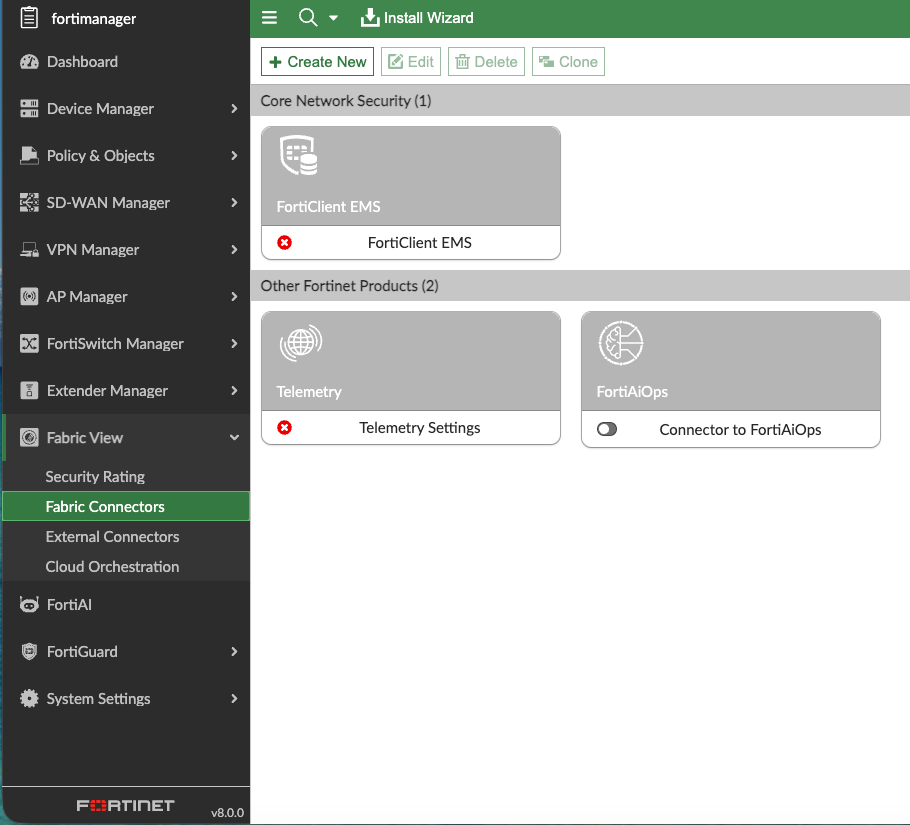

FortiAIOps intergration

Note that FortiAnalyzer in your lab is set up to forward all logs to AIOPS.
Note that this is done for you in this lab however in realworld deployments this needs to be done.
You can inspect the configuration in FAZ

Login to AIOps

In Security Fabrick Menu 
Select Fabric Connector
Set the Deployment mode to Fortimanager
Select Connect New

Enter the IP of your fortimanger 172.30.100.11

This will show disconnected.

Log into fortimanager

Fabric View

Enable FortiAIOPS fabric connector

