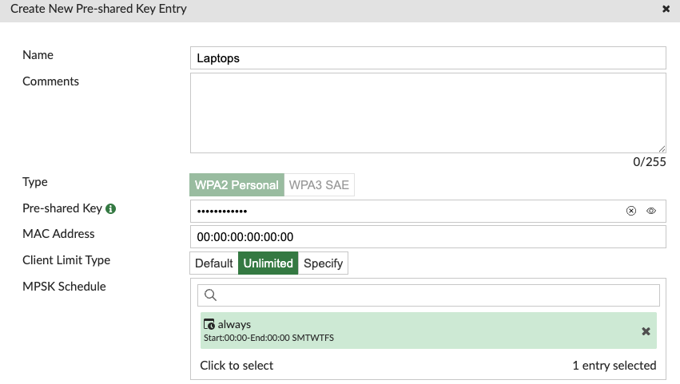
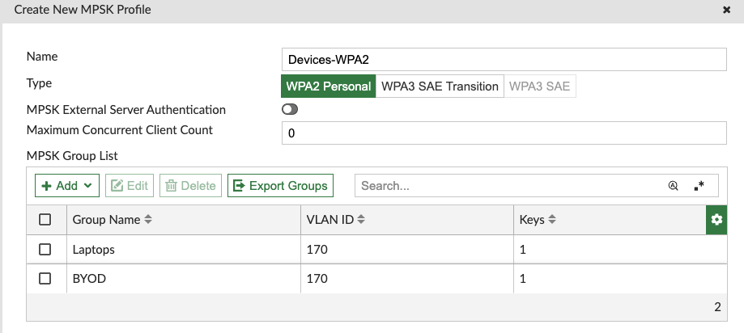

SSID Configuration

Additional SSID profiles

802.1X Auth with FortiAuthenticator.

Configure FAC as Radius Server -> 

Create User 1 will AUTH with returned vlan 210
Create User 2 will Auth with returned vlan 211

Configure on FAC FortiGates as Radius Client

Test User Auth from FortiGate to ensure connectivity.

Create SSID "PodNumber"8021x Auth this will use FAC for Radius

Under this VLAN create two VLANs 150 and 160

172.30.150.x/24
172.30.160.x/24

MPSK 

Create new MPSK Profile

Devices-WPA2
Add new MPSK Group List.

Create a New PSK 

Name : Laptops
VLAN Type : Fixed VLAN
VLAN ID : 160

In MPSK List click Add 

Create Key

Enter the Name as Laptops

Enter the Pre shared Key as "WirelessLab1"

Set the Client Limit Type to Unlimited

Set MPSK Provile to Always

Click OK

Create a New PSK 

Name : BYOD
VLAN Type : Fixed VLAN
VLAN ID : 170

In MPSK List click Add 

Create Key

Enter the Name as Laptops

Enter the Pre shared Key as "WirelessLab2"

Set the Client Limit Type to Unlimited

Set MPSK Provile to Always

Click OK

Click OK

Right Click on Devices-WPA2 and select Clone

Rename this Profile to Devices - WPA3

Set the type to WPA3 SAE Transition

Edit the Laptops PSK Entry

Set type to WPA3 SAE

Enter the fixed mac address of your laptop here. Note WPA3 doesnt allow for access without defining the mac address.

set the SAE Password to "WirlessLab1"

Click OK

Click Ok again to exit the Pre Shared Key Entry Table

Click on BYOD 

Select Edit
Click on the BYOD Entry 
Edit on the BYOD Entry on the MPSK List

Change the type to WPA3 SAE transition

Set Type to WPA3

Set the SAE Password to "WirelessLab2"

Enter the fixed MAC address of your phone or other device.

Click OK

Change the type of the MPSK Profile from WPA3 SAE-Transition to WPA3-SAE

Create NEW SSID
Name "PodNumber"-Devices-WPA2
SSID "PodNumber"-Devices
Set Beacon Advertising to Name
Set Security Mode to WPA2 Personal
Set Mode to Multiple
Select Devices-WPA2
Ensure Dynamic VLAN Assignment is Toggled On
Click Ok

Create NEW SSID
Name "PodNumber"-Devices-WPA3
SSID "PodNumber"-Devices
Set Beacon Advertising to Name
Set Security Mode to WPA3 SAE
Set Mode to Multiple
Select Devices-WPA3
Ensure Dynamic VLAN Assignment is Toggled On
Click Ok

Modify the provisioning template.
Add the VLAN interfaces to the SSID interfaces. 
VLANS 160 and 170

On the WPA2 "PODNumber-Devices-WPA2 use the following subnets
VLAN 160 172.30.161.x/24
VLAN 170 172.30.171.x/24

On the WPA2 "PODNumber-Devices-WPA3 use the following subnets
VLAN 160 172.30.162.x/24
VLAN 170 172.30.172.x/24

Create a Policy to allow 172.30.161.x and 172.30.162.x to communicate with each other
Create a Policy to allow 172.30.171.x and 172.30.172.x to communicate with each other

Create a Policy to allow all of these subnets to go to the internet.

Consider ways to resolve this and limitations to this with Bonjour and Multicast. What are some approaches to resolve this issue other than "bridging the ssid"

Connect your devices to these SSID.
Use the users you created earlier.

IP Ranges for reference we are using in this lab

| Name          | Network         | Gateway        | Vlan ID |
| ------------- | --------------- | -------------- | ------- |
| User1 Vlan     | 172.30.210.0/24 | 172.30.210.254 | 210     |
| User2 Vlan     | 172.30.210.0/24 | 172.30.210.254 | 211     |
| Guest SSID     | 172.30.220.0/24 | 172.30.220.254 |         |
| Devices-WPA2 Native SSID    | 172.30.230.0/24 | 172.30.230.254 |         |
| Devices-WPA2 Laptop    | 172.30.161.0/24 | 172.30.161.254 |160         |
| Devices-WPA2 BYOD    | 172.30.161.0/24 | 172.30.161.254 |170         |
| Devices-WPA3 Native SSID     | 172.30.240.0/24 | 172.30.240.254 |         |
| Devices-WPA3 Laptop    | 172.30.162.0/24 | 172.30.162.254 | 160        |
| Devices-WPA3 BYOD    | 172.30.172.0/24 | 172.30.172.254 | 170        |
| ServicesLB    | 172.30.250.1/32 | xxx            |         |