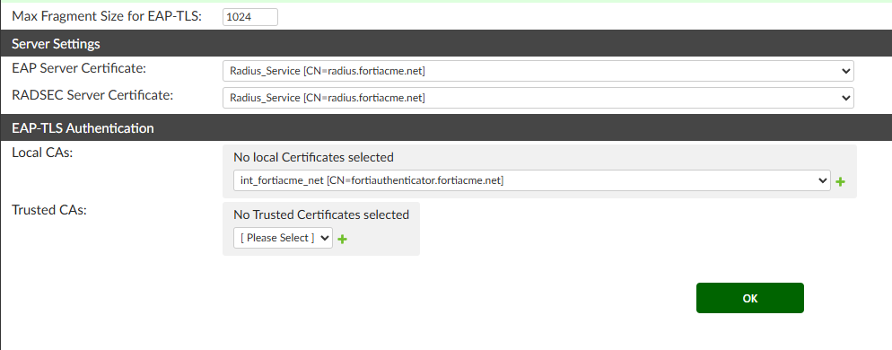
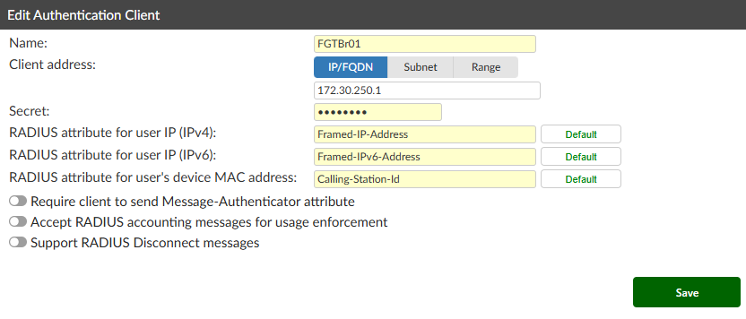
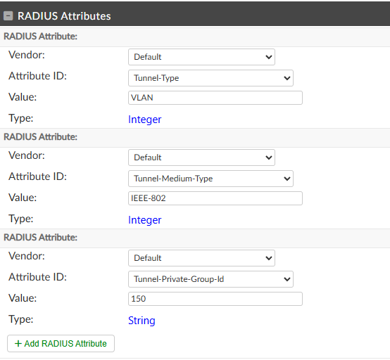
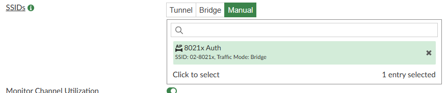

#### Lab 5 - Bring on the Radiation: 802.1x Style

| Device             | Username/PW        |
| ------------------ | ------------------ |
| FabricStudio       | admin/fortinet1!   |
| FortiManager       | admin/fortinet4A!! |
| FortiAuthenticator | admin/fortinet4A!! |

> [!NOTE]
> **What is 802.1x and why is it the enterprise standard?**
>
> 802.1x is an IEEE standard for port-based Network Access Control (NAC). Unlike PSK or MPSK where devices authenticate using a shared secret, 802.1x authenticates individual users or devices using their own unique credentials — and the network has no idea what those credentials are until the RADIUS server validates them.
>
> **The three-party model:**
> Every 802.1x authentication involves three roles:
> - **Supplicant** — the client device (laptop, phone) running an 802.1x-capable network stack
> - **Authenticator** — the FortiGate or AP, which acts as a gatekeeper. It passes EAP messages between the client and the RADIUS server but never sees the credentials
> - **Authentication Server** — the RADIUS server (FortiAuthenticator here), which validates credentials and tells the authenticator whether to allow or deny access
>
> **Why enterprises choose 802.1x over PSK:**
> - **Individual identity** — You know exactly who is connected, not just that someone knows a password. Every connection is tied to a username, logged with a timestamp and MAC address.
> - **No shared secrets** — There is no single key that, if leaked, compromises everyone's access. Each user has their own credential.
> - **Instant revocation** — Disable a user's account in Active Directory and they lose Wi-Fi access immediately — no rekeying, no hunting down which devices had the PSK.
> - **Dynamic VLAN assignment** — The RADIUS server can place each user on a different VLAN based on their identity, group membership, or device type — all on a single SSID.
> - **Full audit trail** — Every authentication attempt is logged: who, when, from which MAC address, and what VLAN they were assigned.
> - **Policy richness** — Beyond VLANs, RADIUS attributes can enforce bandwidth limits, session timeouts, QoS markings, and more.
>
> **How to leverage it in the enterprise:**
> - Integrate FortiAuthenticator with Active Directory so users authenticate with their domain credentials — no separate account management required
> - Use dynamic VLAN assignment to automatically place Sales on the Sales VLAN, Engineering on the Engineering VLAN, and contractors on a restricted VLAN — all from the same SSID
> - Deploy EAP-TLS with MDM-issued certificates (Intune, Jamf) to eliminate passwords entirely — a stolen device cannot authenticate if its certificate has been revoked
> - Create time-limited accounts in FortiAuthenticator for contractors and partners without touching AD, with automatic expiry
> - Combine with FortiNAC for device posture checks — only devices that are patched, managed, and compliant get placed on the corporate VLAN

##### Preparing 802.1x Authentication

1. Connect to FortiAuthenticator and log in

2. Navigate to Certificate Management > End Entities > Local Services and click Create New
   - Certificate ID: Radius_Service
   - Certificate Authority: int_fortiacme_net
   - Issuer: Local CA
   - Name (CN): radius.fortiacme.net
   - Subject Alternate Name > DNS: radius.fortiacme.net
   - Click Save

3. Navigate to Authentication > Radius Service > General
   - Assign your Radius_Service certificate to both EAP Server and RADSEC Server Certificates
   - Change Local CAs to the FortiAcme Intermediate

  

   - Click OK

4. Navigate to Authentication > Radius Service > Clients and click Create New
   - Name: FGTBr01
   - IP/FQDN: 172.30.250.1
   - Secret: fortinet4A!!
   - Leave the rest default

  

   - Click Save

5. Navigate to Authentication > Radius Service > Policies and click Create New
   1. Radius Clients
      - Policy Name: Wireless8021x
      - Move FGTBr01 over to Chosen Clients
      - Click Next
   2. Radius Criteria
      - Click Next
   3. Authentication Type
      - Password/OTP Authentication
      - Accept EAP > Accept PEAP and EAP-TTLS
      - Click Next
   4. Identity Sources
      - Click Next
   5. Authentication Factors
      - Password only
      - Click Next
   6. Radius Response
      - Click Save and Exit

> [!TIP]
> **Choosing the right EAP method:**
> - **PEAP** — The most widely deployed enterprise EAP method. The user authenticates with a username and password inside an encrypted TLS tunnel. The server presents a certificate that the client validates. Easy to deploy, supported on every major OS, and a great starting point for most organisations.
> - **EAP-TTLS** — Similar to PEAP but more flexible in how inner authentication works. Useful in mixed environments with non-Windows devices.
> - **EAP-TLS** — The gold standard. Both the client and the server present certificates — no password is ever used. Requires a PKI and certificate deployment (typically via MDM), but is extremely secure and immune to phishing and credential theft. This is the recommended long-term target for any mature enterprise wireless deployment.
>
> In this lab we are using PEAP/EAP-TTLS with usernames and passwords for simplicity. In production, consider EAP-TLS for managed corporate devices and PEAP for BYOD or guest-class access.

6. Navigate to User Management > Local Users and create two users
   1. User 1
      - Username: user1
      - Password: fortinet4A!!
      - Allow Radius Authentication
      - Click Save
   2. User 2
      - Username: user2
      - Password: fortinet4A!!
      - Allow Radius Authentication
      - Click Save

7. Return to **both** users and set the following RADIUS attributes
   1. Radius Attribute 1
      - Vendor: Default
      - Attribute ID: Tunnel-Type
      - Value: VLAN
   2. Radius Attribute 2
      - Vendor: Default
      - Attribute ID: Tunnel-Medium-Type
      - Value: IEEE-802
   3. Radius Attribute 3
      - Vendor: Default
      - Attribute ID: Tunnel-Private-Group-Id
      - Value: 150 for user1 / 160 for user2

  

> [!TIP]
> **What these three RADIUS attributes actually do:**
> When a user successfully authenticates, the RADIUS server sends these attributes back to the FortiGate along with the access decision. Together they instruct the FortiGate to place the user on a specific VLAN:
> - **Tunnel-Type = VLAN** — use VLAN tunnelling for this session
> - **Tunnel-Medium-Type = IEEE-802** — this is an 802 (Ethernet/Wi-Fi) network
> - **Tunnel-Private-Group-Id = 150 or 160** — the VLAN ID to assign
>
> This is the engine behind dynamic VLAN assignment. In production, these attributes are typically set at the group level in Active Directory rather than per user — every member of the "Engineering" AD group automatically gets VLAN 100, every member of "Sales" gets VLAN 200, and so on. Change a user's AD group and their VLAN changes at next login, with no changes needed on the network side.

##### Creating the SSID and VLANs

8. In FortiManager, navigate to Policy & Objects > User & Authentication > Radius Servers and click Create New
9. Configure the server as follows
   - Name: FortiAuthenticator
   - Primary Server Name/IP: 172.30.100.10
   - Primary Server Secret: fortinet4A!!
   - Create New Per-Device Mapping
     - Mapped Device: FGTBr01
     - Advanced Options > Source IP: 172.30.250.1
   - Click OK and add change notes

10. Navigate to AP Manager > SSIDs and click Create New
    - Name: 8021x Auth
    - Traffic Mode: Bridge
    - SSID: xx-8021x (xx is your pod number)
    - Security Mode: WPA3 Enterprise
    - Authentication: Radius Server - select FortiAuthenticator
    - Dynamic VLAN Assignment: Enable
    - Schedule: Always

> [!NOTE]
> With Dynamic VLAN Assignment enabled, the FortiGate does not decide which VLAN a user lands on — the RADIUS server does. This means your network policy lives in one place (FortiAuthenticator or Active Directory) and applies consistently across every AP, every site, and every FortiGate in your environment. Add a new branch office and it inherits the same policy automatically.

11. Navigate to FortiSwitch Manager > VLAN and create two new VLANs
    1. User1 VLAN
       - Interface Name: User1 Vlan
       - VLAN ID: 150
       - IP/Netmask: 172.30.150.254/255.255.255.0
       - DHCP Server: Enable
       - Address Range: 172.30.150.2 - 172.30.150.250
       - Netmask: Specify - 255.255.255.0
       - DNS Server: Same as System DNS
       - Advanced > NTP Server: Same as System NTP
       - Map to Normalized Interface > Create New
         - Name: User1 Vlan
         - Per-Platform Mapping > Create New
           - Matched Platform: All
           - Mapped Interface: User1 Vlan
       - Click OK
    2. User2 VLAN
       - Interface Name: User2 Vlan
       - VLAN ID: 160
       - IP/Netmask: 172.30.160.254/255.255.255.0
       - DHCP Server: Enable
       - Address Range: 172.30.160.2 - 172.30.160.250
       - Netmask: Specify - 255.255.255.0
       - DNS Server: Same as System DNS
       - Advanced > NTP Server: Same as System NTP
       - Map to Normalized Interface > Create New
         - Name: User2 Vlan
         - Per-Platform Mapping > Create New
           - Matched Platform: All
           - Mapped Interface: User2 Vlan
       - Click OK

12. Navigate to Policy & Objects > Policy Packages > FGTBranch and create two new policies
    1. DNS and NTP Policy
       - Name: 8021x Vlans -> DNS n NTP
       - Action: Accept
       - Incoming Interface: User1 Vlan and User2 Vlan
       - Outgoing Interface: Overlay
       - Source: User1 Vlan and User2 Vlan
       - Destination: NS01
       - Service: DNS and NTP
       - Click OK
    2. Clone the policy above and change the following
       - Name: 8021x Vlans -> Internet
       - Outgoing Interface: Underlay
       - Destination: All
       - Service: All
       - NAT: Enabled
       - Click OK

13. Navigate to AP Manager > Operational Profiles > FortiAP Profiles and edit your existing profile
    - Change SSIDs on Radio 2 and Radio 3 to Manual and add 8021x Auth
    - Click OK

  

14. Run a full install (Policy and Device) to FGTBr01

##### Testing

15. Connect to your SSID using either username and password and accept any certificate prompt
    - Note: If you did not add your Root and Intermediate certificates, you may need to accept additional certificate warnings

> [!TIP]
> Try connecting once as user1 and confirm you receive an IP in the 172.30.150.x range, then connect as user2 and confirm you land on 172.30.160.x. This demonstrates the core value of 802.1x — the same SSID, the same AP, but completely different network placement based on who you are.

#### Lab complete — move on to Lab 6
