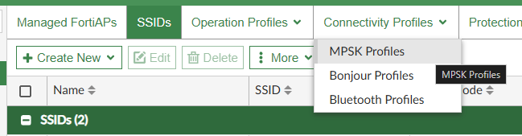
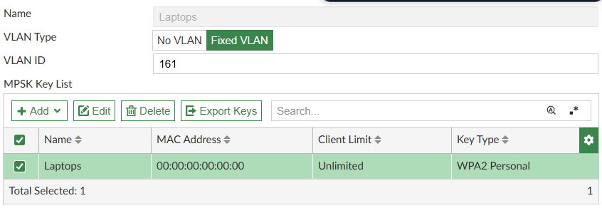
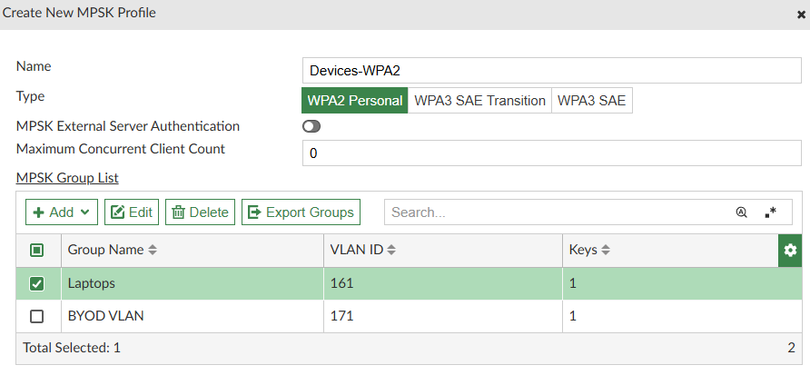
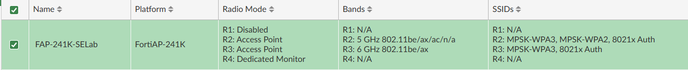

# Lab 5 - Split Personality with MPSK
#### Setting up MPSK SSID
| Device             | Username/PW        |
| ------------------ | ------------------ |
| FabricStudio       | admin/fortinet1!   |
| FortiManager       | admin/fortinet4A!! |
| Fortiauthenticator | admin/fortinet4A!! |

1. On Fortimanager Navagate to AP Manager > Managed FortiAP's > Connectivity Profiles > MPSK Profiles and Create New

>[!tip]
>We're Creating both WPA2 and WPA3 here 6Ghz only supports WPA3 ( its the rules we don't make them ) and WPA2 to support legacy Devices
2. In the new profile configure
   - Name: Devices-WPA2
   - Under MPSK Group List, Create a Group ( Add Button )
     - Name Laptops
     - Vlan Type : Fixed Vlan
     - Vlan ID : 161
     - In MPSK Key List Add
       - Name : Laptops
       - Pre-shared Key : WirelessLab1
       - Key Limit Type : Unlimited
       - Schedule : Always

       - Click Ok
     - Click Ok
   - Create Another Group
     - Name BYOD VLAN
     - Vlan Type : Fixed Vlan
     - Vlan ID : 171
     - In MPSK Key List Add
       - Name : BYOD VLAN
       - Pre-shared Key : WirelessLab2
       - Key Limit Type : Unlimited
       - Schedule : Always
       - Click Ok
     - Click Ok

   - Click Ok

>[!note]
> Enter the fixed mac address of your laptop here. Note WPA3 doesnt allow for access without defining the mac address. Be aware most OSs will randomize this for security purposes ( mac especially ) So you'll need to disable this when connecting to the ssid.
3. Create another for WPA3
   - Name: Devices-WPA3
   - Under MPSK Group List, Create a Group ( Add Button )
     - Name Laptops
     - Vlan Type : Fixed Vlan
     - Vlan ID : 162
     - In MPSK Key List Add
       - Name : Laptops
       - Type : WPA3 SAE
       - SAE Password : WirelessLab1
       - MAC Address : [ Your Laptops MAC ]
       - Schedule : Always
       - Click Ok
     - Click Ok
   - Create Another Group
     - Name BYOD VLAN
     - Vlan Type : Fixed Vlan
     - Vlan ID : 172
     - In MPSK Key List Add
       - Name : BYOD VLAN
       - Pre-shared Key : WirelessLab2
       - MAC Address : [ **NOT** Your Laptops MAC ] ( Can't overlap )
       - Schedule : Always
       - Click Ok
     - Click Ok

4. Navagate to SSIDs and Create New
    - Name : MPSK-WPA2
    - Traffic Mode : Tunnel
    - SSID: xx-Devices-WPA2 (xx is your pod number)
    - Security Mode : WPA2-Personal
    - Pre-shared key : Multiple
    - MPSK Profile : Devices-WPA2
    - Dynamic Vlan Assignment : Enable
    - Schedule : Always

5. Clone the last SSID and change
    - Name : MPSK-WPA3
    - SSID: xx-Devices-WPA3 (xx is your pod number)
    - Security Mode : WPA3-SAE
    - SAE Password : fortinet1!
    - Hash-to-Element (H2E) only : Enable
    - MPSK Profile : Devices-WPA3
    - Dynamic Vlan Assignment : Enable
    - Schedule : Always

6. Navagate to Operation Profiles > FortiAP Profiles and edit the exsisting Profile
   - Add MPSK-WPA2 and MPSK-WPA3 to radio 2
   - Add MPSK-WPA3 to radio 3

1. Run the script... You can thank me later
2. I've already created all the mapped interfaces for these to... you're welcome
3.  Clone the policies do it over again