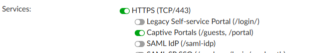
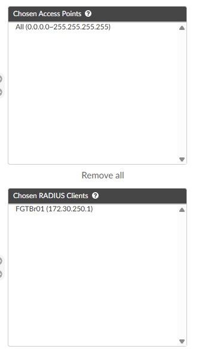
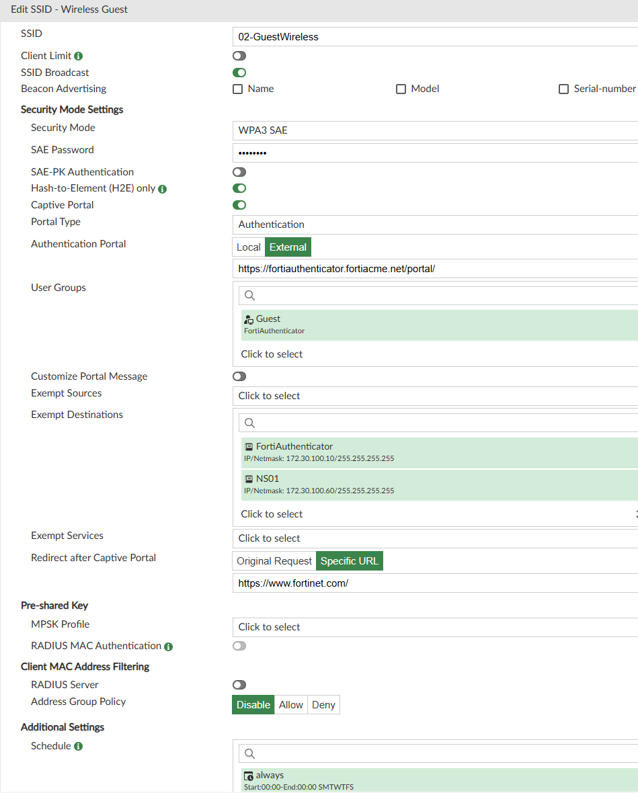
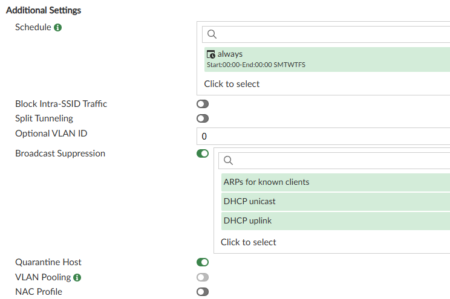

# Wireless for your friends
#### Setting up captive guest portal

### Authenticator for Guests
1. Navagate to Authentication > User Management > User Groups and select Create New
   - Name : Guests
   - Type : Local
   - Radius Attributes : Add one
     - Vendor Fortinet
     - Attribute ID : Fortinet-Group-Name
     - Value Type : Static
     - Value : Guest
   - Click Save
2. Navagate to Authentication > Portals > Portals and select Create New.
   - Name : Guest-Portal
   - User Account Self-Registration : Enabled
   - Account Expires after : 3 Hour
   - Place Registered users into a group : Select Guests
   - Password Creation : User-Defined
   - Account delivery options ... : Display on browser page 
   - Leave the rest default and click Save
3. Navagate to Authentication > Portals > Access Points and select Create New.
   - Name : All
   - Client address : Range > 0.0.0.0-255.255.255.255
   - Click Save
4. Navagate to System > Network > Interfaces > Edit Port2
   - Under Services > HTTPS : Enable Captive Portals 
  
   - CLick Save
   - Log Back in

5. Navagate to Authentication > Portals > Policies, click Captive Portal at the top and Create New
   - Policy type
     - Name : Guest-Policy
     - Poral : Guest-Portal
     - Click Next
   - Portal selection criteria
     - HTTP Parameter : ssid
     - Operator : [string]exact_match
     - Value : xx-GuestWireless (xx is your pod number)
     - Click Next
   - Authorized clients
     - Move All to Chosen Access Points
     - Move FGTBr01 Over to Chosen Radius Clients
  
   - Click Next
   - Authentication type
     - Leave this default
     - Click Next 
   - Identity sources
     - Leave this default
     - Click  Next 
   - Authentication factors
     - Authentication Methods: Password-only
     - Next
   - RADIUS response
     - Click  Save and Exit

1. Logging into your Fortimanager Navagate to Policy & Objects > User & Authentication > User Groups and Create New
   - Name : Guest
   - Remote Authentication Servers : Create New
     - Remote Server : FortiAuthenticator
     - Group Name : Guest
   - Click OK

2. Navagate to AP Manager > Managed FortiAPs > SSIDs and create a new SSID
   - Name : Wireless Guest
   - Mode : Tunnel
   - IP/Network Mask : 172.30.220.0/24
   - DHCP Server Enabled
   - Address Range : 172.30.220.2 - 172.30.220.250
   - Netmask : Specify > 255.255.255.0
   - DNS Server : Same as system DNS
   - SSID : xx-GuestWireless (xx is your pod number)
   - Security Mode : Can be WPA3 SAE / WPA2 Personal / Open ( dealers choice )
   - Captive Portal : Enabled
   - Portal Type : Authentication
   - Authentication Portal : https://fortiauthenticator.fortiacme.net/portal/
   - User groups : Guest ( make sure its the Radius one )
   - Exempt destinations : FortiAuthenticator and NS01
   - Redirect after Captive Portal : Specific URL > https://www.fortinet.com/
   - Schedule : Always
   - Quarantine Host : Enabled

1. Lastly Navagate to Policy & Objects > Policy Packages > FGT Bracnh and create two Firewall policies
   1. - Name : GuestWireless -> Services
      - Action : Accept
      - Incoming Interface : Guest Wireless
      - Outgoing Interface : Overlay
      - Source : Wireless Guest
      - Destination : FortiAuthenticator, NS01
      - Services : DNS, HTTPS
      - Leave the rest and click OK add a change note
   2. - Name : GuestWireless -> Internet
      - Action : Accept
      - Incoming Interface : Guest Wireless
      - Outgoing Interface : Underlay
      - Source : Wireless Guest
      - User/Group : Guest ( the radius one )
      - Destination : All
      - Services : All
      - Nat : Enabled
      - Leave the rest and click OK add a change note

1. Navagate to Device & Group > FGTBr01 > Cli Configurations > Firewall > Auth-Portal
   - Portal-addr : portal.fortiacme.net
   - Click Ok
2. Navagate to Device & Group > FGTBr01 > Cli Configurations > user > Settings
   - Auth-cert : fortiacme.star
   - Auth-type : http and https
   - Click Ok

3. Add To AP Manager Profile
