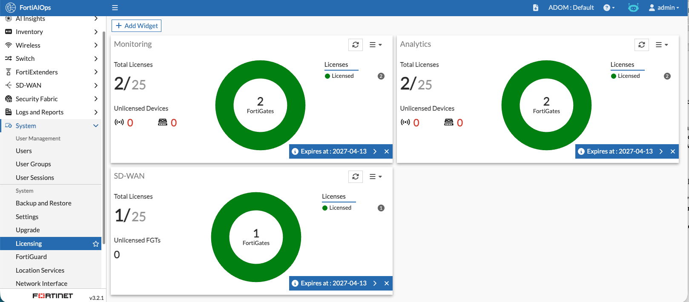
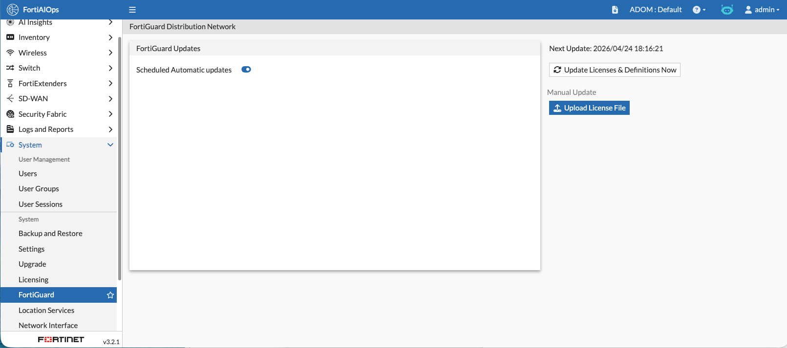

AIOPS Licencing Review

Navigate to System-> Licencing

You can see that you will have 1 SDWAN licence consumed and 2 Monitoring and Analytics Licences Consumed

If you select System - > FortiGuard
FortiAIOPS updates the licence via fortiguard however you can upload the licence file from forticare by using the manual update file option seen here

When you register a new FortiAIOPS you will need the system ID

this is found by clicking the Manual Update butten then "click here to know how to get a licence file?"
In step one you are presented with the system ID. This is required for inital registration.

Confirm that you are getting logs from FAZ to your AIOPS

Logs and Reports
 Under fortigate you should see Event logs. Check that you have Wifi Events and FortiSwitch Events
