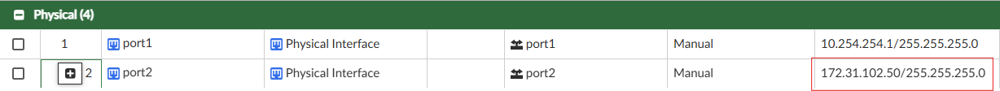
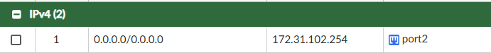
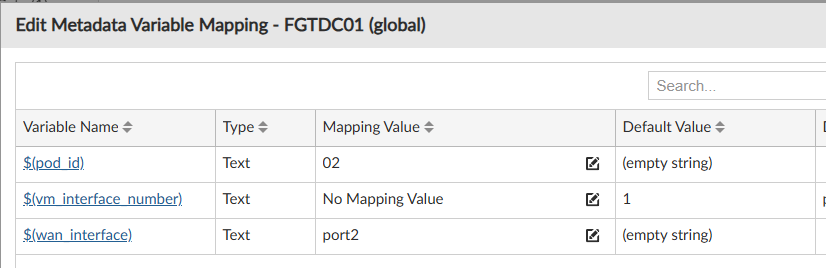
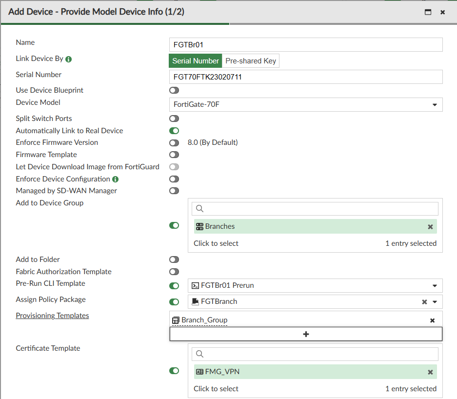
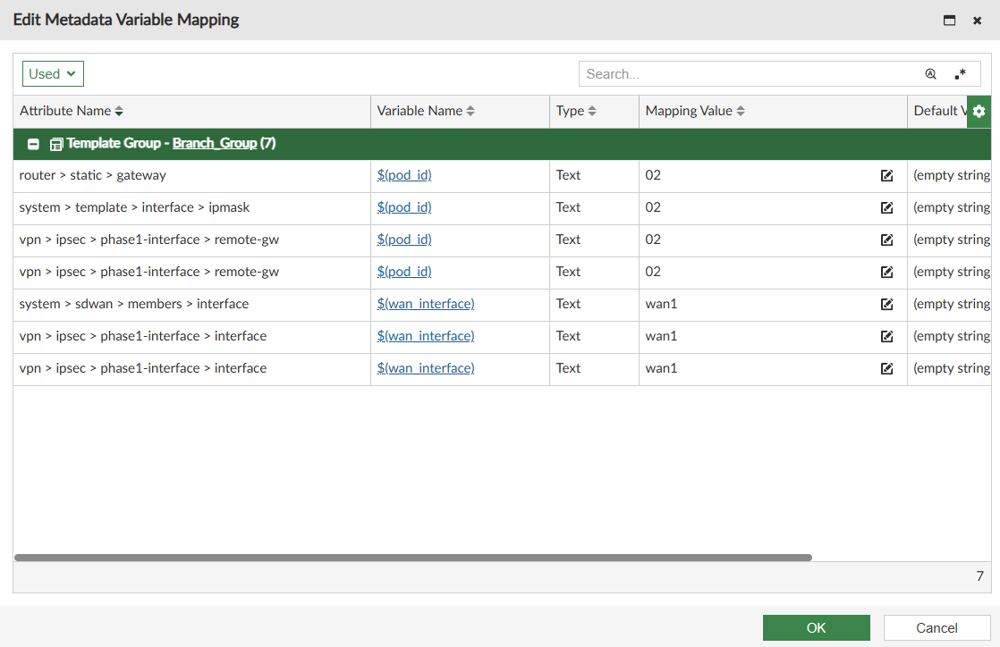
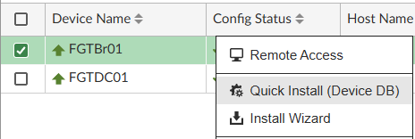
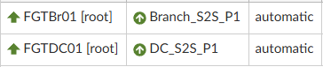

#### Lab 1 - Prepwork

| Device       | Username/PW        |
| ------------ | ------------------ |
| FabricStudio | admin/fortinet1!   |
| FortiManager | admin/fortinet4A!! |

> [!NOTE]
> **FortiManager and Zero Touch Provisioning**
>
> FortiManager is Fortinet's centralised management platform for FortiGate devices. Rather than logging into each firewall individually to make changes, FortiManager gives you a single pane of glass to configure, push policy, and monitor every device in your estate — whether that's 5 devices or 5,000.
>
> **Zero Touch Provisioning (ZTP)** takes this a step further. Instead of shipping a pre-configured device to a branch or having a technician on-site, ZTP allows a FortiGate to phone home to FortiManager the moment it gets an internet connection, identify itself by serial number, and automatically receive its full configuration — VPN tunnels, firewall policies, wireless profiles, and all. The device goes from factory reset to fully operational without anyone touching the CLI.
>
> **How it works in this lab:**
> - A DHCP option on the lab network tells the FortiGate where FortiManager lives
> - FortiManager has a model device pre-staged with the branch's serial number
> - The moment the FortiGate connects and contacts FortiManager, it is authorised, assigned its policy package and provisioning templates, and configured automatically
>
> **Why this matters at scale:**
> - Deploy a new branch in minutes, not days
> - Eliminate configuration drift — every device is built from the same templates
> - Policy packages mean a change made once in FortiManager propagates to every branch simultaneously
> - Meta variables let you use a single template across all branches, with per-device values (IP addresses, pod IDs) injected automatically at install time

> [!WARNING]
> FortiManager is particular about the order of operations — please wait until advised to power on and plug in devices. Rushing this step will likely lead to errors that you will need to troubleshoot.
>
> Everything physical should be powered off and unattached at this point.

##### Task 1 - Check FabricStudio

1. Log into FabricStudio
2. Navigate to Fabric Workspace > Fabric ID 2
3. Check that all devices are running
4. Log into FortiManager
5. Verify the following on FGTDC01 are correct for your pod (xx is your pod number, e.g., 02 for Pod 2)
   - The IP of Port2 (172.31.1xx.50)
   - The static default route (172.31.1xx.254)
   - The Pod_id variable for FGTDC01 is your pod ID (xx)
     - Right-click the device and select Edit Variable Mapping

> [!NOTE]
> For example, Pod 2 would look like the following:
>
> 
>
> 
>
> 

> [!NOTE]
> These should already be correct, but they were set manually — so double-check.

##### Task 2 - Branch FGT ZTP

> [!TIP]
> **What you are building here:**
> A model device is a placeholder in FortiManager that represents the branch FortiGate before it physically exists on the network. By pre-staging it with a serial number, policy package, and provisioning templates, FortiManager knows exactly what to send the device the moment it calls home. This is the foundation of ZTP — the network team configures everything in advance, and the physical deployment becomes as simple as plugging in a cable.

6. Under Device Manager, add a new Model device for your bench FortiGate with the following configuration
   - Name: FGTBr01
   - Serial Number: [your device]
   - Device Model: [will populate automatically]
   - Add to device group: Branches
   - Pre-Run CLI Template: FGTBr01 Prerun
   - Assign Policy Package: FGTBranch
   - Provisioning Templates: Branch_Group
   - Certificate Templates: FMG_VPN
   - Edit Meta variables and change the mapping value for:
     - pod_ip: [your pod number] e.g., 02 (the leading zero is important for any pod under 10)
     - wan_interface: wan1
   - Leave the rest default and click Next

  

  

7. Connect your FortiGate's WAN1 to the lab connection and power the device on

> [!NOTE]
> For ease of deployment, a DHCP option has been added to point the FortiGate to FortiManager — this should work automatically. If it doesn't, manually point it via console connection:
>
> ```
> config system central-management
>     set type fortimanager
>     set fmg 172.31.1xx.50
> end
> ```

8. Wait for the device to autolink. Once complete and synchronized, run a quick install
   - This may show that nothing needs to be installed — that is fine

  

9. Navigate to Device Manager > Monitors > VPN Monitor — you should see a VPN built between your desk FortiGate and your environment

  

> [!NOTE]
> As this is a wireless training lab, most of the initial templates have been pre-configured. If you are curious, take time to look through them — the majority will not be explored as part of this lab.

#### Lab complete — move on to Lab 2
